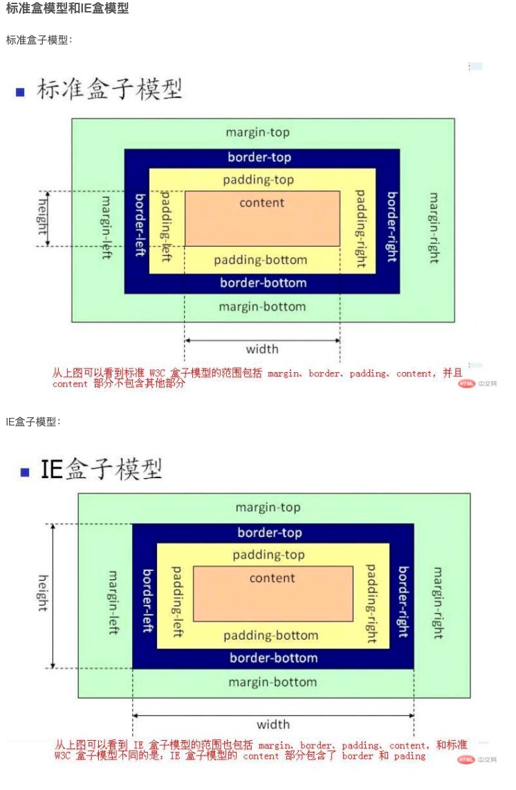

# CSS 知识点

## 盒模型

- 每一个 html 元素都可以看为一个盒子
- 一个盒子的主要的属性为 width、height、padding、border、margin
- 在标准盒子模型中，width 和 height 指的是内容区域的宽度和高度。增加内边距、边框和外边距不会影响内容区域的尺寸，但是会增加元素框的总尺寸。
- IE 盒子模型中，width 和 height 指的是内容区域+border+padding 的宽度和高度。
  

## transition 和 animation 的区别

- 相同点 随时间改变元素对属性值
- 不同点
  - transition 需要触发一个事件才能改变属性，而 animation 不需要触发任何事件的情况下才会随时间改变属性值
  - transition 为 2 祯，从 from 到 to，而 animation 可以一祯一祯的

## BFC

- 是 web 页面的可视 css 渲染的一部分 是块盒子的布局过程发生的区域。也是浮动元素与其他元素交互的区域

```html
<style>
  .father {
    /* float: left;
      position: absolate;
      display: inline-block; */
    overflow: hidden;
  }

  .son {
    width: 300px;
    height: 300px;
    background-color: blue;
    float: left;
  }
</style>
<!-- 块级格式化上下文，他是指一个独立的块级渲染区域，只有Block-level BOX参与，该区域拥有一套渲染规则来约束块级盒子的布局，且与区域外部无关 -->
<!-- 如何创建bfc
  方法1 float 不是node
  方法2 position 不是 static 或者relative
  方法3 display的值是inline-bloc、flex、或者inline-flex
  方法4 overflow:hidden 这个比较友好不会影响其他标签 -->
<div class="father">
  <div class="son"></div>
  <div class="son"></div>
  <div class="son"></div>
</div>
```

### BFC 的理解

- 块级格式化上下文 ， 他是指一个独立的块级渲染区域，只有 Block-level BOX 参与，该区域拥有一套渲染规则来约束块级盒子的布局，且与区域外部无关

### 规则

- 垂直方向上的距离由 margin 决定，属于同一个 BFC 的两个相邻的标签的 margin 会发生重叠
  - 解决了 外边距重叠
- 每个标签的左外边距与包含块的左外边界相接触（从左向右），即使浮动标签也是如此。
  - 解决了 自适应两栏或三栏布局
- BFC 的区域不会与浮动的标签区域重叠
  - 解决了 防止字体环绕
- 计算 BFC 高度的时候，浮动子元素也参与计算
  - 解决了 清除浮动
  - 给下一个节点的 dom 添加 clear:both
  - 通用
    .clearfix { \*zoom: 1;}
    .clearfix: after { content: ' '; display: table; clear: both; }

### BFC 中的盒子对齐

- 特性的第一条是：内部的 Box 会在垂直方向上一个接一个的放置。
- 浮动的元素也是这样，box3 浮动，他依然接着上一个盒子垂直排列，并且所有的盒子都左对齐

### 外边距重叠

- 特性的第二条：垂直方向上的距离由 margin 决定 在常规文档流中，两个兄弟盒子之间的垂直距离是由他们的外边距所决定的，但不是他们的两个外边距之和，而是以较大的为准。

## Flex

- flex-direction
- flex-wrap
- flex-flow
- justify-content
- align-items
- order
- flex-grow

## 解决 css 阻塞污染的问题

- 解决办法 link 标签添加 media 媒体类型或查询

```javascript
<link href="style.css" rel="stylesheet">
<link href="style.css" rel="stylesheet" media="all">
<link href="portrait.css" rel="stylesheet" media="orientation:portrait">
<link href="print.css" rel="stylesheet" media="print">
```

- 第一个声明阻塞渲染，适用于所有情况。
- 第二个声明同样阻塞渲染：“all”是默认类型，如果您不指定任何类型，则隐式设置为“all”。因此，第一个声明和第二个声明实际上是等效的。
- 第三个声明具有动态媒体查询，将在网页加载时计算。根据网页加载时设备的方向，portrait.css 可能阻塞渲染，也可能不阻塞渲染。
- 最后一个声明只在打印网页时应用，因此网页首次在浏览器中加载时，它不会阻塞渲染。
- 最后，请注意“阻塞渲染”仅是指浏览器是否需要暂停网页的首次渲染，直至该资源准备就绪。无论哪一种情况，浏览器仍会下载 CSS 资产，只不过不阻塞渲染的资源优先级较低罢了。

## css 的缩放、渐变、旋转和平移

- 渐变 transition：all 3s ease
  - all 代表渐变所有元素（all 可以用样式中有的 width、height、background 之类的代替）
  - 1s 代表渐变时间
  - ease 代表匀速渐变
    - linear:匀速运动
    - ease:从初始状态过渡到终止状态，由快到慢，逐渐变慢
    - ease-in:从初始到终止速度越来越快，呈一种加速状态
    - ease-out:从初始到终止速度越来越慢，呈一种减速状态
    - ease-in-out:先加速再减速
  - 含不含：hover 都要加 transition：all 3s ease 保证鼠标移入和移出都有动画效果
- transform 里有缩小(scale)，旋转(rotate)，平移(translate)，倾斜(skew)
  - rotate 有三个方向 X、Y、Z 轴
  - translate(x,y) 接收两个参数 x 代表水平方向偏移量 y 代表垂直方向偏移量
  - shew 代表倾斜
- 旋转

```html
<style>
  .turn {
    animation: turn 2s linear infinite;
  }
  @keyframes turn {
    0% {
      -webkit-transform: rotate(0deg);
    }

    25% {
      -webkit-transform: rotate(90deg);
    }

    50% {
      -webkit-transform: rotate(180deg);
    }

    75% {
      -webkit-transform: rotate(270deg);
    }

    100% {
      -webkit-transform: rotate(360deg);
    }
  }
</style>
```

## 三栏布局 的 5 种方案

- float 中间 margin-left margin-right 需要注意清除浮动
- position 定位 不适合页面布局
- flex 只能兼容 ie9+
- grid 兼容性差
- table 兼容性好 使用方便 不利于搜索引擎爬取

## 圣杯布局 的三种方案

- position
- flex
- float

## 吸顶布局

- 第一种 `position:sticky`
  - 使用条件：
    - 父元素不能 overflow:hidden 或者 overflow:auto 属性
    - 必须指定 top、bottom、left、right 4 个值之一，否则只会处于相对定位
    - 父元素的高度不能低于 sticky 元素的高度
    - sticky 元素仅在其父元素内生效

```html
<style>
  .sticky {
    position: -webkit-sticky;
    position: sticky;
    top: 0;
  }
</style>
```

- 第二种 基于 jq `offset().top` 返回相对于文档的偏移量

```javascript
...
window.addEventListener('scroll', self.handleScrollOne);
...
handleScrollOne: function() {
    let self = this;
    let scrollTop = $('html').scrollTop();
    let offsetTop = $('.title_box').offset().top;
    self.titleFixed = scrollTop > offsetTop;
}
...
```

- 第三种 使用原生的`offsetTop`实现

```javascript
getOffset: function(obj,direction){
    let offsetL = 0;
    let offsetT = 0;
    while( obj!== window.document.body && obj !== null ){
        offsetL += obj.offsetLeft;
        offsetT += obj.offsetTop;
        obj = obj.offsetParent;
    }
    if(direction === 'left'){
        return offsetL;
    }else {
        return offsetT;
    }
}
...
window.addEventListener('scroll', self.handleScrollTwo);
...
handleScrollTwo: function() {
    let self = this;
    let scrollTop = window.pageYOffset || document.documentElement.scrollTop || document.body.scrollTop;
    let offsetTop = self.getOffset(self.$refs.pride_tab_fixed);
    self.titleFixed = scrollTop > offsetTop;
}
...
```

## css 绘制常见图形

```html
<style>
  * {
    margin: 0;
    padding: 0;
  }

  .pakeage {
    width: 100%;
  }

  ul {
    width: 55%;
    margin: 30px auto;
    display: flex;
    flex-wrap: wrap;
    justify-content: space-between;
  }

  li {
    list-style: none;
    width: 25%;
    display: flex;
    align-items: center;
    justify-content: center;
    flex-wrap: wrap;
    position: relative;
    padding-top: 82px;
  }

  .label {
    margin: 30px 0;
    text-align: center;
    position: absolute;
    top: 0;
    left: 0;
    width: 100%;
  }

  .circle {
    width: 200px;
    height: 200px;
    margin: 0 auto;
    border-radius: 100%;
    background-color: #8bc34a;
  }

  .circle1 {
    width: 80%;
    height: 150px;
    margin: 0 auto;
    border-radius: 50%;
    background-color: #8bc34a;
  }

  .circle2 {
    width: 80%;
    height: 150px;
    margin: 0 auto;
    border-radius: 50%/100% 100% 0 0;
    background-color: #8bc34a;
  }

  .circle3 {
    width: 80%;
    height: 150px;
    margin: 0 auto;
    border-radius: 100% 0 0 100%/50%;
    background-color: #8bc34a;
  }

  .circle4 {
    width: 80%;
    height: 150px;
    margin: 0 auto;
    border-radius: 100% 0 0 100%/50%;
    background-color: #8bc34a;
  }

  .circle5 {
    width: 80%;
    height: 150px;
    margin: 0 auto;
    border-radius: 100% 0 0 0;
    background-color: #8bc34a;
  }

  .circle6 {
    width: 258px;
    height: 275px;
    margin: 0 auto;
    border-radius: 258px 258px 258px 258px / 275px 275px 275px 275px;
    background-color: #8bc34a;
    display: flex;
    justify-content: center;
    align-items: center;
  }

  .circle7 {
    background: #fff;
    width: 112px;
    height: 232px;
    border-radius: 112px 112px 112px 112px / 232px 232px 232px 232px;
  }

  .circle8 {
    /* background-color: #8BC34A; */
    width: 130px;
    height: 100px;
    display: flex;
    align-items: center;
    justify-content: center;
    position: relative;
  }

  .circle8::before {
    content: '';
    position: absolute;
    transform: skew(45deg);
    background-color: #8bc34a;
    top: 0;
    left: 0;
    right: 0;
    bottom: 0;
    z-index: -1;
  }

  .circle9 {
    width: 140px;
    height: 140px;
    position: relative;
    display: flex;
    justify-content: center;
    align-items: center;
  }

  .circle9::before {
    content: '';
    position: absolute;
    top: 0;
    bottom: 0;
    left: 0;
    right: 0;
    background-color: #8bc34a;
    transform: rotate(45deg);
    z-index: -1;
  }

  .circle10 {
    background-color: #8bc34a;
    transform: rotate(45deg);
    width: 100px;
  }

  .circle10 img {
    position: relative;
    transform: rotate(-45deg);
    width: 300px;
    max-width: 100%;
  }

  .circle11 {
    background-color: #8bc34a;
    background: linear-gradient(135deg, transparent 15px, #8bc34a 0) top left, linear-gradient(
          -135deg,
          transparent 15px,
          #8bc34a 0
        ) top right,
      linear-gradient(-45deg, transparent 15px, #8bc34a 0) bottom right, linear-gradient(
          45deg,
          transparent 15px,
          #8bc34a 0
        ) bottom left;
    background-size: 50% 50%;
    background-repeat: no-repeat;
    padding: 1em 1.2em;
    max-width: 12em;
    line-height: 1.5em;
  }

  .circle12 {
    width: 100px;
    height: 100px;
    background-color: #8bc34a;
    border-radius: 50%;
    background-image: linear-gradient(to right, transparent 50%, #655 0);
  }

  .circle12::before {
    content: '';
    margin-left: 50%;
    display: block;
    height: 100%;
    border-radius: 0 100% 100% 0 / 50%;
    background-color: inherit;
    transform-origin: left;
    transform: rotate(0.3turn);
  }

  .circle13 {
    width: 100px;
    height: 100px;
    background-color: #8bc34a;
    border-radius: 50%;
    background-image: linear-gradient(to right, transparent 50%, #655 0);
  }

  .circle13::before {
    content: '';
    margin-left: 50%;
    display: block;
    height: 100%;
    border-radius: 0 100% 100% 0 / 50%;
    background-color: inherit;
    transform-origin: left;
    background: #655;
    transform: rotate(0.1turn);
  }

  .circle14 {
    width: 140px;
    height: 140px;
    border-radius: 50%;
    background: yellowgreen;
    background-image: linear-gradient(
      to right,
      transparent 50%,
      currentColor 0
    );
    color: #655;
  }

  .circle14::before {
    content: '';
    display: block;
    margin-left: 50%;
    height: 100%;
    border-radius: 0 100% 100% 0 / 50%;
    background-color: inherit;
    transform-origin: left;
    animation: spin 3s linear infinite, bg 6s step-end infinite;
  }

  @keyframes spin {
    to {
      transform: rotate(0.5turn);
    }
  }

  @keyframes bg {
    50% {
      background: currentColor;
    }
  }
</style>
<div class="package">
  <ul>
    <li>
      <div class="label">圆形</div>
      <div class="circle"></div>
    </li>
    <li>
      <div class="label">自适应椭圆</div>
      <div class="circle1"></div>
    </li>
    <li>
      <div class="label">自适应半椭圆</div>
      <div class="circle2"></div>
    </li>
    <li>
      <div class="label">自适应的半椭圆:沿纵轴劈开的半椭圆</div>
      <div class="circle3"></div>
    </li>
    <li>
      <div class="label">自适应的半椭圆:沿纵轴劈开的半椭圆</div>
      <div class="circle4"></div>
    </li>
    <li>
      <div class="label">自适应1/4 圆</div>
      <div class="circle5"></div>
    </li>
    <li>
      <div class="label">欧朋logo</div>
      <div class="circle6">
        <div class="circle7"></div>
      </div>
    </li>
    <li>
      <div class="label">平行四边形</div>
      <div class="circle8">translate:skew()</div>
    </li>
    <li>
      <div class="label">菱形</div>
      <div class="circle9">translate:rotate()</div>
    </li>
    <li>
      <div class="label">菱形图片</div>
      <div class="circle10">
        
      </div>
    </li>
    <li>
      <div class="label">切角效果</div>
      <div class="circle11">
        Hey, focus! You’re supposed to be looking at my corners, not reading my
        text. The text is just placeholder!
      </div>
    </li>
    <li>
      <div class="label">饼图 < 50%</div>
      <div class="circle12"></div>
    </li>
    <li>
      <div class="label">饼图 > 50%</div>
      <div class="circle13"></div>
    </li>
    <li>
      <div class="label">饼图动画</div>
      <div class="circle14"></div>
    </li>
  </ul>
</div>
```
