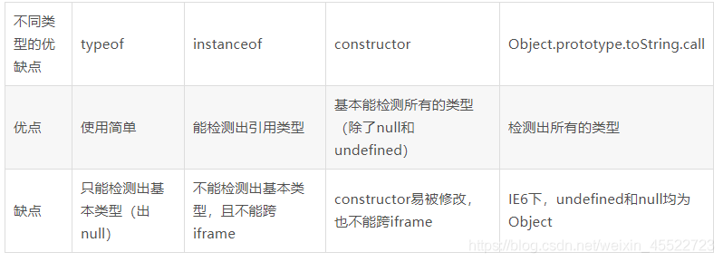

# Js 知识点

## 拖拽

- onmousedown 鼠标按下事件
- onmousemove 鼠标移动事件
- onmouseup 鼠标抬起事件

```javascript
window.onload = function () {
  var drag = document.getElementById('drag');
  drag.onmousedown = function (event) {
    var event = event || window.event;
    var diffX = event.clientX - drag.offsetLeft;
    var diffY = event.clientY - drag.offsetTop;
    console.log(diffX, diffY);
    if (typeof drag.setCapture !== 'undefined') {
      drag.setCapture();
    }
    document.onmousemove = function (event) {
      var event = event || window.event;
      var moveX = event.clientX - diffX;
      var moveY = event.clientY - diffY;
      if (moveX < 0) {
        moveX = 0; //防止模块拖拽到视图区左侧边界外
      } else if (moveX > window.innerWidth - drag.offsetWidth) {
        moveX = window.innerWidth - drag.offsetWidth; //防止模块拖拽到视图区右侧边界外
      }
      if (moveY < 0) {
        moveY = 0; //防止模块拖拽到视图区上侧边界外
      } else if (moveY > window.innerHeight - drag.offsetHeight) {
        moveY = window.innerHeight - drag.offsetHeight; //防止模块拖拽到视图区下侧边界外
      }
      console.log(moveX, moveY);
      drag.style.left = moveX + 'px';
      drag.style.top = moveY + 'px';
    };
    document.onmouseup = function () {
      this.onmousemove = null;
      this.onmouseup = null;
      if (typeof drag.releaseCapture !== 'undefined') {
        drag.releaseCapture();
      }
    };
  };
};
```

## 原型/构造函数/实例

- 原型（`prototype`）：一个简单的对象，用于实现对象的**属性继承**。可以简单的理解成对象的爹。在 Firefox 和 Chrome 中，每个`JavaScript`对象中都包含一个`__proto__`(非标准)的属性指向它爹（该对象的原型），可用 `obj.__proto__`进行访问。
- 构造函数：可以通过 new 来**新建一个对象**的函数。
- 实例：通过构造函数和`new`创建出来的对象，便是实例。**实例通过**`__proto__`**指向原型，通过**`constructor`**指向构造函数**
- Object.prototype.**proto** === null

## 原型链

- 原型链是由原型对象组成的
- 每个对象会有一个`__proto__`属性，这个属性指向创建该对象的原型
- `__proto__`将对象链接起来组成了原型链，是用来**实现继承和共享属性**的有限的对象链
- **属性查找机制：** 查找对象的属性，如果没有就沿着原型链向上查找知道顶级原型对象 object.prototype,如果还是没有找到 输出 undefined
- **属性修改机制：** 只能修改实例对象本身的属性，如果实例对象本身没有此属性，则直接增加此属性，如果想要修改原型对象的属性 `b.prototype.x = 2` ,`注意:`如果原型的属性被修改 继承该对象的实例的属性同事发生改变

## JS 执行上下文

### 全局执行上下文

- 全局执行上下文只有一个，在客户端中一般由浏览器创建，也就是我们熟知的 window 对象，我们能通过 this 直接访问
- 通过 var 创建全局变量对象 ，都可以通过 window 直接访问

### 函数执行上下文

- 函数执行上下文可存在无数个，每当一个函数被调用时都会创建一个函数上下文，需要注意的是， `同一个函数被多次调用，都会创建一个新的上下文`
- 函数执行上下文又称`执行栈`，`执行栈用于存储代码执行期间创建的所有上下文`，秉持`先进后出`的特性
- js 运行时会`创建一个全局执行上下文并压入到执行栈中`

```javascript
function f1() {
  f2();
  console.log(1);
}

function f2() {
  f3();
  console.log(2);
}

function f3() {
  console.log(3);
}

f1(); //3 2 1
```

## 闭包

- 优点：避免全局变量污染
- 就是能够读取去他函数内部变量的函数。

```javascript
function init() {
  var name = 'Mozilla'; // name 是一个被 init 创建的局部变量
  function displayName() {
    // displayName() 是内部函数，一个闭包
    alert(name); // 使用了父函数中声明的变量
  }
  displayName();
}
init();
```

- 闭包的作用
  - 用于从外部读取其他函数内部变量的函数
  - 可以使用闭包来模拟私有方法
  - 让这些变量的值始终保持在内存中
- 闭包的使用场景：

  - 1.创建私有变量 2.延长变量的生命周期
  - 1.return 一个函数

  ```javascript
  var n = 10;
  function fn() {
    var n = 20;
    function f() {
      n++;
      console.log(n);
    }
    return f;
  }
  var x = fn();
  x(); // 21
  ```

  - 2. 函数作为参数

  ```javascript
  var a = '林一一'
  function foo(){
      var a = 'foo'
      function fo(){
          console.log(a)
      }
      return fo
  }
  function f(p){
      var a = 'f'
      p()
  }
  f(foo())
  /* 输出
  *   foo
  /
  ```

  - 3.IIFE(自执行函数)

  ```js
  var n = '林一一';
  (function p(){
      console.log(n)
  })()
  /* 输出
  *   林一一
  /
  ```

  - 4.循环赋值

  ```js
  for (var i = 0; i < 10; i++) {
    (function (j) {
      setTimeout(function () {
        console.log(j);
      }, 1000);
    })(i);
  }
  ```

  - 5.使用回调函数就是在使用闭包

  ```js
  window.name = '林一一';
  setTimeout(function timeHandler() {
    console.log(window.name);
  }, 100);
  ```

  ```javascript
  function makeSizer(size) {
    return function () {
      document.body.style.fontSize = size + 'px';
    };
  }

  var size12 = makeSizer(12);
  var size14 = makeSizer(14);
  var size16 = makeSizer(16);

  document.getElementById('size-12').onclick = size12;
  document.getElementById('size-14').onclick = size14;
  document.getElementById('size-16').onclick = size16;
  ```

- 柯里化函数

  ```javascript
  // 假设我们有一个求长方形面积的函数
  function getArea(width, height) {
    return width * height;
  }
  // 如果我们碰到的长方形的宽老是10
  const area1 = getArea(10, 20);
  const area2 = getArea(10, 30);
  const area3 = getArea(10, 40);

  // 我们可以使用闭包柯里化这个计算面积的函数
  function getArea(width) {
    return (height) => {
      return width * height;
    };
  }

  const getTenWidthArea = getArea(10);
  // 之后碰到宽度为10的长方形就可以这样计算面积
  const area1 = getTenWidthArea(20);

  // 而且如果遇到宽度偶尔变化也可以轻松复用
  const getTwentyWidthArea = getArea(20);
  ```

- 装饰器的类需要传参的时候 需要用到闭包
- computed 需要传参的时候也需要用到闭包
- element antd 等 日期插件的 disable 类事件需要传参的时候 也需要闭包

- 注意事项 如果不是某些特定任务需要使用闭包，在其它函数中创建函数是不明智的，因为闭包在处理速度和内存消耗方面对脚本性能具有负面影响
- 我们在使用闭包的时候需要及时清理不再使用到的变量，否则可能会导致内存泄漏问题

## 对象的拷贝

- 浅拷贝 以赋值的形式拷贝引用对象，仍指向同一个地址，修改时原对象也会收到影响
  - `Object.assign`
  - 展开运算符（...）
  - lodash clone
- 深拷贝 完全拷贝一个新对象，**修改时原对象不再受到任何影响**
  - `JSON.parse(JSON.stringify(obj))`:性能最快
    - 具有循环引用的对象时，报错
    - 当值为函数、`undefined`、或者`symbol`时，无法拷贝
  - 递归进行逐一赋值
  - lodash \_\_.cloneDeep
  - $.extend

## new 运算符的执行过程

- 新建一个空对象
- 把这个空对象的`__proto__ = Con.prototype`
- 绑定 this： apply
- 返回新对象 如果构造函数有自己的返回的值 则返回该值

## instanceof 原理

- 能在实例的原型对象链中找到 prototype 所指向的构造函数的原型对象，则返回 true

```javascript
// __proto__: 代表原型对象链
instance.[__proto__...] === instance.constructor.prototype
// return true
```

## 类型判断

```javascript
let class2type = {};
'Array Date RegExp Object Error'
  .split(' ')
  .forEach((e) => (class2type['[object ' + e + ']'] = e.toLowerCase()));

function type(obj) {
  if (obj == null) return String(obj);
  return typeof obj === 'object'
    ? class2type[Object.prototype.toString.call(obj)] || 'object'
    : typeof obj;
}
```

## 模块化

- 提高项目可维护、可扩展、可协作性
- 在浏览器中用 es6 的模块化支持，在 node 中使用 commonjs 的模块化支持
- 分类
- es6:`import / export`
- commonjs:`require / module.exports / exports`
- amd: `require / defined`
- `require`与`import`的区别
- `require`支持**动态导入**，`import`不支持
- `require`是**同步**导入，`import` 是**异步**导入
- `require` 是**值拷贝**，导出值不回影响导入值，`import`指向**内存地址**导入值会随导出值而变化

## 防抖与节流

防抖与节流函数是一种最常用的**高频触发优化方式**，能对性能有较大的帮助

- **防抖（debounce）**：将多次高频操作优化为只在最后一次执行，通常使用的场景是：用户输入，只需在输入完成后做一次输入校验即可
- n 秒后在执行该事件，若在 n 秒内被重复触发，则重新计时
- **节流** ： n 秒内只运行一次，若在 n 秒内重复触发，只有一次执行
  - 常用与滚动条事件 或者是 resize 事件

## js 的由来 以及单线程的原因

- js 最初被设计为浏览器的脚本语言
- 主要对页面的操作、与浏览器的交互、与用户的交互、页面逻辑处理等
- 当多个线程对 dom 节点进行操作，线程间对同步问题就会很复杂，为了解决这个问题 js 被设计成了单线程

## AST 抽象语法树

- 将代码逐字母解析成树状对象的形式，这是语言之间的转换、代码语法检查、代码风格检查、代码格式化，代码高亮，代码错误提示、代码自动补全等的基础

## js 代码的执行过程

- js 引擎在执行 js 代码的时候，会进行词法分析、语法分析、语义分析等操作，生生 ast 抽象语法树，根据 ast 抽象语法树生成 cpu 可执行的机器码并执行

## babel 编译原理

- babylon 将 es6/es7 代码解析成 AST
- babel-traverse 对 AST 进行遍历转译，得到新的 AST
- 新 AST 通过 babel-generator 转换成 es5

## v8 引擎运行的三个阶段

- 语法分析阶段：检查是否有语法错误 SyntaxError，有的话在 console 抛出异常并中止执行
- 编译阶段:进行执行上下文（Execution Context）的创建，包括变量对象、建立作用域链、确定 this 的指向等
- 执行阶段:将编译阶段中创建的执行上下文压入调用站，并成为正在运行的执行上下文，代码执行结束后，将其弹出调用栈

## 函数柯里化

- 为一个函数设置通用函数供重复使用

```javascript
const add = function add(x) {
  return function (y) {
    return x + y;
  };
};

const add1 = add(1);

add1(2) === 3;
add1(20) === 21;
```

## 跨域

- JSONP: 利用<script>标签不受跨域限制的特点，缺点是只能支持 get 请求

```javascript
 function jsonp(url,jsonpCallback,success){
   const script = document.createElement('script)
   script.src = url
   script.async = true
   script.type = 'text/javascript'
   window[jsonpCallback] = function(data) {
     success && succrss(data)
   }
   document.body.appendChild(script)
 }
```

- 设置 cors：Access-Control-Allow-Origin：\*
- postMessage

## Event loop 中的 job queue

- macro-task 队列真实包含任务：
  script(主程序代码),setTimeout, setInterval, setImmediate, I/O, UI rendering

  micro-task 队列真实包含任务：
  process.nextTick, Promises, Object.observe, MutationObserver

  由此我们得到的执行顺序应该为：

  script(主程序代码)—>process.nextTick—>Promises...——>setTimeout——>setInterval——>setImmediate——> I/O——>UI rendering

  在 ES6 中 macro-task 队列又称为 ScriptJobs，而 micro-task 又称 PromiseJobs

```javascript
setTimeout(function () {
  console.log(1);
}, 0);

new Promise(function (resolve, reject) {
  console.log(2);
  resolve();
})
  .then(function () {
    console.log(3);
  })
  .then(function () {
    console.log(4);
  });

process.nextTick(function () {
  console.log(5);
});

console.log(6);
//输出2,6,5,3,4,1
```

- 这里要注意的一点在定义 promise 的时候，promise 构造部分是同步执行的

## 更复杂的例子

```javascript
setTimeout(function () {
  console.log(1);
}, 0);

new Promise(function (resolve, reject) {
  console.log(2);
  setTimeout(function () {
    resolve();
  }, 0);
})
  .then(function () {
    console.log(3);
  })
  .then(function () {
    console.log(4);
  });

process.nextTick(function () {
  console.log(5);
});

console.log(6);

//输出的是  2 6 5 1 3 4
```

- 这种情况跟我们（2）中的例子，区别在于 promise 的构造中，没有同步的 resolve，因此 promise.then 在当前的执行队列中是不存在的，只有 promise 从 pending 转移到 resolve，才会有 then 方法，而这个 resolve 是在一个 setTimout 时间中完成的，因此 3,4 最后输出

## 实现 sleep 的效果

### 通过 promise 的方式来实现

```javascript
function sleep(ms) {
  return new Promise((resolve) => {
    console.log(111);
    setTimeout(resolve, ms);
  });
}
sleep(500).then(() => console.log(222));
```

## Promise

- Promise 允许我们通过链式调用的方式来解决“回调地狱”的问题，特别是在异步过程中，通过 Promise 可以保证代码的整洁性和可读性。
- 用于同时发送多个异步请求
- 状态只能弄 未完成->完成 ， 未完成->失败
- promise 的构造函数是同步
- promise 的 then 方法当中的方法是异步回调
- promise 的 resolved 也是异步回调
- promise 一旦执行中途无法取消，promise 的错误无法在外部被捕捉到，只能在内部进行与判断，promise 内如何执行，监测起来很难

#### 手写一个 promise

```javascript
  function myPromise(constructor){
    let self = this;//谁调用 this 就指向谁
    self.status = "pending" //定义状态改变前的初始状态
    //定义状态为resolved的时候的状态
    self.value = undefined
    //定义状态为rejected的时候的状态
    self.reason = undefined
    function resolved(value) {
      if(self.status === "pending"){
        self.value = value;
        self.status = "resolved"
      }
    }
    function rejected(reason) {
      if(self.status === "pending"){
        self.reason = reason;
        self.status = "rejected"
      }
    }
    //捕获构造异常
    try{
      constructor(resolved,rejected)
    }catch(e){
      reject(e)
    }
  }
  //在myPromise的原型上定义脸是调用的then方法
  myPromise.prototype.then = function(onFullfilled,onRejeccted){
    let self = this
    switch(self.status){
      case "resolved"
        onFullfilled(self.value)
        break
      case "rejected"
        onRejeccted(self.reason)
        break
      default
    }
  }
```

## promise 的应用场景

- 多个请求结果合并在一起
  - 一个页面有多个请求，我们需求所有的请求都返回数据后再一起处理渲染

```javascript
//1.获取轮播数据列表
function getBannerList() {
  return new Promise((resolve, reject) => {
    setTimeout(function () {
      resolve('轮播数据');
    }, 300);
  });
}

//2.获取店铺列表
function getStoreList() {
  return new Promise((resolve, reject) => {
    setTimeout(function () {
      resolve('店铺数据');
    }, 500);
  });
}

//3.获取分类列表
function getCategoryList() {
  return new Promise((resolve, reject) => {
    setTimeout(function () {
      resolve('分类数据');
    }, 700);
  });
}

function initLoad() {
  // loading.show() //加载loading
  Promise.all([getBannerList(), getStoreList(), getCategoryList()])
    .then((res) => {
      console.log(res);
      // loading.hide() //关闭loading
    })
    .catch((err) => {
      console.log(err);
      // loading.hide()//关闭loading
    });
}
//数据初始化
initLoad();
```

- 合并请求结果并处理错误
  - 我们需求单独处理一个请求的数据渲染和错误处理逻辑，有多个请求，我们就需要在多个地方写

```javascript
//1.获取轮播图数据列表
function getBannerList() {
  return new Promise((resolve, reject) => {
    setTimeout(function () {
      // resolve('轮播图数据')
      reject('获取轮播图数据失败啦');
    }, 300);
  });
}

//2.获取店铺列表
function getStoreList() {
  return new Promise((resolve, reject) => {
    setTimeout(function () {
      resolve('店铺数据');
    }, 500);
  });
}

//3.获取分类列表
function getCategoryList() {
  return new Promise((resolve, reject) => {
    setTimeout(function () {
      resolve('分类数据');
    }, 700);
  });
}

function initLoad() {
  // loading.show()
  Promise.all([
    getBannerList().catch((err) => err),
    getStoreList().catch((err) => err),
    getCategoryList().catch((err) => err),
  ]).then((res) => {
    console.log(res); // ["获取轮播图数据失败啦", "店铺数据", "分类数据"]

    if (res[0] == '轮播图数据') {
      //渲染
    } else {
      //获取 轮播图数据 失败的逻辑
    }
    if (res[1] == '店铺数据') {
      //渲染
    } else {
      //获取 店铺列表数据 失败的逻辑
    }
    if (res[2] == '分类数据') {
      //渲染
    } else {
      //获取 分类列表数据 失败的逻辑
    }

    // loading.hide()
  });
}

initLoad();
```

- 验证多个请求结果是否都是满足条件
  - 做一个表单的输入内容安全验证，调用的是云函数写的方法，表单有多 7 个字段需要验证，都是调用的一个 内容安全校验接口，全部验证通过则 可以 进行正常的提交

```javascript
function verify1(content) {
  return new Promise((resolve, reject) => {
    setTimeout(function () {
      resolve(true);
    }, 200);
  });
}

function verify2(content) {
  return new Promise((resolve, reject) => {
    setTimeout(function () {
      resolve(true);
    }, 700);
  });
}

function verify3(content) {
  return new Promise((resolve, reject) => {
    setTimeout(function () {
      resolve(true);
    }, 300);
  });
}

Promise.all([
  verify1('校验字段1的内容'),
  verify2('校验字段2的内容'),
  verify3('校验字段3的内容'),
])
  .then((result) => {
    console.log(result); //[true, true, true]

    let verifyResult = result.every((item) => item);
    //验证结果
    console.log(verifyResult ? '通过验证' : '未通过验证'); // 通过验证
  })
  .catch((err) => {
    console.log(err);
  });
```

## js 数组的方法

- toString() 把数组转换为数组值（逗号分隔）的字符串
- join() 通过制定连接符生成字符串
- pop() / push() 末尾推入和弹出，改变原数组， push 返回数组长度, pop 返回原数组最后一项
- shift() / unshift() 头部推入和弹出，改变原数组，unshift 返回数组长度，shift 返回原数组第一项
- 方法（在开头）向数组添加新元素，并“反向位移”旧元素
- splice() 返回删除元素组成的数组 改变原数组
- concat() 方法通过合并（连接）现有数组来创建一个新数组
- slice() 返回截取后的新数组 不改变原数组
- sort() 方法用于对数组的元素进行排序
  - 可以接收一个回调函数
  - 排序改变原数组
- indexOf / lastIndexOf(value,fromIndex):查找数组项，返回对应的下标
- map() :遍历数组，返回回调返回值组成的新数组

```javascript
var officersIds = officers.map(function (officer) {
  return officer.id;
  //箭头函数用法
  const officersIds = officers.map((officer) => officer.id);
});
```

- some 有一项返回 true 则整体为 true
- every：有一项返回 false，则整体为 false
- filter() 提取数组中的某些元素
- reduce()
  - 一个简单的例子，你就能感受到 .reduce() 的用法了。假如你有一个包含一些飞行员以及他们飞行经验的数组。
  ```javascript
  var pilots = [
    {
      id: 10,
      name: 'Poe Dameron',
      years: 14,
    },
    {
      id: 2,
      name: "Temmin 'Snap' Wexley",
      years: 30,
    },
    {
      id: 41,
      name: 'Tallissan Lintra',
      years: 16,
    },
    {
      id: 99,
      name: 'Ello Asty',
      years: 22,
    },
  ];
  ```
- 如果你需要知道所有飞行员的总飞行年数。用 .reduce() 将会非常直观。

```javascript
var totalYears = pilots.reduce(function (accumulator, pilot) {
  return accumulator + pilot.years;
}, 0);
//&&&&&&&&&&&&&&&&&&&&&&&&&&&&&&
const totalYears = pilots.reduce((acc, pilot) => acc + pilot.years, 0);
```

## 字符串的方法

- length 属性返回字符串的长度
- indexOf indexOf() 方法返回字符串中指定文本首次出现的索引（位置）
- lastIndexOf() 方法返回指定文本在字符串中最后一次出现的索引
  - 如果未找到文本， indexOf() 和 lastIndexOf() 均返回 -1
- search() 方法搜索特定值的字符串，并返回匹配的位置

## es6 新特性

- 块级作用域 主要是跟闭包相关
- 类
- 模版字符串
- promise 解决回调函数嵌套问题
- 模块化 export 和 import
- 箭头函数
- proxy
- 解构赋值
- symbol
  - 确保唯一，即使采用相同的名称，也会产生不同的值，我们创建一个字段，仅为 知道对应 symbol 的人能访问，使用 symbol 很有用
  - symbol 并不是 100%隐藏，有内置方法 Object.getOwnPropertySymbols(obj)可以获得所有的 symbol。
  - 也有一个方法 Reflect.ownKeys(obj)返回对象所有的键，包括 symbol。 所以并不是真正隐藏。但大多数库内置方法和语法结构遵循通用约定他们是隐藏的。

## this

- 1、在对象方法中， this 指向调用它所在方法的对象。
- 2、单独使用 this，它指向全局(Global)对象。
- 3、函数使用中，this 指向函数的所属者。
- 4、严格模式下函数是没有绑定到 this 上，这时候 this 是 undefined。
- 5、在 HTML 事件句柄中，this 指向了接收事件的 HTML 元素。
- 6、apply 和 call 允许切换函数执行的上下文环境（context），即 this 绑定的对象，可以将 this 引用到任何对象。
- 箭头函数本身没有 this 指向 箭头函数当中的 this 指向作用域对象 setTimeout()的 this 本身指向 window 在 setTimeout 当中使用箭头函数可以把 this 指向更换到当前作用域
- `this指向:最后调用当前代码的那个对象`

## 数组扁平化

- 数组扁平化是指讲一个多位数组变为一维数组
- 核心思想是遍历数组 如果还存在数组就继续遍历 如果都是元素就 concat
- reduce
- tostring split
- join + split
- 递归 递归的遍历每一项，若为数组则继续遍历，否则 concat

```javascript
// 方法一
let arr = [1, 2, [3, 4, [5, [6]]]];
console.log(arr.flat(Infinity)); //flat参数为指定要提取嵌套数组的结构深度，默认值为 1

// 方法二
function fn(arr) {
  return arr.reduce((prev, cur) => {
    return prev.concat(Array.isArray(cur) ? fn(cur) : cur);
  }, []);
}

// 手动flatten函数
var arr = [1, 2, 3, [4, 5], [6, [7, [8]]]];
function wrap() {
  let ret = [];
  return function flat(a) {
    for (var item of a) {
      if (item.construstor === Array) {
        ret.concat(flat(item));
      } else {
        ret.push(item);
      }
    }
    return ret;
  };
}

console.log(wrap()(arr));
```

## dom 的 api

- 创建节点型 api
- 页面修改型 api
- 节点查询型 api
- 节点关系型 api
- 元素属性型 api
- 元素样式型 api

## virtual dom

- 本质上是 js 和 dom 之间做了一个缓存
- 1.用 js 对象模拟 dom 树，得到一棵虚拟 dom 树
- 2.当页面数据变更时，生成新的虚拟 dom 树。比较新旧两颗虚拟 dom 树的差异
- 3.把差异应用到真正的 dom 树上

## function 可以 new 那么箭头函数可以吗

- 不可以
  - 箭头函数没有自己的 this
  - 箭头函数没有 prototype 属性
  - 在 new 操作符的操作中 箭头函数不满足

## JavaScript 对象的底层数据结构是什么

- 堆和栈组合
- 基本数据类型是存放在栈中
- 引用数据类信访

## 基本类型对应的内置对象，以及他们之间的装箱拆箱操作

- 装箱：
  - 把基本数据类型转化为对应的引用数据类型的操作\*\*，装箱分为隐式装箱和显示装箱
  - 隐式装箱

```javascript
let a = 'sun';
let b = a.indexof('s'); // 0 // 返回下标
// 上面代码在后台实际的步骤为：
let a = new String('sun');
let b = a.indexof('s');
a = null;
```

- - 显式装箱

```javascript
let a = new String('sun	');
```

- 拆箱

```javascript
let name = new String('sun');
let age = new Number(24);
console.log(typeof name); // object
console.log(typeof age); //  object
// 拆箱操作
console.log(typeof age.valueOf()); // number // 24  基本的数字类型
console.log(typeof name.valueOf()); // string  // 'sun' 基本的字符类型
console.log(typeof age.toString()); // string  // '24' 基本的字符类型
console.log(typeof name.toString()); // string  // 'sun' 基本的字符类型
```

## null 和 undefined 的区别

- null 表示"没有对象"，即该处不应该有值
- undefined 表示"缺少值"，就是此处应该有一个值，但是还没有定义

## 判断数据类型的几种方法

- typeof 用于判断基本数据类型 判断引用数据类型困难
- instanceof 用于检测原型
- Object.prototype.toString() 所有类型的对象都适用 返回对象的类型
- constructor 用于查看构造函数
  

## es6 class 的底层实现

```javascript
//转义前
class Parent {
  constructor(name, age) {
    this.name = name;
    this.age = age;
  }
  //类公有方法
  sayName() {
    console.log(this.name);
  }
  //静态方法
  static sayhi() {
    console.log(this.name);
  }
}
//经过babel官网转义后
var Parent = /*#__PURE__*/ (function () {
  function Parent(name, age) {
    _classCallCheck(this, Parent);
    this.name = name;
    this.age = age;
  }
  _createClass(
    Parent,
    [
      {
        key: 'sayName',
        value: function sayName() {
          console.log(this.name);
        },
      },
    ],
    [
      {
        key: 'sayhi',
        value: function sayhi() {
          console.log(this.name);
        },
      },
    ],
  );
  return Parent;
})();
```

```javascript
function _classCallCheck(instance, Constructor) {
  if (!instance instanceof Constructor) {
    throw new TypeError('Cannot call a class as a function');
  }
}
```

- 用于判断是否用过 new 关键字 用过 new 说明 this 是 Parent 的实例 返回 true
- 没用过 那么 this 在严格模式下是 window window 不是 Parent 的实例 返回 false

## 理解词法作用域和动态作用域

```javascript
var a = 2;
function foo() {
  console.log(a);
}
function bar() {
  var a = 3;
  foo();
}
bar();
```

- 如果处于词法作用域，也就是现在的 javascript 环境。变量 a 首先在 foo()函数中查找，没有找到。于是顺着作用域链到全局作用域中查找，找到并赋值为 2。所以控制台输出 2
- 如果处于动态作用域，同样地，变量 a 首先在 foo()中查找，没有找到。这里会顺着调用栈在调用 foo()函数的地方，也就是 bar()函数中查找，找到并赋值为 3。所以控制台输出 3
- `两种作用域的区别，简而言之，词法作用域是在定义时确定的，而动态作用域是在运行时确定的`

## 理解堆栈溢出和内存泄漏的原理，如何防止

- 堆栈溢出 内存空间已经被申请完 没有足够的内存可以提供
- 内存泄漏 某段代码执行完成之后的当中申请的内存并没有释放
  - 1.闭包 2.遗忘的定时器 3.意外的全局变量 4.脱离 dom 的引用
- 减少使用全局变量、闭包、避免死循环

## 如何处理循环的异步操作

- async/await

## 理解模块化解决的实际问题，可列举几个模块化方案并理解其中原理

## 为何 try 里面放 return，finally 还会执行，理解其内部机制

- 无论是否会产生 catch，都会执行 finally 中的语句。
- 如果产生 catch，且 catch 中含有 return，虽然会执行 finally 的语句，但返回的值依旧是 catch 的值，除非 finally 也有 return。
- 如果产生 catch，且 catch 中不含有 return，return 在函数的最后面，那返回的值将是 finally 中的值。
- finally 代码中最好不要包含 return，程序会提前退出，也就是说返回的值不是 try 或 catch 中的值，而是 finally 的值。
- 如果 return 在 try 中，虽然会进入 finally，但是因为 finally 是在 return 后面的表达式运算之后执行的，此时并没有返回运算之后的值，而是把值保存起来，不管 finally 对该值做任何的改变，返回的值都不会改变，依然返回保存起来的值。也就是说方法的返回值是在 finally 运算之前就确定了的。（例子 1 中 i 的返回值是 6 而不是 7）

## Promise 并行和串行理解

- 并行：多个异步请求同时进行

```javascript
var promises = function () {
  return [1000, 2000, 3000].map((current) => {
    return new Promise(function (resolve, reject) {
      setTimeout(() => {
        console.log(current);
      }, current);
    });
  });
};

Promise.all(promises()).then(() => {
  console.log('end');
});
```

- 串行：一个异步请求完了之后在进行下一个异步请求

```javascript
var p = function () {
  return new Promise(function (resolve, reject) {
    setTimeout(() => {
      console.log('1000');
      resolve();
    }, 1000);
  });
};
var p1 = function () {
  return new Promise(function (resolve, reject) {
    setTimeout(() => {
      console.log('2000');
      resolve();
    }, 2000);
  });
};
var p2 = function () {
  return new Promise(function (resolve, reject) {
    setTimeout(() => {
      console.log('3000');
      resolve();
    }, 3000);
  });
};

p()
  .then(() => {
    return p1();
  })
  .then(() => {
    return p2();
  })
  .then(() => {
    console.log('end');
  });
```

## 什么是高阶函数

- 将函数作为参数或者返回值的函数

```js
function highOrder(params, callback) {
  return callback(params);
}
```

## 将伪数组转化为数组

- Array.prototype.slice.call() 不兼容 ie8 以下
- 兼容 ie8 以下

```javascript
function listToArray(likeArray) {
  var ary = [];
  try {
    Array.prototype.slice.call(likeArray);
  } catch (e) {
    for (var i = 0; i < likeArray.length; i++) {
      ary[ary.length] = likeArray[i];
    }
  }
}

// arguments
function fn() {
  console.log(arguments);
  console.log(Array.prototype.slice.call(arguments));
}
fn(1, 2, 3, 4, 5);

// 含有length属性的对象
let obj1 = {
  0: 1,
  1: '蔡徐坤',
  2: '鹿晗',
  length: 3,
};
console.log(Array.prototype.slice.call(obj1));

// 数组的拼接 必须用apply

let arr11 = [1, 2, 3];
let arr22 = [4, 5, 6];

console.log(arr11.concat(arr22));

Array.prototype.push.apply(arr11, arr22);
```
