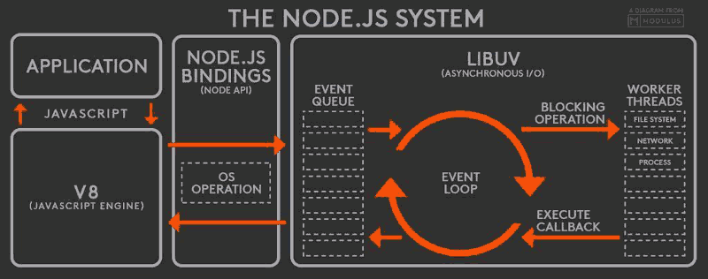
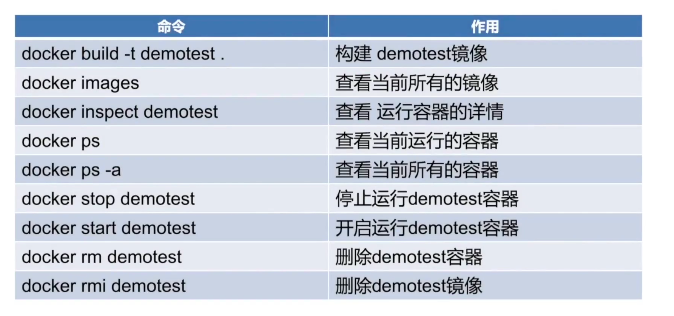

# NodeJS 知识点
## nodeJs 是什么
- 基于Chrome v8 引擎的js运行环境
- nodejs 使用了事件驱动、非阻塞式I/O的模型，使其轻量又高校
- 在chrome里写js控制浏览器 nodejs就是用类似方式控制整个计算机
## node事件循环 event loop
  - 所有同步任务都在主线程上执行，形成一个执行栈
  - 当主线程中的执行栈为空时，检查事件队列是否为空，如果为空，则继续检查，如果不为空，则执行
  - 去除任务队列的首部，加入执行栈
  - 执行任务
  - 检查执行栈，如果执行栈为空 跳回第二部如果不为空则继续检查

### 什么是事件循环
  - 事件循环是nodejs处理非阻塞I/O操作的机制-尽管javaScript是单线程处理的-当又肯呢个的时候，他们会把操作转移到系统内核中去
  - 既然目前大多数内核都是多线程的，他们可在后台处理多种操作。当其中的一个操作完成的时候，内核通知nodejs将合适的回调函数添加到轮询队列中等待时机执行。
  - node在主线程里维护了一个**事件队列**，接到请求之后将请求当作一个事件放入这个队列中，然后继续接其他的请求。当主线程空闲的时候，就开始循环事件队列，检查队列中是否有要处理的事件，这时要分两种情况，如果是非I/O任务，就亲自处理，并通过回调函数返回到上层调用，如果是I/O任务，就从**线程池**中拿出一个线程来处理这个事件，并指定回调函数，然后继续循环队列中的其他事件。
  - 当线程中的I/O任务完成以后，就执行制定的回调函数，并把这个完成的事件放到事件队列的尾部，等待事件循环，当主线程再次循环到该事件时，就直接处理并返回给上层调用，这个过程叫做**事件循环**
  - 无论是linux平台还是windows平台，nodejs内部都是通过线程池来完成异步的I/O操作的，而LIBUV针对不同平台的差异性实现了统一调用。因此，**nodejs的单线程仅仅是指JavaScript运行在单线程中，而并非nodejs是单线程**。
### 工作原理

#### 定义事件队列
  ```javascript
  /**
   * 定义事件队列
  * 入队：push()
  * 出队：shift()
  * 空队列：length == 0
  */
  globalEventQueue: []  
  ```
  - 我们利用数组来模拟队列结构：数组的第一个元素是队列的头部，数组的最后一个严肃是队列的尾部，push()就是在队列尾部插入一个元素，shift()就是从队列头部探出一个元素。这样就实现了一个简单的事件队列。
#### 定义接受请求入口
    每一个请求都会被拦截并进入处理函数
  ```javascript
    /**
  * 接收用户请求
  * 每一个请求都会进入到该函数
  * 传递参数request和response
  */
  processHttpRequest:function(request,response){
    //定义一个事件对象
    varevent = createEvent({
      params:request.params,//传递请求参数
      result:null,//存放请求结果
      callback：function(){}//指定回调函数
    })
    //在队列的尾部添加该事件
    globalEventQueue.push(event)
  }
  ```
#### 定义 Event loop
  - 当主线程处于空闲时就开始循环事件队列，所以我么你还要定义一个函数来循环事件队列：
  ```javascript
  /**
   * 事件循环主体，主线程择机执行
  * 循环遍历事件队列
  * 处理非IO任务
  * 处理IO任务
  * 执行回调，返回给上层
  */
  eventLoop:funciton(){
    //如果队列不为空，就继续循环
    while(this.globalEventQueue.length > 0){
      //从队列的头部拿出一个事件
      varevent = this.globalEventQueue.shift()
      //如果是耗时任务
      if(isIOTask(event)){
        //从线程池里拿出一个线程
        varthread = getThreadFromThreadPool()
        //交给线程处理
        thread.handleIOTask(event)
      }else{
        // 非耗时任务处理后，直接返回结果
        varresult = handleEvent(event)
        // 最终通过回调函数返回给v8，再由v8返回给应用程序
        event.callback.call(null,result)
      }
    }
  }
  ```
  - 主线程不停的检测事件队列，对于 I/O 任务，就交给线程池来处理，非 I/O 任务就自己处理并返回。
#### 处理 I/O 任务
  ```javascript
  /**
 * 处理IO任务
 * 完成后将事件添加到队列尾部
 * 释放线程
 */
handleIOTask:function(event){
    //当前线程
    varcurThread =this;
 
    // 操作数据库
    varoptDatabase = function(params,callback){
        varresult = readDataFromDb(params);
        callback.call(null,result)
    };
     
    // 执行IO任务
    optDatabase(event.params,function(result){
        // 返回结果存入事件对象中
        event.result = result;
 
        // IO完成后，将不再是耗时任务
        event.isIOTask =false;
         
        // 将该事件重新添加到队列的尾部
        this.globalEventQueue.push(event);
         
        // 释放当前线程
        releaseThread(curThread)
    })
}
  ```
  - `因此，我们可以简单的理解为：Node.js 本身是一个多线程平台，而它对 JavaScript 层面的任务处理是单线程的。`
### nodejs 的短板
  - cpu密集型是短板 主要表现为数据加解密（node.bcrypt.js）数据压缩和解压（node-tar）类似的任务nodejs就会亲自处理 逐个计算，一个执行完毕之后才会执行下一个
  - 在nodejs的事件队列中，如果前面的cpu计算任务没有完成那么后面的任务就会阻塞，而nodejs只有一个event loop 也就是占用一个cpu内核 当nodejs被cpu密集型任务占用，导致其他任务阻塞，却还有其他cpu内核空闲造成资源浪费
### node的适用场景
  - restful api 请求和响应都只需要少量的文本，并且不需要大量逻辑处理，因此可以并发处理万条链接
  - 聊天服务 - 轻量级、高流量、没有负责的计算逻辑
## node的特征
  - 单线程、事件驱动、非阻塞I/O
  - 比其他服务端性能更好速度更快
## node解决跨域问题
```javascript
//解决跨域问题
app.use(async(ctx, next) => {
    
    //指定服务器端允许进行跨域资源访问的来源域。可以用通配符*表示允许任何域的JavaScript访问资源，但是在响应一个携带身份信息(Credential)的HTTP请求时，必需指定具体的域，不能用通配符
    ctx.set("Access-Control-Allow-Origin", "*");

    //可选。它的值是一个布尔值，表示是否允许客户端跨域请求时携带身份信息(Cookie或者HTTP认证信息)。默认情况下，Cookie不包括在CORS请求之中。当设置成允许请求携带cookie时，需要保证"Access-Control-Allow-Origin"是服务器有的域名，而不能是"*";如果没有设置这个值，浏览器会忽略此次响应。
    ctx.set("Access-Control-Allow-Credentials", true);
    
    //指定服务器允许进行跨域资源访问的请求方法列表，一般用在响应预检请求上
    ctx.set("Access-Control-Allow-Methods", "OPTIONS, GET, PUT, POST, DELETE");
    
    //必需。指定服务器允许进行跨域资源访问的请求头列表，一般用在响应预检请求上
    ctx.set("Access-Control-Allow-Headers", "x-requested-with, accept, origin, content-type");
    // ctx.set("X-Powered-By", ' 3.2.1');
    
    //告诉客户端返回数据的MIME的类型，这只是一个标识信息,并不是真正的数据文件的一部分
    ctx.set("Content-Type", "application/json;charset=utf-8");
    
    //如果不设置mode，直接设置content-type为application/json，则fetch会默认这是跨域模式（mode:'cors'），在跨域POST之前，客户端会先发一条OPTIONS请求来”探探路”，如果服务器允许，再继续POST数据。对于这种OPTIONS请求，需要在服务器配置允许接受OPTIONS请求，这样写就是直接允许了所有的OPTIONS请求，也可以按照需求来判断OPTIONS请求中更详细的信息
    if (ctx.request.method == "OPTIONS") {
        ctx.response.status = 200
    }
    await next();
});
```
## node 全局对象
  - Class:Buffer
  - process
  - console
  - clearInterval、setInterval
  - clearTimeout、setTimeout
  - global
## node process
  - process.env 环境变量 例如通过process.env.NODE_ENV 获取不同环境项目配置信息
  - process.nexTick
## node fs
  - fs.readFileSync 同步读取
  - fs.readFile 异步读取
  - fs.writeFileSync 同步写入
  - fs.writeFile 异步写入
  - fs.appendFileSync 文件追加写入
  - fs.appendFile 文件异步写入
  - fs.copyFileSync 文件同步拷贝
  - fs.copyFile 文件异步拷贝
  - fs.mkdirSync 同步创建目录
  - fs.mkdir 异步创建目录
## Buffer 
  - Nodejs不能控制数据传输的速度和到达时间，只能决定何时发送数据，如果还没到发送时间，则将数据放在Buffer中，即在RAM中，直至将它们发送完毕
  ```javascript
  const buffer = Buffer.from("你好");
  console.log(buffer);
  // <Buffer e4 bd a0 e5 a5 bd>
  const str = buffer.toString();
  console.log(str);
  // 你好
  ```
  - 
## react-travel
### 技术栈
  - axios
  - react、react-router-dom
  - ts
  - antd
  - redux、redux-tookit、redux-persist
### 模块
  - 首页
### koa、koa2、express
