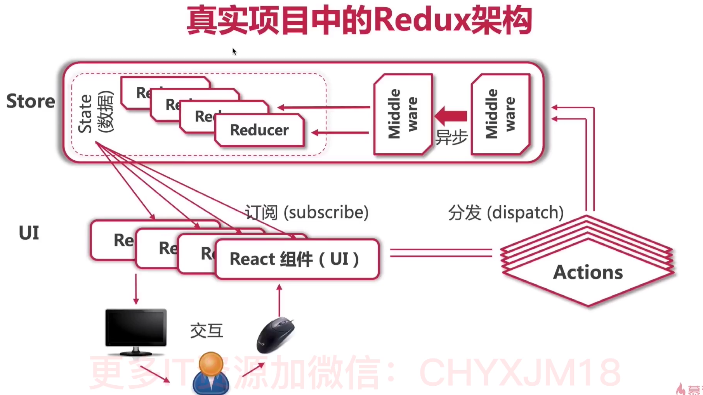
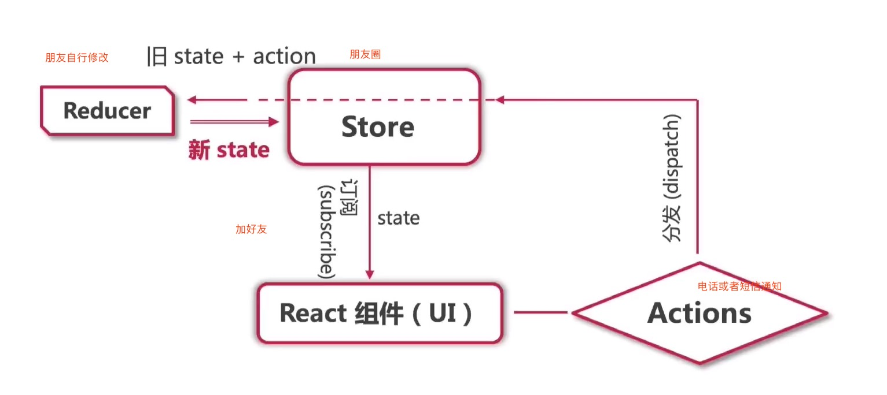
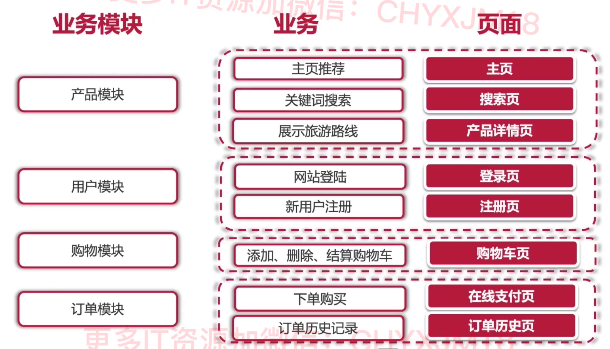
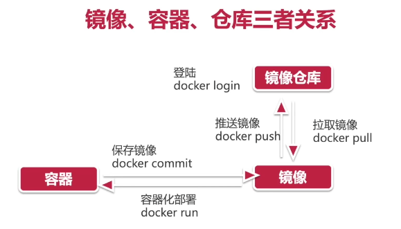

# React 知识点

## react 是什么

- react 适用于构建用户界面的 javascript 库
- 用来写 html 页面 构建 web 应用

## react 的特点

- 声明式 jsx
- 组件
- rn vr
- 单向数据流
- 虚拟dom
## 安装

- npm i react react-dom

## 使用

```html
<div id="root"></div>
<script src="./node_modules/react/umd/react.development.js"></script>
<script src="./node_modules/react-dom/umd/react-dom.development.js"></script>
<script>
  /**
   * 参数一 元素名称
   * 参数二 元素属性
   * 参数三 元素的子节点
   */
  const title = React.createElement('h1', null, 'Hello React');
  /**
   * 参数一 渲染的react元素
   * 参数二 挂载点
   */
  ReactDOM.render(title, document.getElementById('root'));
</script>
```

## 脚手架create-react-app
- 是facebook团队开发的 用于构建react但页面应用的脚手架工具

- npx create-react-app my-app

## npx

- 无需安装脚手架

## jsx

- javascript xml
- 条件渲染
  - if else
  - 三元运算符

## 组件

- 表示页面中的部分功能

### 函数组件

- 使用 js 中的函数创建的组件
- 名称大写字母开头
- 必须有返回值

```javascript
// 函数组件
// function Hello() {
//   return <div>这是我的第一个函数组件</div>
// }

const Hello = () => <div>这是我的第一个函数组件</div>;
ReactDOM.render(<Hello />, document.getElementById('root'));
```

### 类组件

- 使用 es6 的 class 创建组件
- 名称大写字母开头
- 继承 React.Component 这个父类
- 必须提供 render()方法
- render 方法必须要有返回值

```javascript
// 类组件
class Hello extends React.Component {
  render() {
    return <div>这是我的第一个类组件</div>;
  }
}
ReactDOM.render(<Hello />, document.getElementById('root'));
```

## 复合组件

```javascript
function Name(props) {
  return <h1>网站名称：{props.name}</h1>;
}
function Url(props) {
  return <h1>网站地址：{props.url}</h1>;
}
function Nickname(props) {
  return <h1>网站小名：{props.nickname}</h1>;
}
function App() {
  return (
    <div>
      <Name name="菜鸟教程" />
      <Url url="http://www.runoob.com" />
      <Nickname nickname="Runoob" />
    </div>
  );
}

ReactDOM.render(<App />, document.getElementById('example'));
```

## State 状态

- 函数

```javascript
class Clock extends React.Component {
  constructor(props) {
    super(props);
    this.state = { date: new Date() };
  }

  render() {
    return (
      <div>
        <h1>Hello, world!</h1>
        <h2>现在是 {this.state.date.toLocaleTimeString()}.</h2>
      </div>
    );
  }
}

ReactDOM.render(<Clock />, document.getElementById('example'));
```

- 将生命周期方法加到类中

```javascript
class Clock extends React.Component {
  construtor(props) {
    super(props);
    this.state = { date: new Date() };
  }

  componentDidMount() {
    this.timerID = setInterval(() => this.tick());
  }

  componentWillUnmount() {
    clearInterval(this.timerID);
  }

  tick() {
    this.setState({
      data: new Date(),
    });
  }

  render() {
    return (
      <div>
        <h1>Hello,world!</h1>
        <h2>现在是{this.state.date.toLocalTimeString()}</h2>
      </div>
    );
  }
}
ReactDOM.render(
  <Clock />
  document.getElementById('example')
)
```

## props

- state 和 props 主要的区别在于 props 是不可变的，而 state 可以根据与用户交互来改变。这就是为什么有些容器组件需要定义 state 来更新和修改数据。 而子组件只能通过 props 来传递数据

```javascript
function HelloMessage(props) {
  return <h1>Hello {props.name}!</h1>;
}

const element = <HelloMessage name="Runoob" />;

ReactDOM.render(element, document.getElementById('example'));
```

- 默认 props
  - defaultProps 属性
  - 场景 分页组件 每页显示条数

```javascript
class HelloMessage extends React.Component {
  render() {
    return <h1>Hello,{this.props.name}</h1>;
  }
}
HelloMessage.defaultProps = {
  name: 'Runoob',
};
```

- 父子组件间通信

```javascript
class WebSite extends React.Component {
  constructor() {
    super();

    this.state = {
      name: '菜鸟教程',
      site: 'https://www.runoob.com',
    };
  }
  render() {
    return (
      <div>
        <Name name={this.state.name} />
        <Link site={this.state.site} />
      </div>
    );
  }
}

class Name extends React.Component {
  render() {
    return <h1>{this.props.name}</h1>;
  }
}

class Link extends React.Component {
  render() {
    return <a href={this.props.site}>{this.props.site}</a>;
  }
}

ReactDOM.render(<WebSite />, document.getElementById('example'));
```

## props 验证

- prop-types 库

```javascript
class MyTitle extends React.Component {
  render() {
    return <h1>Hello, {this.props.title}</h1>;
  }
}

MyTitle.propTypes = {
  title: PropTypes.string,
};
```

## 事件处理

- this 的指向
  - 使用 class 的实例方法

```javascript
class Hello extends React.Component{
  onIncrement = () => {
    this.setState({...})
  }
}
```

```javascript
function ActionLink() {
  function handleClick(e) {
    e.preventDefault();
    console.log('链接被点击');
  }

  return (
    <a href="#" onClick={handleClick}>
      点我
    </a>
  );
}
```

- `你必须谨慎对待 JSX 回调函数中的 this，类的方法默认是不会绑定 this 的。如果你忘记绑定 this.handleClick 并把它传入 onClick, 当你调用这个函数的时候 this 的值会是 undefined。`
- 可以使用箭头函数绑定 this

```javascript
class Toggle extends React.Component {
  constructor(props) {
    super(props);
    this.state = { isToggleOn: true };

    // 这边绑定是必要的，这样 `this` 才能在回调函数中使用
    this.handleClick = this.handleClick.bind(this);
  }

  handleClick() {
    this.setState((prevState) => ({
      isToggleOn: !prevState.isToggleOn,
    }));
  }

  render() {
    return (
      <button onClick={this.handleClick}>
        {this.state.isToggleOn ? 'ON' : 'OFF'}
      </button>
    );
  }
}

ReactDOM.render(<Toggle />, document.getElementById('example'));
```

- 向事件处理程序传递参数

```html
<button onClick={(e) => this.deleteRow(id, e)}>Delete Row</button>
<button onClick={this.deleteRow.bind(this, id)}>Delete Row</button>
```

```javascript
class Popper extends React.Component {
  constructor() {
    super();
    this.state = { name: 'Hello world!' };
  }

  preventPop(name, e) {
    //事件对象e要放在最后
    e.preventDefault();
    alert(name);
  }

  render() {
    return (
      <div>
        <p>hello</p>
        {/* 通过 bind() 方法传递参数。 */}
        <a
          href="https://reactjs.org"
          onClick={this.preventPop.bind(this, this.state.name)}
        >
          Click
        </a>
      </div>
    );
  }
}
```

## 条件渲染

```javascript
function Greeting(props) {
  const isLoggedIn = props.isLoggedIn;
  if (isLoggedIn) {
    return <UserGreeting />;
  }
  return <GuestGreeting />;
}

ReactDOM.render(
  // 尝试修改 isLoggedIn={true}:
  <Greeting isLoggedIn={false} />,
  document.getElementById('example'),
);
```

## 列表渲染

```javascript
const = numbers = [1,2,3,4,5]
const listItems = numbers.map((numbers) =>
  <li>{numbers}</li>
)

ReactDOM.render(
  <ul>{listItems}</ul>
  document.getElementById('example')
)
```

- 加 key 列表

```javascript
function NumberList(props) {
  const numbers = props.numbers;
  const listItems = numbers.map((numbers) => (
    <li key={number.toString()}>{number}</li>
  ));
  return <ul>{listItems}</ul>;
}
const numbers = [1, 2, 3, 4, 5];
ReactDOM.render(
  <NumberList numbers={numbers} />,
  document.getElemenntById('example'),
);
```

## react 组件 api

- 设置状态： setState

```javascript
class Counter extends React.Component {
  constructor(props) {
    super(props);
    this.state = { clickCount: 0 };
    this.handleClick = this.handleClick.bind(this);
  }

  handleClick() {
    this.setState(function (state) {
      return { clickCount: state.clickCount + 1 };
    });
  }
  render() {
    return (
      <h2 onClick={this.handleClick}>
        点我！点击次数为：{this.state.clickCount}
      </h2>
    );
  }
}
ReactDOM.render(<Counter />, document.getElementById('example'));
```

- 替换状态： replaceState
- 设置属性： setProps
- 替换属性： replaceProps
- 强制更新： forceUpdate
- 获取 DOM 节点： findDOMNode
- 判断组件挂在状态：isMounted

## react 的生命周期

- 组件的生命周期 组件从被创建到挂在到页面中运行，再到组件不用时卸载到过程
- 只有类组件才有生命周期

- componentWillMount （废弃）
  - 在渲染前调用，在客户端也在服务端
- componentDidMount
  - 完成 dom 渲染后
  - 发送网络请求
  - dom 操作
  - 在第一个渲染之后调用，触发时 dom 已经加载完毕
  - 可以通过 this.getDOMNode()来进行访问
  - 可以调用 setTimeout setInterval 或者发送 ajax 请求操作

```javascript
class Hello extends React.Component {
  constructor(props) {
    super(props);
    this.state = { opacity: 1.0 };
  }

  componentDidMount() {
    this.timer = setInterval(
      function () {
        var opacity = this.state.opacity;
        opacity -= 0.05;
        if (opacity < 0.1) {
          opacity = 1.0;
        }
        this.setState({
          opacity: opacity,
        });
      }.bind(this),
      100,
    );
  }

  render() {
    return (
      <div style={{ opacity: this.state.opacity }}>Hello {this.props.name}</div>
    );
  }
}

ReactDOM.render(<Hello name="world" />, document.body);
```

- componentWillReceiveProps （废弃）
  - 在组件接收到一个新到 prop 时 2 被调用，这个方法在初始化 render 时不会被调用
- shouldComponentUpdate
  - 返回一个布尔值，在组件接收到新到 props 或者 state 时被调用。在初始化或者 forceUpdate 时不被调用
- componentWillUpdate （废弃）
  - 在组件接收到新到 props 或者 state 但还没有 render 时被调用。在初始化时不会被调用
- componentDidUpdate
  - 在组件完成更新后立即调用。在初始化时不会被调用
  ```javascript
  componentDidUpdate(prveProps){
    console.warn('---子组件生命周期钩子函数：componentDidUpdate)
    console.log('上一次到props',prevProps,',当前的props：',this.props)
    if(prevProps.count !== this.props.count){
      this.setState()
    }
  }
  ```
- componentWillUnmount
  - 在组件从 DOM 中益处之前立即被调用

## 表单处理

### 受控组件

- 其值受到 react 表单的控制
- state 的值来控制表单元素的值

```javascript
class App extends React.Component {
  state = {
    txt: '',
    content: '',
    city: 'sh',
    isChecked: false,
  };

  handleForm = (e) => {
    const target = e.target;
    const value = target.type === 'checkbox' ? target.checked : target.value;
    const name = target.name;
    this.setState({
      [name]: value,
    });
  };
  render() {
    return (
      <div>
        <input
          name="txt"
          type="text"
          value={this.state.txt}
          onChange={this.handleForm}
        ></input>
        <br />
        <textarea
          name="content"
          value={this.state.content}
          onChange={this.handleForm}
        ></textarea>
        <br />
        <select name="city" value={this.state.city} onChange={this.handleForm}>
          <option value="sh">上海</option>
          <option value="bj">北京</option>
          <option value="gz">广州</option>
        </select>
        <br />
        <input
          name="isChecked"
          type="checkbox"
          value={this.state.isChecked}
          onChange={this.handleForm}
        ></input>
      </div>
    );
  }
}
```

### 非受控组件

```javascript
class App extends React.Component {
  constructor() {
    super();
    this.txtRef = React.createRef;
  }
  getTxt = () => {
    console.log('文本框的值为：', this.txtRef.current.value);
  };
  render() {
    return (
      <div>
        <input type="text" ref={this.txtRef}></input>
        <button onClick={this.getTxt}>获取文本框的值</button>
      </div>
    );
  }
}
```

### 组件评论练习

```javascript
class App extends React.Component {
  state = {
    comments: [
      { id: 1, name: 'jack', content: 'shafa!!!' },
      { id: 2, name: 'rose', content: 'bandeng' },
      { id: 3, name: 'tom', content: '楼主好人' },
    ],
    username: '',
    userContent: '',
  };
  addComments = (e) => {
    const { username, userContent, comments } = this.state;
    //非空校验
    if (username.trim() === '' || userContent.trim()) {
      alert('请输入评论人和评论内容');
      return;
    }
    const newComments = [
      {
        id: Math.random(),
        name: username,
        content: userContent,
      },
      ...comments,
    ];
    this.setState({
      comments: newComments,
      username: '',
      userContent: '',
    });
  };
  handleForm = (e) => {
    const { value, name } = e.target;
    this.setState({
      [name]: value,
    });
  };
  getCommitList() {
    return this.state.comments.length === 0 ? (
      <div className="no-commit">暂无评论快去评论吧</div>
    ) : (
      <ul>
        {this.state.comments.map((e) => (
          <li key={e.id}>
            <h3>评论人：{e.name}</h3>
            <p>评论内容：{e.content}</p>
          </li>
        ))}
      </ul>
    );
  }
  render() {
    const { username, userContent } = this.state;
    return (
      <div className="app">
        <div>
          <input
            name="username"
            className="user"
            type="text"
            placeholder="请输入评论人"
            value={username}
            onChange={this.handleForm}
          ></input>
          <br></br>
          <textarea
            name="userContent"
            className="content"
            cols="30"
            rows="10"
            placeholder="请输入评论内容"
            value={userContent}
            onChange={this.handleForm}
          ></textarea>
          <br></br>
          <button onClick={this.addComments}>发表评论</button>
          {this.getCommitList()}
        </div>
      </div>
    );
  }
}
```

## props 接收数据

- 函数组件中用 props.属性

```javascript
const Hello = props => {
  consoel.log(props)
  return (
    <div>
      <h1>props:{props.name}</h1>
    </div>
  )
}
ReactDOM.render(<Hello name="jack" age={19} />,document.getElementById('root))
```

- 类组件中用 this.props.属性

```javascript
class Hello extends React.Component{
  contructor(props){
    super(props)
  }
  console.log(this.props)
  render(){
    return (
    <div>
      <h1>props:{props.name}</h1>
    </div>
  )
  }
}
ReactDOM.render(<Hello name="jack" age={19} />,document.getElementById('root))
```

- props 可以接收一个函数 也可以接收一个 jsx
- props 是只读的

### props children 属性

- 表示组件标签的子节点
- children 可以是任意值

## 父子组件之间的通讯

- 父传子

```javascript
class Parent extends React.Component {
  state = {
    lastName: '王',
  };

  render() {
    return (
      <div className="parent">
        父组件：
        <Child n ame={this.state.lastName} />
      </div>
    );
  }
}
const Clild = (props) => {
  return (
    <div className="child">
      <p>子组件，接收到父组件的数据:{props.lastName}</p>
    </div>
  );
};
```

- 子传父

```javascript
class Parent extends React.Component {
  state = {
    parentMsg: '',
  };
  getChildMsg = (data) => {
    console.log('接收到子组件中传递过来的数据', data);
    this.setState({
      parentMsg: data,
    });
  };
  render() {
    return (
      <div className="parent">
        父组件：{this.state.parentMsg}
        <Child getMsg={this.getChildMsg} />
      </div>
    );
  }
}

class Child extends React.Component {
  state = {
    msg: '刷抖音',
  };
  handleClick = () => {
    this.props.getMsg(this.state.msg);
  };
  render() {
    return (
      <div className="child">
        子组件：
        <button onClick={this.handleClick}>点我，给父组件传递数据</button>
      </div>
    );
  }
}
```

## 兄弟组件之间的通讯

- 思想 ： 状态提升

```javascript
class Counter extends React.Component {
  state = {
    count: 0,
  };
  onIncrement = () => {
    this.setState({
      count: this.state.count + 1,
    });
  };
  render() {
    return (
      <div>
        <Child1 count={this.state.count} />
        <Child2 onIncrement={this.onIncrement} count={this.state.count} />
      </div>
    );
  }
}
const Child1 = (props) => {
  return <h1>计数器：{props.count}</h1>;
};
const Child2 = (props) => {
  return <button onClick={() => props.onIncrement()}>+1</button>;
};
```

- `Context` 组件之间嵌套多层时通信的办法
  - 使用步骤 React.createContext() 创建 Provider（提供数据） 和 Consumer（消费数据） 两个组件
  - const { Provider, Consumer} = React.createContext()

```javascript
const { Provider, Consumer } = React.createContext();
class App extends React.Component {
  render() {
    return (
      <Provider value="pink">
        <div className="App">
          <Node />
        </div>
      </Provider>
    );
  }
}
const Node = (props) => {
  return (
    <div className="node">
      <SubNode />
    </div>
  );
};
const SubNode = (props) => {
  return (
    <div className="subNode">
      <Child />
    </div>
  );
};
const Child = (props) => {
  return (
    <div className="child">
      <Consumer>{(data) => <span>我是子节点 -- {data}</span>}</Consumer>
    </div>
  );
};
```

## 组件添加 props 校验

```javascript
const App = (props) => {
  const arr = props.colors;
  const lis = arr.map((item, index) => <li key={index}>{item}</li>);

  return <ul>{lis}</ul>;
};
App.propTypes = {
  colors: PropTypes.array,
};
ReactDOM.render(
  <App colors={['red', 'blue']} />,
  document.getElementById('root'),
);
```

```javascript
//验证练习
// 添加props校验
// 属性a的类型 数值 number
// 属性 fn的类型 func 且为必填项
// 属性tag 的类型 React元素 element
// 属性 filter 的类型 对象 {area:'上海'，price：1999}
App.propTypes = {
  a: PropTypes.number,
  fn: PropTypes.func.isRequired,
  tag: PropTypes.element,
  filter: PropTypes.shape({
    area: PropTypes.string,
    price: PropTypes.number,
  }),
};
Rea;
```

## 生命周期常用的钩子函数

### 1.创建时

- constructor() -> render() -> componentDidMount()

### 2.更新时

- setState forceUpdate() 接收到新到 props

### 3.卸载时

- componentUnMount()

```javascript
conponentDidMount(){
  const this.timerId = setInterval( () => {
    console.log('定时器正在执行‘)
  },500)
}
componentUnMount(){
  clearInterval(this.timerId)
}
//------------------------------------------
import { withAddToCart } from './AddToCart'
const Robot: React.FC<RobotProps> = () =>{
  return <></>
}
export default withAddToCart(Robot)
```

## 高阶组件的作用
```javascript
export const withAddToCart = (
  ChildComponent: React.ComponentType<RobotProps>
) => {
  return (props) => {
    const setState = useContext(appSetStateContext)
    const addToCart = (id, name) => {
      if (setState) {
        setState((state) => {
          return {
            ...state,
            shoppingCart: {
              items: [...state.shoppingCart.items, { id, name }],
            },
          }
        })
      }
    }
    return <ChildComponent {...props} addToCart={addToCart} />
  }
}

```
### render props 模式

```javascript
import img from './images/cat.png';
class Mount extends React.Component {
  state = {
    x: 0,
    y: 0,
  };
  handleMouseMove = (e) => {
    this.setState({
      x: e.clientX,
      y: e.clientY,
    });
  };
  componentDidMount() {
    window.addEventListener('mousemove', this.handleMouseMove);
  }
  render() {
    return this.props.render(this.state);
  }
}
class App extends React.Component {
  render() {
    return (
      <div>
        <h1>render props 模式</h1>
        <Mount
          render={(mouse) => (
            <p>
              当前鼠标位置 x:{mouse.x}，y:{mouse.y}
            </p>
          )}
        />
        <Mount
          render={(mouse) => (
            
          )}
        />
      </div>
    );
  }
}
```

- children 模式

```javascript
class Mount extends React.Component {
  state = {
    x: 0,
    y: 0,
  };
  handleMouseMove = (e) => {
    this.setState({
      x: e.clientX,
      y: e.clientY,
    });
  };
  componentDidMount() {
    window.addEventListener('mousemove', this.handleMouseMove);
  }
  render() {
    return this.props.children(this.state);
  }
}
class App extends React.Component {
  render() {
    return (
      <div>
        <h1>render props 模式</h1>
        <Mount>
          {(mouse) => (
            <p>
              当前鼠标位置 x:{mouse.x}，y:{mouse.y}
            </p>
          )}
        </Mount>
      </div>
    );
  }
}
```

### 高阶组件

- 创建一个函数 以 with 开头
- 指定函数参数，参数应该以大写字母开头
- 在函数内部创建一个类组件 提供复用的状态逻辑代码 并返回
- 在该组件中，渲染参数组件 同时将状态通过 prop 传递给参数组件

```javascript
import img from './images/cat.png';
function withMouse(WrappedComponent) {
  class Mouse extends React.Component {
    state = {
      x: 0,
      y: 0,
    };
    handleMouseMove = (e) => {
      this.setState({
        x: e.clientX,
        y: e.clientY,
      });
    };
    componentDidMount() {
      window.addEventListener('mousemove', this.handleMouseMove);
    }
    componentWillUnmount() {
      window.removeEventListener('mousemove', this.handleMouseMove);
    }
    render() {
      return <WrappedComponent {...this.state}></WrappedComponent>;
    }
  }
  Mouse.displayName = `WithMouse${getDisplayName(WrappedComponent)}`;
  return Mouse;
}
function getDisplayName(WrappedComponent) {
  return WrappedComponent.displayName || WrappedComponent.name || 'Component';
}
// 用来测试高阶组建
const Position = (props) => (
  <p>
    鼠标当前位置：（x:{props.x},y:{props.y})
  </p>
);
// 猫捉老鼠组件
const Cat = (props) => (
  
);
const MousePosition = withMouse(Position);
const MouseCat = withMouse(Cat);
class App extends React.Component {
  render() {
    return (
      <div>
        <h1>高阶组件</h1>
        <MousePosition></MousePosition>
        <MouseCat></MouseCat>
      </div>
    );
  }
}
```

## setState 更新数据是异步的

- setState 是异步更新数据
- 该语法 后面对 setState() 不要依赖于前面对 setState
- 可以多次调用 setState() 只会触发一次重新渲染

```javascript
handleClick = () => {
  //此处 更新state
  this.setState({
    count: this.state.count + 1, // 1 + 1
  });
  this.setState({
    count: this.state.count + 1, // 1 + 1
  });
  console.log('count:', this.state.count); //1
};
```

### setState 推荐语法

```javascript
this.setState((state, props) => {
  return {
    count: state.count + 1,
  };
});
this.setState((state, props) => {
  return {
    count: state.count + 1,
  };
});
console.log('count: ', this.state.count);
```

- setState 的第二个参数

```javascript
this.setState(
  (state, props) => {
    return {
      count: state.count + 1,
    };
  },
  //状态更新后 并且 重新渲染后 立即执行
  () => {
    console.log('状态更新完成：', this.state.count);
  },
);
```

## jsx 语法的转化过程

- jsx 仅仅是 createElement() 方法的语法糖（简化语法）
- jsx 首先被转化成 createElement()后然 createElement 转化成一个 React 的 js 对象

## React 组件的更新机制

- setState 的作用 1.修改 state 2.更新组件
- 过程 父组件重新渲染时，也会重新渲染子组件，但只会渲染当前组件子树

## 对组件进行性能优化

- 减轻 state
  - 不用做渲染的数据不要放在 state 中 比如定时器 id 等
  - 对于这种需要到多个方法中用到的数据 应该放到 this 中
- 避免不必要的重新渲染
  - 使用钩子函数 shouldComponentUpdate(nextProps,nextState 最新的 state)
  - 触发时机 更新阶段的钩子函数 组件重新渲染的前执行 shouldComponentUpdate -> render

```javascript
class App extends React.Component {
  state = {
    number: 0,
  };
  handleClick = () => {
    this.setState(() => {
      return {
        number: Math.floor(Math.random() * 3),
      };
    });
  };
  shouldComponentUpdate(nextProps, nextState) {
    return nextState.number !== this.state.number;
    // if (nextState.number !== this.state.number) {
    //   return true
    // }
    // return false
  }
  render() {
    console.log('render');
    return (
      <div>
        <h1>随机数：{this.state.number}</h1>
        <button onClick={this.handleClick}>重新生成</button>
      </div>
    );
  }
}
```

## 虚拟 DOM 和 Diff 算法

- react 更新试图的思想是 只要 state 变化就重新渲染视图
- 特点：思路非常清晰
- 问题 组件中只有一个 dom 元素需要更新的时候 也得吧整个组件的内通重新渲染到页面中？`不是`
- 理想状态：`部分更新`
- react 是如何做到部分更新的？`虚拟dom和diff算法`
- 虚拟 dom： 本质上就是一个 js 对象，用来描述你希望在屏幕哈桑看到的内容

```javascript
// 虚拟dom对象
const element = {
  type: 'h1',
  props: {
    className: 'greeting',
    children: 'Hello JSX',
  },
};
// html
<h1 class="greeting">Hello JSX</h1>;
```

- `虚拟dom让React脱离了浏览器的束缚`

### diff 算法 实质是找不同

- 1. 初次渲染时 React 会根据初始 state（Model）创建一个虚拟 DOM 对象
- 2. 根据虚拟 dom 生成真正的 dom，渲染到页面中
- 3. 当数据变化后（setState（）），重新根据新的数据，创建新的虚拟 DOM 对象
- 4.与上一次得到虚拟 dom 对象，使用`diff算法`对比（找不同），得到需要更新的内容
- 5. 最终，React 只将`变化的内容`(patch 补丁)更新到 dom 中， 重新渲染到页面

## 纯组件 PureComponent

- PureComponent 内部自动实现了 shouldComponentUpdate 钩子
- 纯组件内部通过分别对比前后两次 props 和 state 的值 来决定是否重新渲染组件
- 纯组件内部对比的 shallow compare 千层对比
- 值类型 比较两个值是否相同

`错误示范`

```javascript
state = { obj: { number: 0 } };
state.obj.number = 2;
setState({ obj: state.obj });
//PureComponent 内部比较
//最新的state.obj === 上一次的state.obj // true 不重新渲染组件
```

`正确示范`

```javascript
const newobj = { ...this.state.obj, number: Math.floor(Math.random() * 3) };
this.setState({ obj: newobj });
//PureComponent 内部比较
//最新的state.obj === 上一次的state.obj // true 不重新渲染组件
```

## react-router-dom

- 建议使用 BrowserRouter 不建议 hashRouter
- Link 组件 to 属性
- Route 组件

```javascript
import { BrowserRouter as Router, Route, Link } from 'react-router-dom';
const First = () => <p>页面一的页面内容</p>;
const App = () => (
  <Router>
    <div>
      <h1>React路由基础</h1>
      <Link to="/first">页面一</Link>
      <Route path="/first" component={First}></Route>
    </div>
  </Router>
);
ReactDOM.render(<App></App>, document.getElementById('root'));
```

## 路由的执行过程

- 点击 link 组件修改浏览器地址栏中的 url
- react 路由监听到地址栏 url 的改变
- React 路由内部便利所有 Route 组件，使用路由规则 path 与 pathname 进行匹配
- 当路由规则 path 能够匹配地址栏中的 pathname 时 就展示该 Route 组件的内容

## 编程式导航

```javascript
class Login extends React.Component {
  handleLogin = () => {
    this.props.history.push('/home');
  };
  render() {
    return (
      <div>
        <p>登陆页面：</p>
        <button onClick={this.handleLogin}>登录</button>
      </div>
    );
  }
}
const Home = (props) => {
  const handleBack = () => {
    props.history.go(-1);
  };
  return (
    <div>
      <h2>我是后台首页</h2>
      <button onClick={handleBack}>返回</button>
    </div>
  );
};
const App = () => (
  <Router>
    <div>
      <h1>编程式导航：</h1>
      <Link to="/login">去登录页面</Link>
      <Route path="/login" component={Login}></Route>
      <Route path="/home" component={Home}></Route>
    </div>
  </Router>
);
```

## 默认路由 进入页面时就会匹配的路由

```javascript
<Router path="/" component={Home} />
```

### 模糊匹配模式

- 规则 只要 pathname 以 path 开头就会匹配成功

### 精确匹配

- 给默认路由添加 exact 属性

## hooks
- `hooks是一个钩子，给函数组件增加了状态管理和生命周期，react hooks 的出现，标示着 react 中不会在存在无状态组件了，只有类组件和函数组件`
- useState() 返回值 [状态，状态更新函数]
- 副作用钩子 useEffect()
  - `副作用：`就是除了状态相关的逻辑，比如网络请求，监听事件，查找 dom
  - useEffect 的第二个参数，有三种情况
    - 什么都不传，组件每次 render 之后 useEffect 都会调用，相当于 componentDidMount 和 componentDidUpdate
    - 传入一个空数组 [], 只会调用一次，相当于 componentDidMount 和 componentWillUnmount
    - 传入一个数组，其中包括变量，只有这些变量变动时，useEffect 才会执行
- useContext()
- useRef
- useReducer
- useLayoutEffect
- useCallback
- useDebugValue
## 纯函数
- 函数返回结果只依赖于它的参数
- 函数执行过程里面没有副作用
-`执行一个纯函数你不用担心它会干什么坏事，它不会产生不可预料的行为，也不会对外部产生影响`
## redux 数据仓库

- `redux统一保存数据，在隔离了数据与ui的同时，负责处理数据的绑定`
- 比例组件数据
- 数据统一存放在 store 中
- 自建订阅 store 获得数据
- store 同步推送数据更新
  
  

## 旅游网站业务

- 展示旅游路线
  - 主页推荐
  - 关键词搜索
- 网站登录
  - 新用户注册
- 购物车结算
  - 添加购物车
  - 删除购物车
- 下单购买
  - 订单历史记录
    

## redux redux-toolkit
  - createSlice 处理reducer和aciton结合
  - createAsyncThunk 处理异步

## redux-persist 登陆持久化
  - cookie webstorage session
  - cookie 4k webstorage 5M 
  - cookie和webstorage保存在浏览器 session保存在服务器
  - persistStore, persistReducer
## 发布流程
  - npm install -g serve
  - npm install , npm run build
  - serve -s build || serve -s build -l 端口号

## docker
  - 开源的容器化虚拟技术
  - 可移植
  - 非常轻量级
  - 直接运行在宿主机器的内核上
## docker的三个核心概念
  - registry镜像仓库
    - docker Hub `https://hub.docker.com/ / node`
  - Image镜像
    - docker命令拉去镜像 docker pull node
  - Container容器
    - 容器启动命令 docker run
    
    
  - docker pull centos:latest 下载最新centos
  - docker ren -p 9566:80 --name web -i -t centos /bin/bash
  - rpm -ivh http://nginx.org/packages/centos/7/noarch/RPMS/nginx-release-centos-7-0.el7.ngx.noarch.rpm
  - yum install -y nginx

  - docker build + Dockerfile
```xml
  # 第一个阶段： 拉取node镜像来打包React项目
  FROM node:14 as build
  WORKDIR /app
  COPY package*.json ./
  RUN npm install
  COPY tsconfig.json ./
  COPY public public/
  COPY src src/
  RUN npm run build
  # 第二个阶段： 创建并运行Nginx服务器，并且把打包好的文件复制粘贴到服务器文件夹中

  FROM nginx:alpine
  COPY --from=build /app/build /usr/share/nginx/html
  EXPOSE 80
  CMD ["nginx","-g","daemon off;"]
  
```
  - docker build -t react-web . 拷贝镜像到docker容器
  - docker images 检查镜像
  - docker run -d -p 12231:80 react-web 启动项目
  - docker ps 检查项目运行情况