# react 进阶

## JSX

### JSX 的本质，他和 js 之间到底是什么关系

- javascript 的语法扩展，充分具备 javascript 的能力，

### JSX 语法是如何在 js 中生效的

- JSX 会被 babel 编译成 React.creareElement()
- babel 是一个工具链， 主要用于将 es6 语法转换为 es5 语法 以便在旧版本浏览器中运行
- React.creareElement() 调用的语法糖 这个方法返回一个 React Element 的 js 对象

### React.createElement

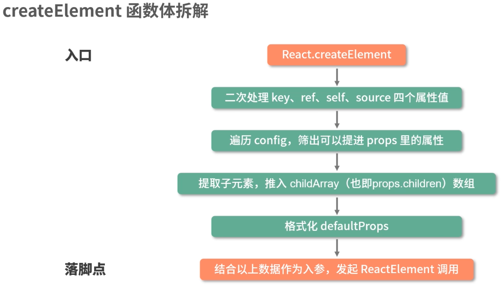

- React.createElement 只是一个参数中介 将处理好的参数最终返回给 ReactElement

### ReactElement

- 将 React.createElement 进行处理组装 变成一个 element 对象
- 返回的 element 对象传递给 React.createElement 方法返回给开发者 此时 返回的是一个 vdom
- ReactDOM.render() 将 vdom 转换成真实 dom

### JSX -> DOM


### 为什么要用 JSX 不用会有什么后果

- 相比 React.createElement(),使用 JSX 可以保留 html 结构清晰层次分明的观感，并且充分具备 js 的能力。

### JSX 背后的功能模块是什么，这个功能模块都做了哪些事情

- JSX -> Babel 编译成 React.createElement -> React.createElement 得到一系列参数传递给 ReactElement -> ReactElement 组装出 Element 也就是 vdom 最终传递给 ReactDOM.render -> ReactDOM.render 函数将 vdom 转换成真实 dom

## 生命周期

### react 15 生命周期

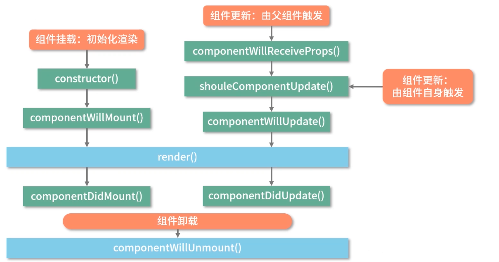

### react 16 生命周期

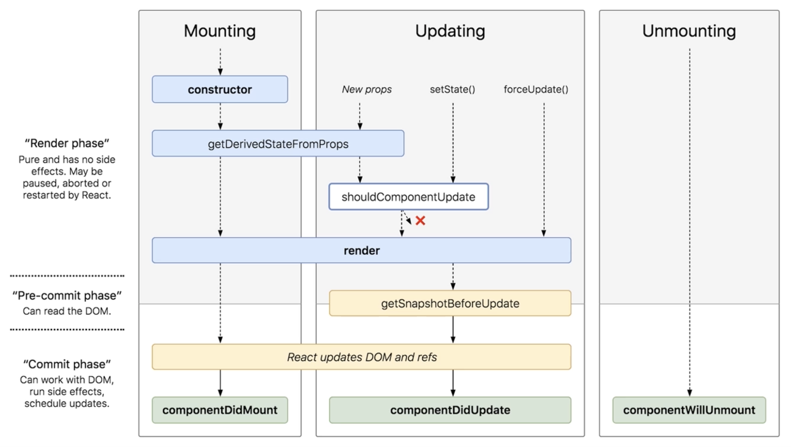

### 生命周期背后的设计思想

- render 是组件的灵魂 生命周期是组件的躯干

### 组件生命周期

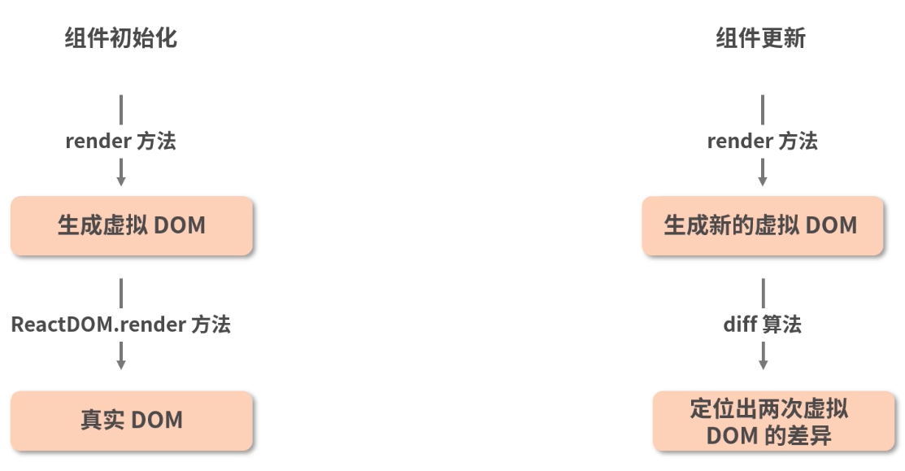

- componentReceiveProps 并不是由 props 的变化触发的 而是由父组件的更新触发的
- react 组件会根据 shouldComponentUpdate 的返回值来决定是否执行该方法之后的生命周期，进而决定是否对组件进行 re-renders（重渲染）

### react 的组件为什么要加 key key 不一致时为什么组件会被删除？

### 15->16 生命周期的变化

- 废弃了 componentWillMount 新增了 getDerivedStateFromProps，
  - getDerivedStateFromProps 不是 componentWillMount 的替代品
  - getDerivedStateFromProp(props 父组件传进来的,state 子组件自身的） 有且只有一个用途 ： 通过改变 props 派生 更新 state
  - getDerivedStateFromProp 需要返回一个对象 以供 react 组件更新
    - 返回的对象针对里面的属性变化做定向更新
  - componentDidUpdate 为什么非死不可 主要还是挡了 fiber 的路
  - getSnapshotBeforeUpdate(prevProps,prevState) 与消失的 componentWillUpdate
- 15 render 方法必须返回单个元素 而 16 允许我们返回元素数组和字符串

## Fiber

- 丝、纤维等意思 是比线程还要纤细的过程 意在对渲染过程实现更加精细的控制
- 从架构角度 Fiber 是 React16 对 React 核心算法的一次重写
- 从编码角度 fiber 是 react 内部所定义的一种数据结构
- Fiber 会使原本的同步渲染过程 变成异步的
- Fiber 会讲一个大的更新任务拆解为许多个小任务
- Fiber 架构的重要特征就是可以被打断的异步渲染模式
- 根据是否可以被打断 react 生命周期 氛围 render （可以被打断，这个阶段用户不可见 就算打断重启 0 感知） 与 commit 阶段（总是同步执行，原因是渲染页面 如果被打断将会带来页面卡顿的视觉效果）

## 兄弟组件通信 EventEmiter

```js
class EventEmiter {
  constructor() {
    // eventMap 用来存储事件和监听函数之间的关系
    this.eventMap = {};
  }
  on(type, handler) {
    // handler 必须是一个函数，如果不是直接报错
    if (!handler instanceof Function) {
      throw new Error('哥 你错了 请传一个函数');
    }
    // 判断 tyoe 事件对应的队列是否存在
    if (!this.eventMap[type]) {
      // 若不存在 新建该队列
      this.eventMap[type] = [];
    }
    this.eventMap[type].push(handler);
  }
  // 别忘了我们前面说过触发时是可以携带数据的，params就是数据的载体
  emit(type, params) {
    // 假设该事件是有订阅的（对应的时间队列存在）
    if (this.eventMap[type]) {
      // 将事件队列里的 handler 一次执行出队
      this.eventMap[type].forEach((handler, index) => {
        // 注意别忘了读取 params
        handler(params);
      });
    }
  }
  off(type, handler) {
    if (this.eventMap(type)) {
      this.eventMap[type].splice(this.eventMap[type].indexOf(handler) >>> 0, 1);
    }
  }
}
// 实例化 myEventEmitter
const myEvent = new myEventEmitter();
// 编写一个简单的 handler
const testHander = function (params) {
  console.log(`test事件被触发了，testHandler接收到的入参是${params}`);
};
// 监听test事件
myEvent.on('test', testHandler);

// 在触发 test 事件的同时， 传入希望testHandler感知的参数
myEvent.emit('test', 'newState');
```

## context api

- 组件树全局通信的方式
- 16.3 之前 并不提倡被使用
- 16.3 开始之后 对 context api 进行了改进 新的 contextapi 具备更强的可用性
- 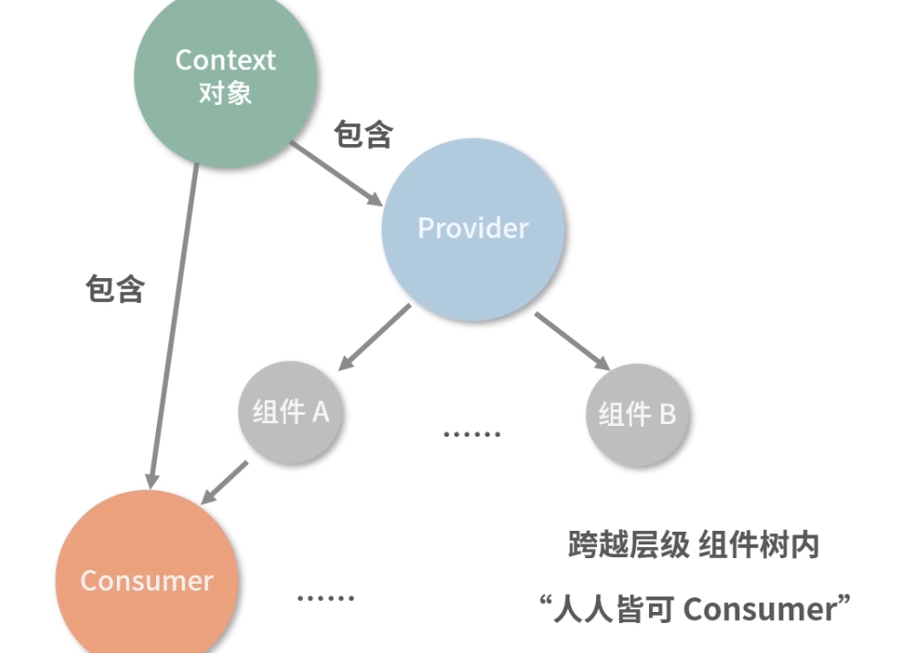

```js
// 三要素
const AppContext = React.createContext()
const {Provider, Consumer} = AppContext

// -------------------------------------

<Provider value={title:this.state.title, content:this.state.content}>
  <Title />
  <Content />
</Provider>

// -------------------------------------

<Consumer>
  {value => <div>{value.title}</div>}
</Consumer>
```

- 新的 context api 解决了什么问题
  - 代码不够优雅 不易分辨出谁是 Provider 谁是 Consumer
  - 如果组件提供的一个 Context 发生了变化，而中间父组件的 shouldComponentUpdate 返回 false，那么使用到该值的后代组件不会进行更新。使用了 Context 的组件则完全失控，所以基本上没有办法能够可靠的更新 context，新的 context 即便组件的 shouldComponentUpdate 返回 false，它仍然可以“穿透”组件继续向后代组件进行传播，进而确保了数据生产者和数据消费者之间的数据的一致性。

## 组件

### 类组件 与 函数组件 的不同

- 类组件需要继承 class 函数组件不需要
- 类组件可以访问生命周期方法 函数组件不能
- 类组件可以获取到实例化后的 this，并基于这个 this 做各种各样的事情，而函数组件不可以
- 类组件中可以定义并维护 state 状态，而函数组件不可以
- 在 hooks 出现之前类组件的能力边界强于函数组件，应该更多去关注两者的不同 进而把不同的特性与不同的场景做连接
- 最大的不同：`函数组件会捕获render内部的状态，这是两类组件最大的不同`
- 是面向对象 与 函数式编程 这两套不同思想的差异
- 函数组件更加契合 react 框架的设计理念

### 类组件

- 是面向对象编程思想的一种表征
- 封装：将一类属性和方法，聚拢到一个 class 里去
- 继承：新的 class 可以通过继承现有的 class 实现对某一类属性和方法的复用
- 类组件 大而全的背后 是不可忽视的学习成本
- 编写的逻辑封装后是和组件粘在一起的这就使得类组件内部的逻辑难以实现拆分和复用。虽然强大绝非万能

## hooks

### hooks 设计动机与工作模式

- hooks 是 react 团队在开发实践中逐渐认知到的一个改进点
- 背后涉及对类组件和函数组件两种组件形式的思考和侧重
- 本质：是一套是函数式组件更强大更灵活的勾子 底层是链表

### useState 为函数组件引入状态

- 早期的函数组件缺乏定义和维护 state 的能力，useState 就是一个为函数组件引入状态的 api

### useEffect 允许函数组件执行副作用操作

- 在一定程度上为函数组件弥补了生命周期的缺失
- 传入回调函数 参数 2 不传 每次 render 都会执行
- 传入回调函数函数切返回值不为函数 仅在挂在阶段执行一次
- 传入回调函数且返回值是一个函数 仅在挂载和卸载阶段执行
  - 返回的函数被称为 `清除函数`
  - 回调函数本身是 A 返回值函数是 B 挂载执行 A 卸载执行 B
- 传入回调函数且返回值是一个函数 参数 2 不传 每一次都触发 且卸载阶段也触发
  - 每次渲染执行 A 卸载执行 B
- 传入回调函数 传入一个非空的数组 数组中有状态变化的时候执行 A

### 为什么需要 react hooks

- 告别难以理解的 class
  - this
  - 生命周期
- 解决业务逻辑难以拆分的问题
- 使状态逻辑服用变得简单可行
- 函数组件从设计思想上来看 更加契合 React 的理念 react 组件是一个接收状态输出 ui 的函数
- hooks 能够帮助我们实现业务逻辑的聚合避免复杂的组件和冗余的代码
- 状态复用：hook 将复杂的问题变简单
  - 复用状态逻辑 靠的是 HOC 高阶组件 和 render Props 常见问题是“嵌套地狱”
- 局限性
  - hooks 暂时还不能完全地为函数组件不起类组件的能力
    - getSnapshotBeforeUpdate
    - componentDidCatch
  - 轻量几乎是函数组件的基因 这可能会使它不能够很好的消化复杂
  - hooks 在使用层面有严格的规则约束

### react hooks 的使用原则

- 只在 react 函数中调用 hook
- 不要再循环、条件或嵌套函数中调用 hook
  - `要确保hooks在每次渲染时都保持同样的执行顺序` hooks 渲染是通过一次便利来定位每个 hooks 内容的。如果前后两次读到的链表在顺序上出现差异，那么渲染的结果自然是不可控的
  - 首次渲染 hooks 调用链路
    - mountState 构建链表并渲染 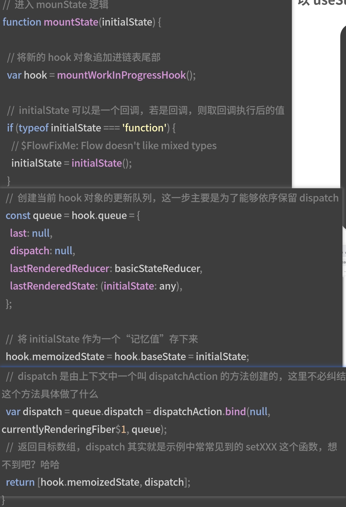
  - 更新渲染 hooks 调用链路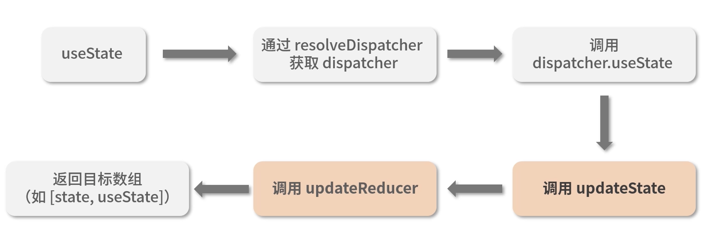
    - updateState 按顺序去遍历之前构建好的链表 取出对应的数据信息进行渲染

## 虚拟 dom

- 走 数据驱动视图 这条基本调路 操作真实 dom 性能损耗大 操作假 dom 不就好了
- 模版引擎 与 虚拟 dom 是递进关系
- 虚拟 dom 是前端开发者们为了追求更好的`研发体验`和`研发效率` 而创造出来的高阶产物，能够在提供更爽更搞笑的研发模式的同时仍然保持一个还不错的性能
- 虚拟 dom 的掠食主要是在于 js 计算的耗时，dom 操作的能耗和 js 计算的能耗根本不在一个量级
- `跨平台问题`
- 批量更新：在通用虚拟 dom 库里是由 batch 函数来处理的
  - batch 的作用是缓冲每次生成的补丁集 进行集中化的 dom 批量更新

## Reconclier

### react 15 栈调和（stack Reconclier）过程

- 通过如 ReactDOM 等类库使之与真实的 dom 同步 这一过程叫做`协调（调和）`
- 调和是 `使一致` 的过程
- Diff 是 `找不同` 的过程
- Diff 策略的设计思想
  - 若两个组件属于同一个类型 他们将拥有相同的 dom 输型结构
  - 处于同一层级的一组子节点 可用通过设置 key 作为唯一标识从而维持各个节点在不同渲染过程中的稳定性
- Diff 逻辑的拆分与解读
  - diff 算法性能突破的关键点在于 `分层对比`
  - 类型一致的节点才有继续 diff 的必要性
  - key 属性的设置 可以帮我们尽可能重用同一层及内的节点

### setState 工作流

- setState -> shouldComponentUpdate -> componentWillUpdate -> render -> componentDidUpdate
- 在 setTimeout、setInterval 等函数中包括在 dom 原生事件中，它都表现为同步
- 异步的动机和原理 批量更新的艺术 （nextTick、event loop ）
  - 每来一个 setState 就把它塞进一个队列里攒起来等时机成熟 再把攒起来等 state 结果做合并 最后只针对最新的 state 值走一次更新流程
- setTimeout 里的 setState 是同步的原因是 setTimeout 帮助 setState 逃脱了 react 的管控 在 react 管控下的 setState 一定是异步的
  - 在 reactMount.js 组件初始化的时候调用了 batchedUpdates 因为组件初始化的生命周期里面会使用 setState
  - 在 reactEventListener.js 事件监听里面也调用了 batchedUpdates 因为事件里面也可能会调用 setState
  - 在事件执行开始时 isBatchUpdates 直接为 true 也就是锁上了 setState 的执行只能是异步的 而 setTimeout 里面本身是异步的 isBatchUpdates 无法约束 setTimeout 里面的代码 所以 setState 同步执行了
    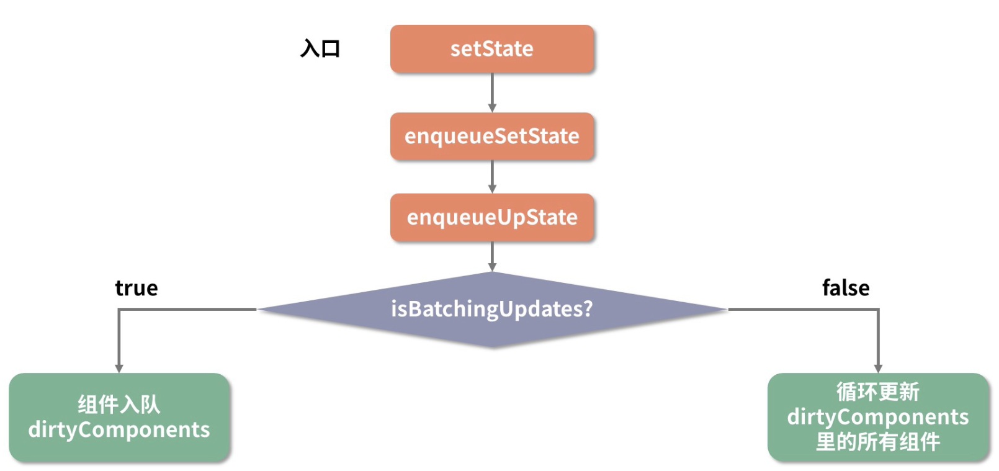

```js
// setState
ReactComponent.protytype.setState = function (partialState, callback) {
  this.updater.enqueueSetState(this, partialState);
  if (callback) {
    this.updater.enqueueCallback(this, callback, 'setState');
  }
};
```

```js
  // enqueueSetState 将新的state装入状态队列里，使用enqueueUpdate处理即将要更新的组件实例
  enqueueSetState:function(publicInstance, partialState) {
  // 根据this拿到对应的组件实例
  var internalInstance = getInternalInstanceReadyForUpdate(publicInstance,'setState')
  // 这个 queue 对应的就是一个组件实例的state 数组
  var queue = internalInstance._pendingStateQueue || (internalInstance._pendingStateQueue = [])
  queue.push(partialState)
  // enqueueSetState 用来处理当前的组件实例
  enqueueUpdate(internalInstance)
 }
```

```js
// enqueueUpdate batchingStrategy react内部专门用来管控批量更新的对象
function enqueueUpdate(component) {
  ensureInjected();
  // 注意这一句是问题的关键，isBatchingUpdates标识着当前是否处于批量创建/更新组件的阶段
  if (!batchingStrategy.isBatchingUpdates) {
    // 若当前没有处于批量创建/更新组件的阶段，则立即更新组件
    batchingStrategy.batchedUpdates(enqueueUpdate, component);
    return;
  }
  // 否则，先把组件塞入 dirtyComponents 队列里，让它“再等等”
  dirtyComponents.push(component);
  if (component._updateBatchNumber == null) {
    component._updateBatchNumber = updateBatchNumber + 1;
  }
}
```

```js
  // batchingStrategy源码 锁 当锁上时代表此时正在进行批量更新 其他任务都必须进入dirtyComponent里等待 react面对大量状态仍然能够进行有序处理的更新机制
  var ReactDefaultBatchingStrategy = {
    // 全局唯一的锁标识
    isBatchingUpdates:false
    // 发起更新动作的方法
    batchedUpdates:function(callback,a,b,c,d,e){
      // 缓存锁变量
      var alreadyBatchingStrategy = ReactDefaultBatchingStrategy.isBatchingUpdates
      // 把锁锁上
      ReactDefaultBatchingStrategy.isBatchingUpdates = true

      if(alreadyBtachingStrategy) {
        callback(a,b,c,d,e)
      } else {
        // 启动事务， 将callback放进事务里执行
        transaction.perform(callback,null,a,b,c,d,e)
      }
    }
  }
```

### transaction（事务） 机制

- 在 react 源码中分布的非常广泛
- 出现了 initialize、perform、close、closeAll 或者 notifyAll 这样的方法名 很可能就在一个 transaction 机制中
- transaction 在 react 源码中表现为一个核心类
- transaction 是创建一个黑盒，该黑盒能够封装任何的方法
- 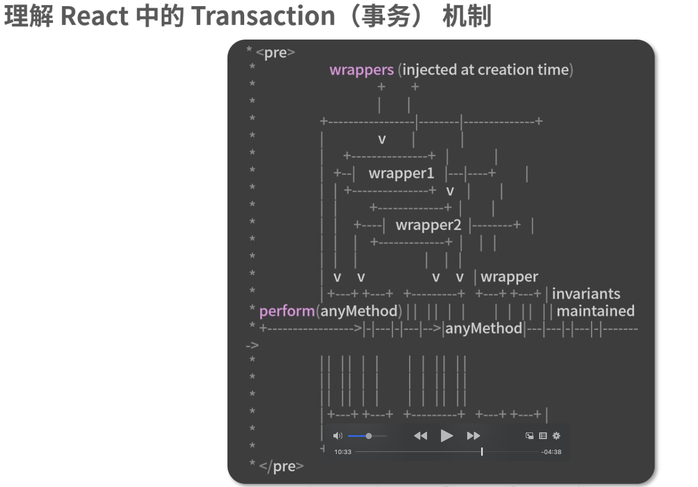

### ReactDefaultBatchingStrategy 批量更新策略事务

- 有两个 wrapper（包装）

```js
var RESET_BATCHED_UPDATES = {
  initialize: emptyFunction,
  close: function () {
    ReactDefaultBatchingStrategy.isBatchingUpdates = false;
  },
};
var FLUSH_BATCHED_UPDATES = {
  initialize: emptyFunction,
  close: ReactUpdates.flushBatchedUpdates.bind(ReactUpdates),
};
```

- 在 callback 执行完之后 RESET_BATCHED_UPDATES 将 isBatchingUpdates 设置为 false ， FLUSH_BATCHED_UPDATES 将执行 flushBatchedUpdates 然后里面会循环所有 dirtyComponent，然后逐一执行 updateComponet 执行所有的生命周期方法 实现组件的更新

### 对 react 的定位

- react 是用 js 构建`快速相应`的大型 web 应用程序的首选方式。它在 facebook 和 Instagram 上表现优秀

### Stack Reconciler 到底有着怎样根深蒂固的局限性（卡顿）

- 如果渲染县城和 js 县城同时工作那么渲染的结果将是难以预测的，`js线程和渲染线程必须是互斥的，其中一个线程执行的时候另一个线程只能挂起等待`，具有相似特征的还有事件线程浏览器 eventloop 机制决定了事件任务是由一个异步队列来维持的`当事件被触发时不会立刻执行事件任务，而是由事件线程把它添加到任务队列的末尾，等待js同步代码执行完毕后在空闲的时间里执行出队`
- 主要问题：js 对朱线程的超时占用问题
- 栈调和机制下的 diff 算法，其实是树的深度优先遍历的过程 子节点的所有子节点都比较完毕之后在比较兄弟节点 这个过程是同步的 不可以被打算 所以栈调和需要的调和事件会很长 意味着 js 会长时间霸占主线程进而导致 渲染卡顿/卡死、交互长时间无响应等问题

### Fiber 是如何解决问题的

- 丝、纤维等意思 是比线程还要纤细的过程 意在对渲染过程实现更加精细的控制
- 从架构角度 Fiber 是 React16 对 React 核心算法的一次重写
- 从编码角度 fiber 是 react 内部所定义的一种数据结构
- 从工作流角度来看，Fiber 节点保存了组件需要更新的状态和副作用
- 应用目的：实现`增量渲染`:把一个渲染任务分成多个渲染任务 然后分到多个帧里面进行渲染，目的是为了实现任务的可中断、可恢复，并给不同的任务赋予不同的优先级，最终达成更加丝滑的用户体验
- 可中断、可恢复、优先级
  - 15 Reconciler 找不同 -> Renderer 渲染不同
  - 16 scheduler 调度更新的优先级 -> Reconciler 找不同 -> Renderer 渲染不同
  - 当任务 A 在执行的之后 进来一个优先级更高的任务 B A 会被中断 开始执行 B 当 B 执行好之后 下次执行任务会重新执行 A 的渲染任务

### Fiber 架构对生命周期的影响

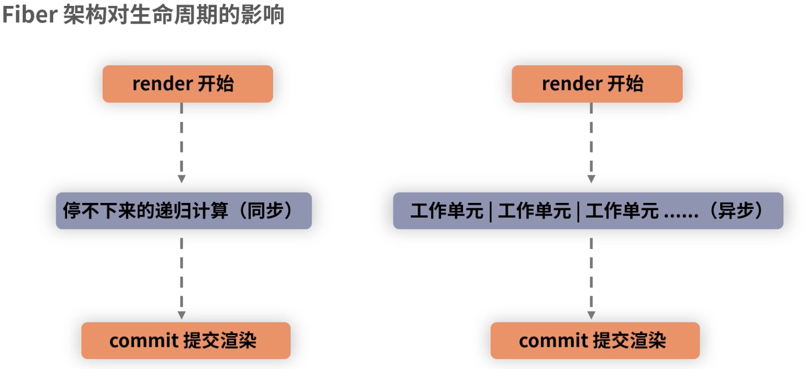

- render 的工作单元有着不同的优先级 react 可以根据优先级的高低去实现工作单元的打断和恢复

### ReactDOM.render 调用栈

- ReactDOM.render 的函数体中调用了 legacyRenderSubtreeIntoContainer

```js
return legacyRenderSubtreeIntoContainer(
  null,
  element,
  container,
  false,
  callback,
);
```

- 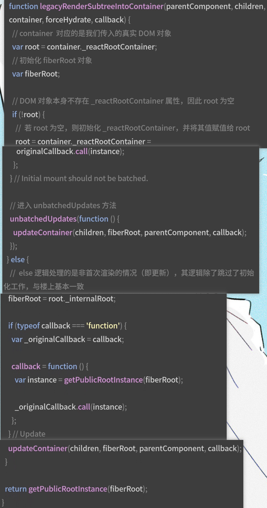
- 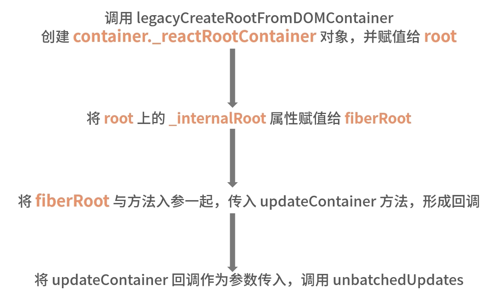
- fiberRoot 本质你一个 FiberRootNode 对象 包含一个 current 属性
- current 是 FiberNode 正式 fiber 节点对应的对象类型
- fiberRoot 是 真实 dom 的节点， rootFiber 作为虚拟 dom 的根节点
- updateContainer
  - 请求当前 Fiber 节点的 lane（优先级）
  - 结合 lane（优先级）创建当前 Fiber 节点的 update 对象并将其入队
  - scheduleUpdateOnFiber 方法 调度当前节点 rootFiber
- reactDom.render 发起对首次渲染链路中，这些意义都不大，因为这个渲染过程是同步的 scheduleUpdateOnFiber 里面调用了 perfoemSyncWorkOnRoot 方法
- perfoemSyncWorkOnRoot 是 render 阶段的起点 render 阶段的任务就是完成 Fiber 树的构建 他是整个渲染链路中最核心的一环

### react 的启动方式

- legacy 模式：`ReactDOM.render(<App />, rootNode)` 同步渲染链路
  - 仍然是一个深度优先搜索的过程 在这个过程中 beginWork 将创建新的 Fiber 节点
  - 而 completeWork 则负责将 Fiber 节点映射为 DOM 节点
- blocking 模式: `ReactDOM.createBlockingRoot(rootNode).render(<App />)`
- concurrent 模式：`ReactDOM.createRoot(rootNode).render(<App />)` 异步渲染链路

### react 如何知道当前的 lane 优先级

- mode 属性 决定着这个工作流是一气呵成 （同步）的还是分片执行（异步）的

```js
function requestUpdateLane(fiber) {
  // 获取 mode 属性
  var mode = fiber.mode;
  // 结合 mode 属性判断当前的
  if ((mode & BlockingMode) === NoMode) {
    return SyncLane;
  } else if ((mode & ConcurrentMode) === NoMode) {
    return getCurrentPriorityLevel() === ImmediatePriority$1
      ? SyncLane
      : SyncBatchedLane;
  }

  // ...

  return lane;
}
```

### Fiber 一定是异步渲染吗

- Fiber 架构的设计确实是为了 Concurrent 而存在
- Fiber 架构在 React 中并不能够和异步渲染画 严格的等号
- 是一种同时兼容了同步渲染与异步渲染的设计

### workInProgress 节点创建

- performSyncWorkOnRoot -> renderRootSync -> prepareFreshStack 重制一个新的堆栈环境 -> createWorkInProgress -> createFiber 的返回值 是 workInProgress
- workInProgress 的 alternate 将只想 current
- current 的 alternate 将反过来指向 workInProgress
- 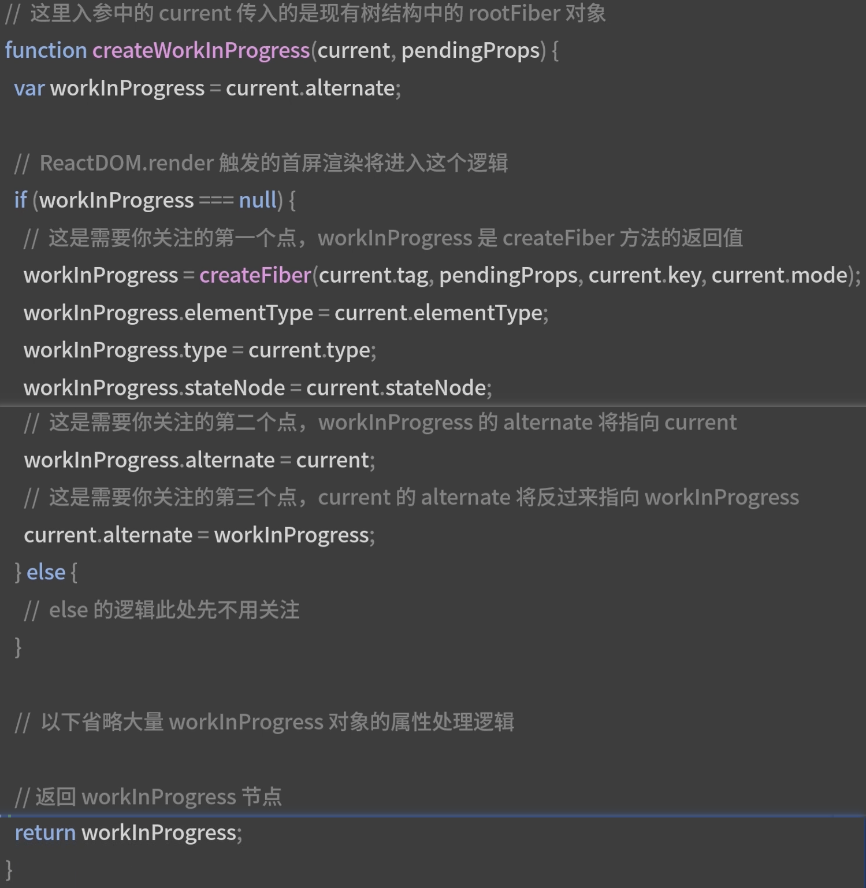
- createFiber 产生一个 FiberNode 实例 也就是 fiber 节点的对象类型
- workInProgress 节点其实就是 current 节点（即 rootFiber)的副本
- fiberRoot 对象（FiberRootNode 实例）-> current -> rootFiber 对象（FiberNode 实例）<—> alternte <-> rootFiber 对象（FiberNode 实例）-> APP（FiberNode 实例）
- workLoopSync
  - 通过 while 循环反复判断 worlInProgress 是否为空
  - 触发对 beginWork 的调用 进而实现对新 Fiber 节点的创建

```js
function workLoopSync() {
  // 若 workInProgress不为空
  while (workInProgress !== null) {
    // 针对他执行 performUnitOfWork方法
    performUnitOfWork(workInProgress);
  }
}
```

### beginWork

- beginWork 的入参是一对用 alternate 连接起来的 workInProgress 和 current 节点
- beginWork 的核心逻辑是根据 fiber 节点（workInProgress）的 tag 属性的不同调用不同的节点创建函数
- `"update+类型名"`的方法很多 但是逻辑都比较相似 通过调用 reconcileChildren 方法 生成当前节点的子节点

```js
function reconcileChildren(current, workInProgress, nextChildren, renderLanes) {
  // 判断current 是否为null
  if (current === null) {
    // 若current为null， 则进入mountChildrenFibers 的逻辑
    workInProgress.child = mountChildFibers(
      workInProgress,
      null,
      nextChildren,
      renderLanes,
    );
  } else {
    // 若current不为null， 则进入reconcileChildFibers的逻辑
    workInProgress.child = reconcileChildrenFiers(
      workInProgress,
      current.child,
      nextChildren,
      renderLanes,
    );
  }
}
```

```js
var recondileChildFibers = ChildReconciler(true);
var mountChildFibers = ChildReconciler(false);
```

### ChildReconciler

- recondileChildFibers 和 mountChildFibers 的不同，在于对副作用的处理不同

```js
function placeSingleChild(newFiber) {
  if (shouldTrackSideEffects && newFiber.alternate === null) {
    newFIber.flags = Placement;
  }
  return newFiber;
}
```

- 给 fiber 节点打上一个 flags（effectTag）的标记
- Placement 的意思是需要新增 dom 节点
- 副作用的定义：数据获取、订阅、或者修改 DOM 等动作
- ChildReconciler 中定义了大量如 placeXXX、deleteXXX、updateXXX、reconcileXXX 等这样的函数，这些函数覆盖了对 Fiber 节点的创建、增加、删除、修改等动作，将直接或间接地被 reconcileChildFibers 所调用
- ChildReconnciler 的返回值是一个名为 ireconcileChildFibers 的函数，这个函数是一个逻辑分发起，它将根据入参的不同，执行不同 Fiber 节点操作，最终返回不同的目标 Fiber 节点

### Fiber 节点创建过程


### Fiber 节点间是如何连接的呢

- child 代表子节点
- return 代表父节点
- sibling 代表当前节点的第一个兄弟节点

### completeWork

- 调用链路：performUnitOfWork -> completeUnitOfWork -> completeWork
- 内部是三个关键动作
  - 创建 DOM 节点 createInstance
  - 将 dom 节点插入到 dom 树 appendAllChildren
  - 为 dom 节点设置属性 FinalizeInitialChildren
- completeWork 针对渲染 h1 标签 - hostComponent 也就是原声 dom 类型
  - getHostContext() 为 dom 节点创建做准备
  - createInstance() 创建 dom 节点
  - appendAllChildren() 把创建好的 dom 节点挂载到 dom 树上去
  - FinalizeInitialChildren 为 dom 节点设置属性
- complete 的执行是严格自底向上的 子节点的兄弟节点总是先于父节点执行

```js
function performUnitOfWork(unitOfWork) {
  // ...
  // 获取入参节点对应的current节点
  var current = unitOfWork.alternate;

  var next;

  if (xxx) {
    //...
    // 创建当前节点的节点
    next = beginWork$1(current, unitOfWork, subtreeRenderLanes);
  }
  // ...

  if (next === null) {
    // 调用completeUnitOfWork
    completeUnitOfWork(unitOfWork);
  } else {
    // 将当前节点更新为新创建出的Fiber节点
    workInProgress = next;
  }
  // ...
}
```

### completeUnitOfWork

- 开启收集 EffectList（副作用链） 的“大循环”
- 做了三件事
  - 针对传入的当前机诶单 调用 completeWork
  - 将当前节点的副作用链插入到其父节点对应的副作用链中
  - 以当前节点为起点，循环遍历其兄弟节点及其父节点

### render 阶段的工作目标是什么呢

- 找出界面中需要处理的更新

### EffectList 副作用链

- 价值：让 commit 只负责实现更新，而不负责寻找更新 坐享其成直接拿到 render 阶段的工作成功
- 副作用链可以理解为`render阶段的工作集合`
- 数据结构为链表 由 fiber 节点组成
  - 这些 fiber 节点需要满足两个特性
    - 都是当前 fiber 节点的后代节点
    - 都有待处理的副作用
- fiber 节点的 effectList 代表其子节点所要进行的更新，completeWork 是自底向上执行的 所以 fiberRoot 节点的 effectList 就是本次 render 得出的所有更新
- 设计与实现
  - EffectList 在 fiber 节点中是通过 firstEffect 和 lastEffect 来维护的
  - 为 firstEffect、lastEffect 各赋值一个引用 completedWork（正在被执行 completeWork 相关逻辑的节点）
- 创建过程
  - App FiberNode 的 flags（effectTag）属性为 3 大于 performedWork，因此会进入 effectList 的创建逻辑
  - 创建 effectList 时，并不是为当前 Fiber 节点创建，而是为它的父节点创建 App 节点的父节点是 rootFiber，rootFiber 的 effectList 此时为空
  - rootFiber 的 firstEffect 和 lastEffect 指针都会指向 App 节点、App 节点由此成为 effectList 中的唯一一个 FiberNode

## commit 阶段

- 会在 performSyncWorkOnRoot 中被调用 commitRoot(root)
- root 不是 rootFiber 而是 fiberRoot 实例 fiberRoot 的 current 指向 rootFIber 因此可以拿到 effectList
- 三个阶段
  - before mutation 阶段
    - 这个节点 Dom 节点还没有被渲染到界面上去
    - 过程中会触发 getSnapshotBeforeUpdate 、 useEffect
  - mutation 负责 dom 节点的渲染 渲染过程中会遍历 effectList 根据 flags 的不同进行不同的 dom 操作
  - layout 处理 dom 渲染完毕之后的收尾逻辑
    - componentDidMount、componentDidUpdate、useLayoutEffect
    - fiberRoot 的 current 指针指向 WorkInProgress Fiber 树

### 函数 名词 阶段性理解测验

- performSyncWorkOnRoot
  - performSyncWorkOnRoot 是 render 阶段的起点 render 阶段的任务就是完成 Fiber 树的构建 他是整个渲染链路中最核心的一环
- workLoopSync
  - while 循环判断 workInProgress 是否为空， 如果为空 触发对 beignWork 的调用 进而实现对新 fiber 节点的创建
  - 循环创建 fiber 节点 构建 fiber 树的过程是由 workLoopSync 完成的
- performUnitOfWork
  - workLoopSync 里面如果判断 workInProgress 为空就会执行 performUnitOfWork
  - performUnitOfWork -> completeUnitOfWork -> completeWork
- beginWork
  - 探寻阶段
  - 核心逻辑是根据 fiber 节点（workInProgress）的 tag 属性的不同调用不同的节点创建函数
  - 根据 ReactElement 对象创建所有的 fiber 节点 最终构造出 fiber 树形结构（设置 return 和 sibling 指针）
  - 设置 fiber.flags(二进制形式变量，用来标记 fiber 节点的增删改状态等待 completeWork 阶段处理)
  - 设置 fiber.stateNode 局部状态 ( 如 Class 类型节点：fiber.stateNode = newClass() )
  - updateXXX 函数
- completeWork
  - 回溯阶段
  - 给 fiber 节点创建 dom 实例 将 fiber.stateNode 指向这个 dom 实例
  - 将当前节点的副作用队列 添加到父节点的副作用队列之后 给父节点更新 firstEffect 和 lastEffect 指针
  - 识别 beginWork 阶段设置的 fiber.flags 判断当前 fiber 是否有副作用如果有将当前 fiber 加到父节点的副作用队列中，等待 commit 阶段处理
  - `current树与workInProgress树可以对标“双缓冲”模式下的两套缓冲数据：当current树呈现在用户眼前时，所有的更新都会由workInProgress树来承接WorkInProgress树将会在用户看不到的地方（内存里）悄悄的完成所有改变`
- completeUnitOfWork
  - 处理 beginWork 阶段已经生成的 fiber 节点

### 双缓冲模式

- 主要利好则是能够帮我们较大限度地实现 Fiber 节点的复用，从而减少性能方面的开销
- 初始化的时候只有 current 第一次更新 生成 workInProgress 树 替换 current 树 第二次更新 全部节点复用

### 更新链路要素拆解

- 挂载可以理解为一种特殊的更新 ReactDOM.render 和 setState、useState 也是一种触发更新的姿势 都会创建 update 对象进入同一种更新工作流
- update 对象的创建
  - dispatchAction -> performSyncWorkOnRoot(render 阶段) -> commit 阶段
  - dispatchAction 里面完成 update 对象的创建
- 从 update 对象到 scheduleUpdateOnFiber
  - enqueueUpdate 之前：创建 update
  - enqueueUpdate 调用：将 update 入队
  - udatreQueue 的内容会成为 render 阶段计算 Fiber 节点的新 state 的依据
  - scheduleUpdateOnFiber 调度 update
- scheduleUpdateOnFiber
  - markUpdateLaneFromFiberToRoot
  - 通过 lane === syncLane 判断同步优先级 同步执行 performSyncWorkOnRoot 异步执行 ensureRootIsScheduled
  - ensureRootIsScheduled
    - performSyncWorkOnRoot 同步更新的 render 入口 被 scheduleSyncCallback 调用
    - performConcurrentWorkOnRoot 异步更新的 render 入口 被 scheduleCallback 调用
    - scheduleSyncCallback、scheduleCallback 都是通过调度 unstable_scheduleCallback 来发起调度的

## 调度

### fiber 异步渲染的核心特征 -> concurrent 模式

- “事件切片” 与 “优先级调度”
- 浏览器的刷新频率为 60hz 也就是每 16.6ms 就会刷新一次 超长的 Task 显然会挤占渲染线程的工作时间，引起“掉帧”

### 时间切片是如何实现的？

- 异步渲染模式下 循环创建 fiber 节点 构建 fiber 树的过程是由 workLoopConcurrent 完成的

```js
function workLoopConcurrent() {
  // perform work until Scheduler asks us to yield
  while (workInProgress !== null && !shouldYield()) {
    performUnitOfWork(workInProgress);
  }
}
```

- 当 shouldYield()调用返回为 true ， 就说明当前需要对主线程进行让出了， 此时 while 循环的判断条件整体为 false， while 循环将不再继续

```js
// shouldYield = unstable_shouldYield
exports.unstable_shouldYield = function () {
  return exports.unstable_now() >= deadline;
};
```

- deadline 当前时间切片的倒计事件

```js
var perfirnWorkUnitDeadline = function () {
  if (scheduledHostCallback !== null) {
    var currentTime = exports.unstable_now();
    deadline = currentTime + yieldInterval;
    var hasTimeRemaining = true;
    // ...
  }
};
```

- react 会根据浏览器的帧率计算出时间切片的大小 并结合当前时间 计算出每个切片的倒计时间 workLoopConcurrent 中会调用 shouldYield 来询问当前时间切片是否到期 若已到期则结束循环 让出主线程的控制权

### 优先级调度是如何实现的

- 通过 unstable_scheduleCallback 来发起调度的
- 结合任务的优先级信息为其执行不同的调度逻辑
- unstable_scheduleCallback 的主要工作 针对当前任务创建一个 task 然后结合 startTime 信息 将这个 task 推入 timerQueue 或 taskQueue， 最后根据 timerQueue 或 taskQueue 的执行情况 执行 延时任务或即时任务
  - startTime 任务的开始时间
  - expirationTime 越小任务的优先级就越高
  - timerQueue 一个以 startTime 为排序依据的小顶堆，它存储的是 startTime 大于当前时间（也就是待执行的任务）的任务
  - taskQueue 一个以 expirationTime 为排序依据的小顶堆 它存储的是 startTime 小于当前时间（也就是已过期）的任务
- 小顶堆
  - 对一颗完全二叉树来说 它每个结点的结点值都不大于其左右孩子的结点值 这样的完全二叉树就叫小顶堆
  - 无论我们怎么删除小顶堆的元素 其根节点一定是所有元素中值最小的一个节点
- 小顶堆的堆顶任务一定是整个 timerQueue 堆结构里 startTime 最小的任务 也就是需要最早被执行的未过期任务 那么 unstable_scheduleCallback 会通过 requestHostTimeout 对当前任务发起一个延时调用（handleTimeout） 并不会直接调度执行当前任务
- flushWork 中将调用 workLoop workLoop 会逐一执行 taskQueue 中的任务 直到调度过程被暂停（时间片用尽）或任务全部被清空
- react 发起 task 调度的姿势有两个 setTimeout messageChannel，requestHostCallback 发起的“即时任务”最早也要等到下一次时间循环才能够执行
- 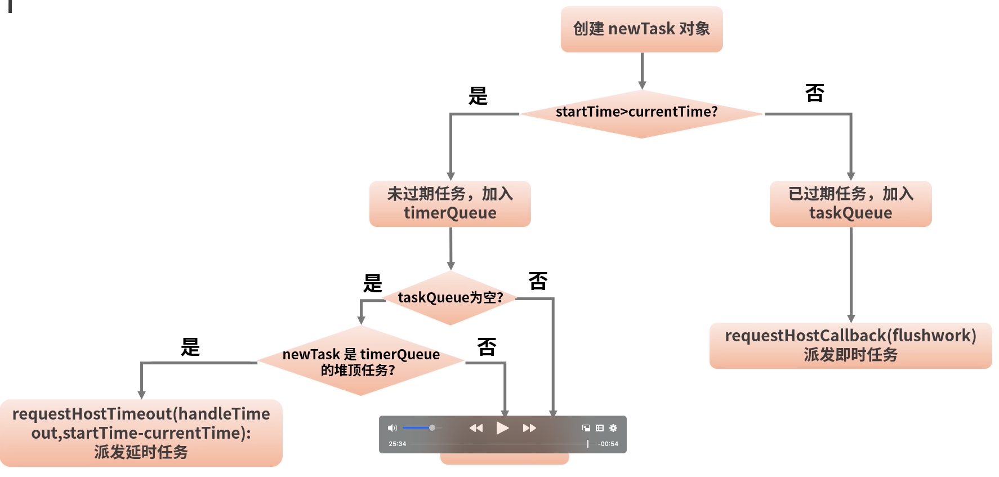

## 事件系统

### 回顾原生 DOM 下都事件流

- 一个页面往往会被绑定许许多多的事件而页面接收事件的顺序就是事件流
- 一个时间传播过程要经过以下三个阶段
  - 事件捕获阶段
  - 目标阶段
  - 事件冒泡阶段
- 事件委托：把多个子元素的同一类型的监听逻辑 合并到父元素上通过一个监听函数来管理的行为

### react 事件流

- 当事件在具体的 DOM 节点上被触发后最终都会冒泡到 document 上，document 上所绑定的统一事件处理程序会将事件分发到具体的组件实例，在分发事件之前 react 首先会对事件进行包装，把原生 dom 事件包装成合成事件
- react 合成事件
  - 在底层哦平了不同浏览器的差异
  - 在上层向开发者暴露统一的、稳定的、与 DOM 原生事件相同的事件接口
  - e.nativeEvent 可以获取到原生事件
- 事件绑定
  - 在挂在阶段完成 completeWork 在给 dom 节点设置属性的时候
  - 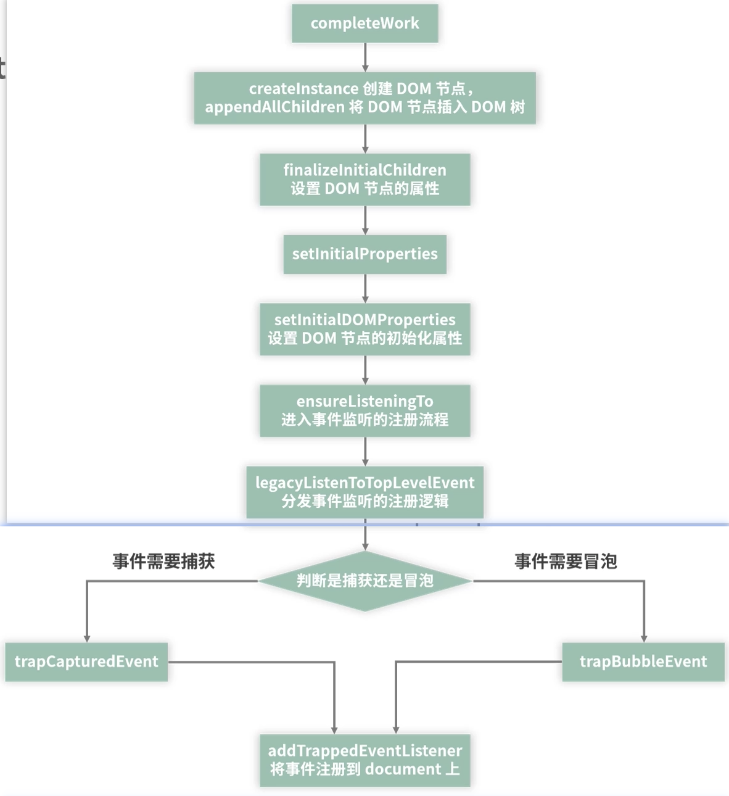
  - legacyListenToTopLevelEvent 会判断已经注册过的事件执行跳过，即便我们在 react 项目中多次调用了对同一个事件的监听，也只会在 document 上触发一次注册
  - 为什么针对同一个事件，即便可能会存在多个回调 document 也只需要注册一次监听？因为 react 最终注册到 document 上的并不是某一个 dom 节点上对应的具体回调逻辑而是一个统一的事件分发函数
- 事件触发
  - 本质 是对 dispatchEvent 函数的调用
  - 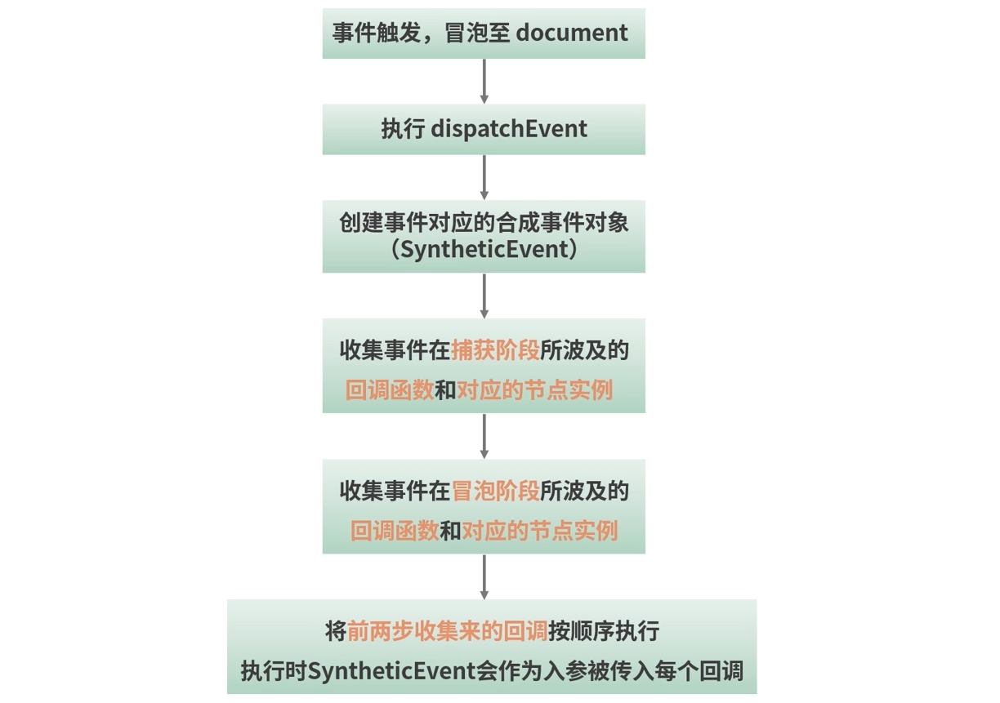
- traverseTwoPhase 里面是事件收集过程
  - 循环收集 tag === HostComponent 的节点 进入 path 数组 因为浏览器只认识 DOM 节点，浏览器事件也只会在 DOM 节点之间传播 path 数组中子节点在前，祖先节点在后
  - 模拟事件在捕获阶段的传播顺序，收集捕获阶段相关的节点实例与回调函数 从后往前遍历 path 数组 模拟事件的捕获顺序 其实就是从父节点往下遍历子节点 直至遍历到目标节点的过程 这个遍历顺序和事件在捕获阶段的传播顺序是一致的 实例收集进 \_dispatchInstances 回调收集进\_dispatchListeners
  - 模拟事件在冒泡阶段的传播顺序，收集冒泡阶段相关的节点实例与回调函数 traverseTwoPhase 会从后往前遍历 path 数组 模拟事件的冒泡顺序 收集事件在捕获阶段对应的回调与实例 实例收集进 \_dispatchInstances 回调收集进\_dispatchListeners

### React 事件系统的设计动机是什么

- 在底层抹平了不同浏览器的差异 在上层面向开发者暴露 统一的、稳定的、与 DOM 原生事件相同的事件接口
- react 自研事件系统使 react 牢牢把握住了事件处理的主动权
- react 的事件系统虽然基于事件委托但是无法从性能入手解释设计动机
- 事件委托的主要作用应该是帮助 react 实现了对所有事件的中心化管控

## redux 数据流框架

- 是 js 状态容器，它提供可预测的状态管理，（原生 js、vue、react 都可以用），存放公共数据的仓库

  - stroe 单一数据源 只读
  - action 是对变化的描述
  - reducer 是一个函数 负责对新的变化进行分发和处理
  - `redux实现组件间通信思路：在redux对整个工作过程中，数据流是严格单向的 是的数据能够自由而有序的在任意组件之间穿梭`
  - store -> view -> action -> reducer -> store
  - redux 工作流

    - createStore 完成 store 对象的创建
    - 基于 reducer 去创建 store 的时候 就是给 store 设置更新规则

    ```js
    import { createStore } from 'redux'

    const store = createStore(
      reducer,
      initial_state, // 初始状态内容
      applyMiddleware(middleware1, middleware2,...) //指定中间件
    )
    ```

    - reducer 的作用是将新的 state 返回给 store

    ```js
    const reducer = (state, action) => {
      // 此处是各种样的state处理逻辑
      return new_state;
    };
    ```

    - action 的作用是通知 reducer 让改变发生

    ```js
    const action = {
      type: 'ADD_ITEM',
      payload: '<li>text</li>',
    };
    ```

### redux 设计思想

- 可以认为 redux 是 flux 的一种实现形式
- Flux 并不是一个具体框架 它是一套由 facebook 技术团队提出的应用架构这套架构约束的是`应用处理数据的模式`
- 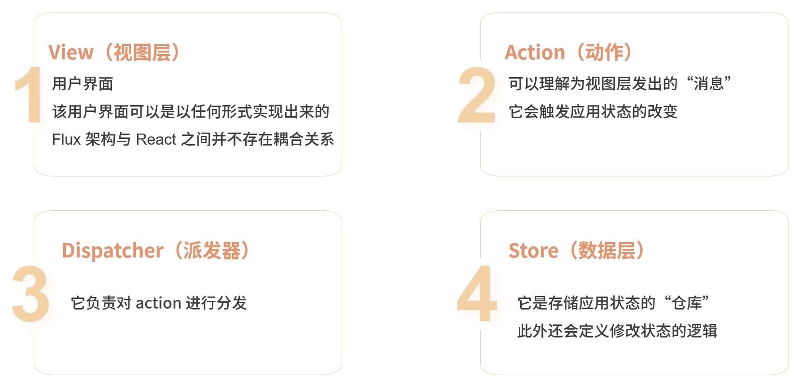
- Flux 的核心特征是单向数据流 要想完全了解单向数据流的好处 我们需要先了解`双向数据流带来了什么问题`
- mvc 模式就是双向数据流的典型代表
- flux 最核心的地方在于严格的单向数据流 在单向数据流下 状态的变化是🉑️预测的

### redux 关键要素与工作流

- 关键要素
  - Store 单一的数据源 且是只读
  - Action 是动作的意思 他是对变化的描述
  - Reducer 它负责对变化进行分发和处理 最终将新的数据返回给 Store
- 工作流 view -> action -> reducer -> store -> view
- redux 是如何工作的
  - applyMiddleware.js 中间件模块
  - bindActionCreators.js 用于将传入的 actionCreators 与 dispatch 方法结合成一个新的方法
  - combineReducers.js 用于将多个 reducer 合并
  - compose.js 用于把接收到的函数从右向左进行组合
  - createStore.js 是我们在使用 redux 时最先调用的方法 他是整个流程的入口 也是 redux 中最核心的 API

### createStore

- 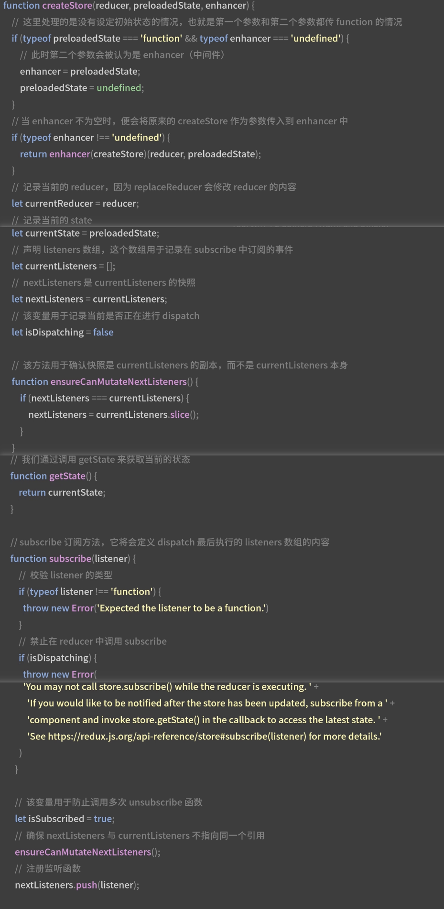
- 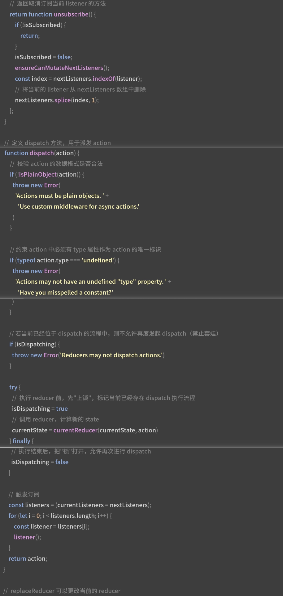
- 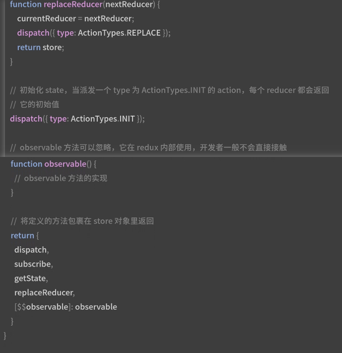
- 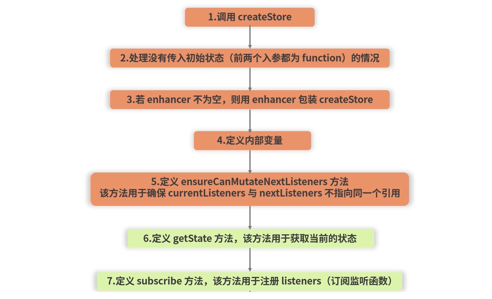

### dispatch

- redux 首先会将 isDispatching 变量置为 true 待 reducer 执行完毕后 再将 isDispatching 变量置为 false
- 用 isDispatching 将 dispatch 的过程锁起来是为了避免开发者在 reducer 中手动调用 dispatch

### subscrible 如何与 redux 主流程相结合

- store 对象创建成功后 通过调用 store.subscribe 来注册监听函数 当 dispatch action 发生时 redux 会在 reducer 执行完毕后 将 listeners 数组中的舰艇函数逐个执行

### 为什么有 nextListeners 和 currentListeners

- 因为 nextListeners 在执行过程中有可能发生变化 但是 for 循环不会感知 会导致元素的索引发生变化 导致函数错误 因此为了保证 for 循环的稳定性 将原始的 nextListeners 保存成不可变 currentListeners

### 中间件的工作模式

- 中间件的引入 会为 redux 工作流带来什么样的改变呢
  - redux-thunk 中间件 实现 redux 引入异步数据流
- action -> middleware -> dispatch -> reducer -> nextState
- 执行时机 action 被分发之后、reducer 触发之前
- 执行前提 即 applyMiddleware 将会对 dispatch 函数进行改写 使得 dispatch 在触发 reducer 之间 会首先执行对 redux 中间件的链式调用

### thunk 中间件到底做了什么

```js
// createThunkMiddleware 用于创建thunk
function createThunkMiddleware(extraArgument) {
  // 返回值是一个 thunk 它是一个函数
  return ({ dispatch, getState }) =>
    (next) =>
    (action) => {
      // thunk 若感知到action是一个函数，就会执行action
      if (typeof action === 'function') {
        return action(dispatch, getState, extraArgument);
      }
      // 若 action不是一个函数 则不处理 直接放过
      return next(action);
    };
}

const thunk = createThunkMiddleware();
thunk.withExtraArgument = createThunkMiddleware;

export default thunk;
```

### applyMiddleware

- applyMiddleware 是 enhancer 的一种 而 enhancer 的意思是“增强器” 它增强的正式 createStore 的能力
- applyMiddleware 是如何与 createStore 配合工作的
  - applyMiddleware 返回一个接收 createStore 为入参的函数 这个函数将会作为参数传给 createStore createStore 发现 enhancer 之后会对 echancer 进行调用
- dispatch 函数是如何被改写的
  - redux 中间件都是高阶函数 会返回一个接收另一个函数为参数的函数 因此有内层函数 和外层函数
  - 外层函数主要作用是获取 dispatch 、getState 这两个 API 而真正的中间件逻辑是在内层函数中包裹的
  - 待 middlewares.map(middleware => middleware(middlewareAPI))执行完毕后 内层函数会被悉数提取至 chain 数组 最后通过 compose 进行函数合成

```js
  // compose 会首先利用 ‘...’ 运算符将入参手链为数据格式
  export default function compose(...funcs) {
    // 处理数组为空的边界情况
    if(funcs.length === 0) {
      return arg => arg
    }

    // 若只有一个函数，也就谈不上组合， 直接返回
    if(funcs.length === 1) {
      reurn funcs[0]
    }

    // 若有多个函数，那么调用reduce方法来实现函数的组合
    return funcs.reduce((a,b) => (...args) => a(b(..args)))
  }
```

## 中间件与面向切面编程

- AOP（面向切面）的存在 恰恰是为了 解决 OOP（面向对象）的局限性
- 面向切面思想在很大程度上 提升了我们组织逻辑的灵活度与干净度 帮助我们规避掉了逻辑冗余、逻辑耦合这类问题

## 性能优化

- 使用 shouldComponentUpdate 规避冗余的更新逻辑
  - 只要父组件发生了更新 那么所有的子组件都会被无条件更新
  - 组件自身调用 setState 无论 state 是否真正发生了变化都会去走一遍更新流程
- PureComponent + Immutable.js
  - PureComponent 将会在使用 shouldComponentUpdate 中对组件更新前后的 props 和 state 进行`浅比较`并根据浅比较多结果 决定是否需要继续更新流程
  - 问题 1 若数据没变 但是引用变了 浅比较仍然会认为数据发生了变化 进而触发一次不必要的更新 导致过度渲染
  - 问题 2 若数据内容变了 但是引用没变 那么浅比较则会认为数据没有发生变化 进而阻断一次更新导致不渲染
  - immutable 让引用的变化和值的变化产生必然的关系 可以解决上述两个问题
  - 打造结合 PureComponent、Immutable 的公共类 改写 setState 达到目的
- React.memo 与 useMemo
  - React.memo 是一个高阶函数 第一个参数接收目标函数 第二个参数 不传默认浅比较 传了将作为是否 rerender 的执行逻辑
  - 如果希望复用的是组件的某一个 或 某几个部分 这种更加精细化的管控 使用 useMemo

## 高阶组件 与 render Props 的对比

- 高阶组件中 目标组件对于数据的获取没有主动权数据的分发逻辑全部收敛在高阶组件的内部
- 在 render props 中 除了父组件可以对数据进行分发处理之外子组件也可以选择性地对数据进行接收
- 都有解决不了的问题
  - 嵌套地狱问题
  - 较高的学习成本
  - props 属性明明冲突问题

## react17

- 重构 jsx 转换逻辑 自动引入 react 降低学习成本
- 事件系统重构
  - 放弃利用 document 来做事件的中心化管控
  - 管控相关的逻辑 被转移到了每个 react 组件自己的容器 dom 节点中
  ```js
  const rootElement = document.getElementById('root');
  ReactDOM.render(<App />, rootElement);
  ```
  - 放弃事件池 因为事件池中的事件处理完后对应的合成事件对象内部的所有属性都会被置空，意在为下一次复用做准备 如果需要在事件处理函数执行过后（setTimeout 之类的延时），获取属性值，那就要用到 event.persist()方法

### react 18 新特性

- 批处理能力覆盖了浏览器原生事件定时器等
- Transitions starTransition useTransition
- Suspense
  - hydration 的过程是逐步的，不需要等待所有的 js 加载完毕再开始 hydration，避免了页面的卡顿。
  - React 会提前监听页面上交互事件（如鼠标的点击），对发生交互的区域优先进行 hydration。
- 启动模式
  - createRoot
  - hydrateRoot
- renderToPipeableStream 用于 Node 环境，实现流式传输
- useSyncExternalStore 是一个为第三方库编写提供的新 hook，主要用于支持 React 18 在 concurrent rendering 下与第三方 store 的数据同步问题。
- useInsertionEffect 主要用于提高第三方 CSS in JS 库渲染过程中样式注入的性能

## react 面试整理

### 谈一谈你对 React 的理解

- 四个角度阐述
  - 讲 概念
    - 采用非线性的结构化模式阐述答案
    - react 的该你安 view = fn(props)
    - fn 可能是一个类组件、函数组件、产生影响 ui 的副作用
    - 构建 ui 视图时，组合组件始终是最优的解决方案
    - react 是以组件化的方式解决视图层开发复用的问题，本质是一个组件化框架
  - 说 用途 - 构建视图
    - 由于虚拟 dom 的关系 react 适用于 pc 和移动端，加上 react native 的加持 react 可以开发 ios Android 应用，还有 react 360 可以开发 VR 应用，冷门的 ink 也可以使用 react 开发命令行应用
  - 理 思路
    - 声明式
      - 优势：直观，可以做到一目了然也便于组合
      - 命令式：
    - 组件化
      - 可以降低系统间功能的耦合性 提高功能内部的聚合性，对前段工程化及代码复用有极大的好处
    - 通用性
      - react 将 dom 抽象为虚拟 dom 开发者不会直接操作 dom 使得 react 不再局限于 web 开发，而是能走向更宽广的平台
  - 列 优缺点
    - 优点：声明式、组件化、通用性
    - 缺点：react 并不是一个功能非常完整的框架、状态管理与路由都是社区维护，导致技术选型与学习使用上有比较高的成本，继承框架也有 比如 dva.js
- 答题
  - `React 是一个网页UI框架，通过组件话的方式解决视图层开发复用的问题，本质是一个组件化框架。它的核心设计思路有3点。分别是声明式、组件话与通用性。 声明式的优势在于直观与组合。组件化的优势在于视图的拆分与模块的复用，可以更容易做到高内聚低耦合，通用性在于一次学习随处编写，比如react native，react 360等，这里主要靠虚拟DOM来保证实现。这使得React等使用范围变得足够广，无论是Web、Native、VR，甚至Shell应用都可以进行开发。这也是React的优势。但作为一个视图层的框架，React的劣势也十分明显，react并没有提供完整的解决方案，在开发大型前端应用时，需要向社区寻找并整合解决方案。为开发者在技术选型和学习使用上造成了一定的成本`
  - 优化、虚拟 dom、工程架构、设计模式

### 为什么 React 要用 JSX

- 考察
  - 技术广度 对流行框架的模版方案是否知悉了解
  - 技术方案 预研能力
- 三步走技巧
  - 一句话解释 JSX
    - JSX 是一个 javascript 的语法扩展 或者说是一个类似于 XML 的 ECMAScript 的语法扩展
  - 核心概念
    - react 并不强制使用 jsx，JSX 是 React.createElement 函数的语法糖，所以 react 团队并不想引入 js 意外事件的开发体系
  - 方案对比
    - `关注点分离` react 中关注点的基本单位是组件 而不想引入模版之中其他概念
- 答题
  - `JSX是一个javascript的语法扩展 结构类似于XML，jsx用于声明react元素，但react并不强制使用jsx，即便使用了也会在编译时借助babel插件编译为React.createElement,也就是说jsx是React.createElement的语法糖，由此可以看出react并不想引入js之外的开发体系，而是希望关注点分离保持组件开发的纯粹性，我所了解的与jsx对应的方案还有模版，模版相对于jsx引入了一些新的指令新的用法对于react团队来说他们认为这样有违jsx的设计初衷`
- 追问 babel 插件 如何实现 jsx 到 js 到编译

```js
module.exports = function (babel) {
  var t = babel.types;
  return {
    name: 'custom-jsx-plugin',
    visitor: {
      JSXElement(path) {
        var openingElement = path.node.openingElement;
        var tagName = openingElement.name.name;
        var args = [];
        args.push(t.stringLiteral(tagName));
        var attribs = t.nullLiteral();
        args.push(attribs);
        var reactidentifier = t.identifier('React');
        var createElementIdentifier = t.identifier('createElement');
        var callee = t.memberExpression(
          reactidentifier,
          createElementIdentifier,
        );
        var callExpression = t.callExpression(callee, args);
        callExpression.arguments = callExpression.arguments.concat(
          path.node.children,
        );
        path.replaceWith(vallExpression, path.node);
      },
    },
  };
};
```

### 如何避免生命周期的坑？

- 避免生命周期中的坑需要做好两件事：
- 不在恰当的时候调用了不该调用的代码；
- 在需要调用时，不要忘了调用。
- 那么主要有这么 7 种情况容易造成生命周期的坑。
  - `getDerivedStateFromProps 容易编写反模式代码，使受控组件与非受控组件区分模糊。`
  - `componentWillMount 在 React 中已被标记弃用，不推荐使用，主要原因是新的异步渲染架构会导致它被多次调用。所以网络请求及事件绑定代码应移至 componentDidMount 中。`
  - `componentWillReceiveProps 同样被标记弃用，被 getDerivedStateFromProps 所取代，主要原因是性能问题。`
  - `shouldComponentUpdate 通过返回 true 或者 false 来确定是否需要触发新的渲染。主要用于性能优化。`
  - `componentWillUpdate 同样是由于新的异步渲染机制，而被标记废弃，不推荐使用，原先的逻辑可结合 getSnapshotBeforeUpdate 与 componentDidUpdate 改造使用。`
  - `如果在 componentWillUnmount 函数中忘记解除事件绑定，取消定时器等清理操作，容易引发 bug。`
  - `如果没有添加错误边界处理，当渲染发生异常时，用户将会看到一个无法操作的白屏，所以一定要添加。`
- react 请求应该放在哪里，为什么？
  - 对于异步请求，应该放在 componentDidMount 中去操作。从时间顺序来看，除了 componentDidMount 还可以有以下选择：
    - constructor：可以放，但从设计上而言不推荐。constructor 主要用于初始化 state 与函数绑定，并不承载业务逻辑。而且随着类属性的流行，constructor 已经很少使用了。
    - componentWillMount：已被标记废弃，在新的异步渲染架构下会触发多次渲染，容易引发 Bug，不利于未来 React 升级后的代码维护。
    - `所以React的请求放在 componentDidMount 里是最好的选择。`

### 类组件和函数组件有什么区别？

- `作为组件而言，类组件与函数组件在使用与呈现上没有任何不同，性能上在现代浏览器中也不会有明显差异。它们在开发时的心智模型上却存在巨大的差异。类组件是基于面向对象编程的，它主打的是继承、生命周期等核心概念；而函数组件内核是函数式编程，主打的是 immutable、没有副作用、引用透明等特点。之前，在使用场景上，如果存在需要使用生命周期的组件，那么主推类组件；设计模式上，如果需要使用继承，那么主推类组件。但现在由于 React Hooks 的推出，生命周期概念的淡出，函数组件可以完全取代类组件。其次继承并不是组件最佳的设计模式，官方更推崇“组合优于继承”的设计概念，所以类组件在这方面的优势也在淡出。性能优化上，类组件主要依靠 shouldComponentUpdate 阻断渲染来提升性能，而函数组件依靠 React.memo 缓存渲染结果来提升性能。从上手程度而言，类组件更容易上手，从未来趋势上看，由于React Hooks 的推出，函数组件成了社区未来主推的方案。类组件在未来时间切片与并发模式中，由于生命周期带来的复杂度，并不易于优化。而函数组件本身轻量简单，且在 Hooks 的基础上提供了比原先更细粒度的逻辑组织与复用，更能适应 React 的未来发展。`

### 如何设计 react 组件？

- `React 组件应从设计与工程实践两个方向进行探讨。从设计上而言，社区主流分类的方案是展示组件与灵巧组件。展示组件内部没有状态管理，仅仅用于最简单的展示表达。展示组件中最基础的一类组件称作代理组件。代理组件常用于封装常用属性、减少重复代码。很经典的场景就是引入 Antd 的 Button 时，你再自己封一层。如果未来需要替换掉 Antd 或者需要在所有的 Button 上添加一个属性，都会非常方便。基于代理组件的思想还可以继续分类，分为样式组件与布局组件两种，分别是将样式与布局内聚在自己组件内部。灵巧组件由于面向业务，其功能更为丰富，复杂性更高，复用度低于展示组件。最经典的灵巧组件是容器组件。在开发中，我们经常会将网络请求与事件处理放在容器组件中进行。容器组件也为组合其他组件预留了一个恰当的空间。还有一类灵巧组件是高阶组件。高阶组件被 React 官方称为 React 中复用组件逻辑的高级技术，它常用于抽取公共业务逻辑或者提供某些公用能力。常用的场景包括检查登录态，或者为埋点提供封装，减少样板代码量。高阶组件可以组合完成链式调用，如果基于装饰器使用，就更为方便了。高阶组件中还有一个经典用法就是反向劫持，通过重写渲染函数的方式实现某些功能，比如场景的页面加载圈等。但高阶组件也有两个缺陷，第一个是静态方法不能被外部直接调用，需要通过向上层组件复制的方式调用，社区有提供解决方案，使用 hoist-non-react-statics 可以解决；第二个是 refs 不能透传，使用 React.forwardRef API 可以解决。从工程实践而言，通过文件夹划分的方式切分代码。我初步常用的分割方式是将页面单独建立一个目录，将复用性略高的 components 建立一个目录，在下面分别建立 basic、container 和 hoc 三类。这样可以保证无法复用的业务逻辑代码尽量留在 Page 中，而可以抽象复用的部分放入 components 中。其中 basic 文件夹放展示组件，由于展示组件本身与业务关联性较低，所以可以使用 Storybook 进行组件的开发管理，提升项目的工程化管理能力。`

### setState 是同步还是异步？

- `setState 并非真异步，只是看上去像异步。在源码中，通过 isBatchingUpdates 来判断setState 是先存进 state 队列还是直接更新，如果值为 true 则执行异步操作，为 false 则直接更新。那么什么情况下 isBatchingUpdates 会为 true 呢？在 React 可以控制的地方，就为 true，比如在 React 生命周期事件和合成事件中，都会走合并操作，延迟更新的策略。但在 React 无法控制的地方，比如原生事件，具体就是在 addEventListener 、setTimeout、setInterval 等事件中，就只能同步更新。一般认为，做异步设计是为了性能优化、减少渲染次数，React 团队还补充了两点。保持内部一致性。如果将 state 改为同步更新，那尽管 state 的更新是同步的，但是 props不是。启用并发更新，完成异步渲染。`

### 如何面向组件跨层级通信？

- context API
- 状态管理
- 如果是兄弟组件可以通过父组件做桥梁通信
- 也可以通过 ref 调用实例方法

- `在跨层级通信中，主要分为一层或多层的情况。如果只有一层，那么按照 React 的树形结构进行分类的话，主要有以下三种情况：父组件向子组件通信，子组件向父组件通信以及平级的兄弟组件间互相通信。在父与子的情况下，因为 React 的设计实际上就是传递 Props 即可。那么场景体现在容器组件与展示组件之间，通过 Props 传递 state，让展示组件受控。在子与父的情况下，有两种方式，分别是回调函数与实例函数。回调函数，比如输入框向父级组件返回输入内容，按钮向父级组件传递点击事件等。实例函数的情况有些特别，主要是在父组件中通过 React 的 ref API 获取子组件的实例，然后是通过实例调用子组件的实例函数。这种方式在过去常见于 Modal 框的显示与隐藏。这样的代码风格有着明显的 jQuery 时代特征，在现在的 React 社区中已经很少见了，因为流行的做法是希望组件的所有能力都可以通过 Props 控制。多层级间的数据通信，有两种情况。第一种是一个容器中包含了多层子组件，需要最底部的子组件与顶部组件进行通信。在这种情况下，如果不断透传 Props 或回调函数，不仅代码层级太深，后续也很不好维护。第二种是两个组件不相关，在整个 React 的组件树的两侧，完全不相交。那么基于多层级间的通信一般有三个方案。第一个是使用 React 的 Context API，最常见的用途是做语言包国际化。第二个是使用全局变量与事件。全局变量通过在 Windows 上挂载新对象的方式实现，这种方式一般用于临时存储值，这种值用于计算或者上报，缺点是渲染显示时容易引发错误。全局事件就是使用 document 的自定义事件，因为绑定事件的操作一般会放在组件的 componentDidMount 中，所以一般要求两个组件都已经在页面中加载显示，这就导致了一定的时序依赖。如果加载时机存在差异，那么很有可能导致两者都没能对应响应事件。第三个是使用状态管理框架，比如 Flux、Redux 及 Mobx。优点是由于引入了状态管理，使得项目的开发模式与代码结构得以约束，缺点是学习成本相对较高。`

### 列举一种 react 状态管理方案

- redux DevTools 状态回溯
- `首先介绍 Flux，Flux 是一种使用单向数据流的形式来组合 React 组件的应用架构。Flux 包含了 4 个部分，分别是 Dispatcher、 Store、View、Action。Store 存储了视图层所有的数据，当 Store 变化后会引起 View 层的更新。如果在视图层触发一个 Action，就会使当前的页面数据值发生变化。Action 会被 Dispatcher 进行统一的收发处理，传递给 Store 层，Store 层已经注册过相关 Action 的处理逻辑，处理对应的内部状态变化后，触发 View 层更新。Flux 的优点是单向数据流，解决了 MVC 中数据流向不清的问题，使开发者可以快速了解应用行为。从项目结构上简化了视图层设计，明确了分工，数据与业务逻辑也统一存放管理，使在大型架构的项目中更容易管理、维护代码。`
- 其次是 Redux，`Redux 本身是一个 JavaScript 状态容器，提供可预测化状态的管理`。社区通常认为 Redux 是 Flux 的一个简化设计版本，但它吸收了 Elm 的架构思想，更像一个混合产物。它提供的状态管理，简化了一些高级特性的实现成本，比如撤销、重做、实时编辑、时间旅行、服务端同构等。`Redux 的核心设计包含了三大原则：单一数据源、纯函数 Reducer、State 是只读的。`Redux 中整个数据流的方案与 Flux 大同小异。`Redux 中的另一大核心点是处理“副作用”，AJAX 请求等异步工作，或不是纯函数产生的第三方的交互都被认为是 “副作用”。`这就造成在纯函数设计的 Redux 中，处理副作用变成了一件至关重要的事情。社区通常有两种解决方案：`第一类是在 Dispatch 的时候会有一个 middleware 中间件层，拦截分发的 Action 并添加额外的复杂行为，还可以添加副作用。第一类方案的流行框架有 Redux-thunk、Redux-Promise、Redux-Observable、Redux-Saga 等。`第二类是允许 Reducer 层中直接处理副作用，采取该方案的有 React Loop，React Loop 在实现中采用了 Elm 中分形的思想，使代码具备更强的组合能力。除此以外，社区还提供了更为工程化的方案，比如 rematch 或 dva，提供了更详细的模块架构能力，提供了拓展插件以支持更多功能。Redux 的优点很多：结果可预测；代码结构严格易维护；模块分离清晰且小函数结构容易编写单元测试；Action 触发的方式，可以在调试器中使用时间回溯，定位问题更简单快捷；单一数据源使服务端同构变得更为容易；社区方案多，生态也更为繁荣。
- 最后是 Mobx，Mobx 通过`监听数据的属性变化`，可以`直接在数据上更改触发UI 的渲染`。在使用上更接近 Vue，比起 Flux 与 Redux 的手动挡的体验，更像开自动挡的汽车。Mobx 的响应式实现原理与 Vue 相同，以 Mobx 5 为分界点，5 以前采用 `Object.defineProperty` 的方案，5 及以后使用 `Proxy` 的方案。它的优点是`样板代码少、简单粗暴、用户学习快、响应式自动更新数据让开发者的心智负担更低`。

### virtual DOM 的原理是什么 x

- `虚拟 DOM 的工作原理是通过 JS 对象模拟 DOM 的节点。在 Facebook 构建 React 初期时，考虑到要提升代码抽象能力、避免人为的 DOM 操作、降低代码整体风险等因素，所以引入了虚拟 DOM。`虚拟 DOM 在实现上通常是 Plain Object，以 React 为例，在 render 函数中写的 JSX 会在 Babel 插件的作用下，编译为 React.createElement 执行 JSX 中的属性参数。React.createElement 执行后会返回一个 Plain Object，它会描述自己的 tag 类型、props 属性以及 children 情况等。这些 Plain Object 通过树形结构组成一棵虚拟 DOM 树。`当状态发生变更时，将变更前后的虚拟 DOM 树进行差异比较，这个过程称为 diff，生成的结果称为 patch`。计算之后，会渲染 Patch 完成对真实 DOM 的操作。
- 虚拟 DOM 的优点主要有三点：`改善大规模 DOM 操作的性能、规避 XSS 风险、能以较低的成本实现跨平台开发。`
- 虚拟 DOM 的缺点在社区中主要有两点。
  - `内存占用较高，因为需要模拟整个网页的真实 DOM。`
  - 高性能应用场景存在难以优化的情况，类似像 Google Earth 一类的高性能前端应用在技术选型上往往不会选择 React。

### react 的 diff 对比其他框架 有何不同

- 在回答有何不同之前，首先需要说明下什么是 diff 算法。
- diff 算法是指生成更新补丁的方式，主要应用于虚拟 DOM 树变化后，更新真实 DOM。所以 diff 算法一定存在这样一个过程：触发更新 → 生成补丁 → 应用补丁。
- React 的 diff 算法，触发更新的时机主要在 state 变化与 hooks 调用之后。此时触发虚拟 DOM 树变更遍历，采用了深度优先遍历算法。但传统的遍历方式，效率较低。为了优化效率，使用了分治的方式。将单一节点比对转化为了 3 种类型节点的比对，分别是树、组件及元素，以此提升效率。
- 树比对：由于网页视图中较少有跨层级节点移动，两株虚拟 DOM 树只对同一层次的节点进行比较。
- 组件比对：如果组件是同一类型，则进行树比对，如果不是，则直接放入到补丁中。
- 元素比对：主要发生在同层级中，通过标记节点操作生成补丁，节点操作对应真实的 DOM 剪裁操作。以上是经典的 React diff 算法内容。自 React 16 起，引入了 Fiber 架构。为了使整个更新过程可随时暂停恢复，节点与树分别采用了 FiberNode 与 FiberTree 进行重构。fiberNode 使用了双链表的结构，可以直接找到兄弟节点与子节点。整个更新过程由 current 与 workInProgress 两株树双缓冲完成。workInProgress 更新完成后，再通过修改 current 相关指针指向新节点。
- 然后拿 Vue 和 Preact 与 React 的 diff 算法进行对比。Preact 的 Diff 算法相较于 React，整体设计思路相似，但最底层的元素采用了真实 DOM 对比操作，也没有采用 Fiber 设计。Vue 的 Diff 算法整体也与 React 相似，同样未实现 Fiber 设计。然后进行横向比较，React 拥有完整的 Diff 算法策略，且拥有随时中断更新的时间切片能力，在大批量节点更新的极端情况下，拥有更友好的交互体验。Preact 可以在一些对性能要求不高，仅需要渲染框架的简单场景下应用。Vue 的整体 diff 策略与 React 对齐，虽然缺乏时间切片能力，但这并不意味着 Vue 的性能更差，因为在 Vue 3 初期引入过，后期因为收益不高移除掉了。除了高帧率动画，在 Vue 中其他的场景几乎都可以使用防抖和节流去提高响应性能。

### 如何根据 React diff 算法原理优化代码呢？

- 根据 diff 算法的设计原则，
- `应尽量避免跨层级节点移动`。
- `通过设置唯一 key 进行优化`，
- `尽量减少组件层级深度。因为过深的层级会加深遍历深度，带来性能问题。`
- 对重渲染做优化
  - 设置 shouldComponentUpdate 或者 React.pureComponet 减少 diff 次数。`

### 如何解释 react 的渲染流程 ？

- React 的渲染过程大致一致，但协调并不相同，以 React 16 为分界线，分为 Stack Reconciler 和 Fiber Reconciler。
- 这里的协调从狭义上来讲，特指 React 的 diff 算法，广义上来讲，有时候也指 React 的 reconciler 模块，它通常包含了 diff 算法和一些公共逻辑。
- 回到 Stack Reconciler 中，Stack Reconciler 的核心调度方式是递归。调度的基本处理单位是事务，它的事务基类是 Transaction，这里的事务是 React 团队从后端开发中加入的概念。在 React 16 以前，挂载主要通过 ReactMount 模块完成，更新通过 ReactUpdate 模块完成，模块之间相互分离，落脚执行点也是事务。
- 在 React 16 及以后，协调改为了 Fiber Reconciler。它的调度方式主要有两个特点，第一个是协作式多任务模式，在这个模式下，线程会定时放弃自己的运行权利，交还给主线程，通过 requestIdleCallback 实现。第二个特点是策略优先级，调度任务通过标记 tag 的方式分优先级执行，比如动画，或者标记为 high 的任务可以优先执行。Fiber Reconciler 的基本单位是 Fiber，Fiber 基于过去的 React Element 提供了二次封装，提供了指向父、子、兄弟节点的引用，为 diff 工作的双链表实现提供了基础。在新的架构下，整个生命周期被划分为 Render 和 Commit 两个阶段。Render 阶段的执行特点是可中断、可停止、无副作用，主要是通过构造 workInProgress 树计算出 diff。以 current 树为基础，将每个 Fiber 作为一个基本单位，自下而上逐个节点检查并构造 workInProgress 树。这个过程不再是递归，而是基于循环来完成。在执行上通过 requestIdleCallback 来调度执行每组任务，每组中的每个计算任务被称为 work，每个 work 完成后确认是否有优先级更高的 work 需要插入，如果有就让位，没有就继续。优先级通常是标记为动画或者 high 的会先处理。每完成一组后，将调度权交回主线程，直到下一次 requestIdleCallback 调用，再继续构建 workInProgress 树。在 commit 阶段需要处理 effect 列表，这里的 effect 列表包含了根据 diff 更新 DOM 树、回调生命周期、响应 ref 等。但一定要注意，这个阶段是同步执行的，不可中断暂停，所以不要在 componentDidMount、componentDidUpdate、componentWiilUnmount 中去执行重度消耗算力的任务。如果只是一般的应用场景，比如管理后台、H5 展示页等，两者性能差距并不大，但在动画、画布及手势等场景下，Stack Reconciler 的设计会占用占主线程，造成卡顿，而 fiber reconciler 的设计则能带来高性能的表现。

### 为什么 Stack Reconciler 模式下 render 函数不支持 return 数组？

- `Stack Reconciler 采用的是递归遍历的模式，那么在递归的情况下就只能返回一个节点元素，肯定就不支持数组`

### React 的渲染异常会造成什么后果？

- 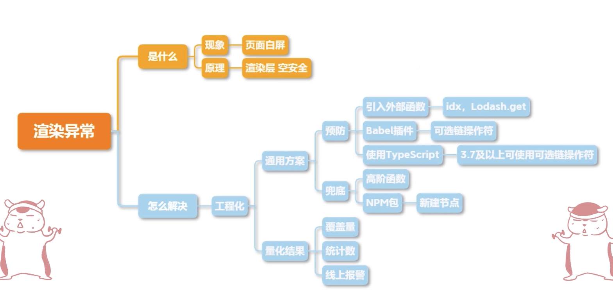
- `React 渲染异常的时候，在没有做任何拦截的情况下，会出现整个页面白屏的现象。`
- 它的成型原因是在渲染层出现了 JavaScript 的错误，导致整个应用崩溃。这种错误通常是在 render 中没有控制好空安全，使值取到了空值。所以在治理上，我的方案是这样的，从预防与兜底两个角度去处理。
- 在预防策略上，引入空安全相关的方案，在做技术选型时，我主要考虑了三个方案：第一个是引入外部函数，比如 Facebook 的 idx 或者 Lodash.get；`第二个是引入 Babel 插件，使用 ES 2020 的标准——可选链操作符`；第三个是 TypeScript，它在 3.7 版本以后可以直接使用可选链操作符。最后我选择了引入 Babel 插件的方案，因为这个方案外部依赖少，侵入性小，而且团队内没有 TS 的项目。在兜底策略上，因为考虑到团队内部和我存在一样的问题，就抽取了兜底的公共高阶组件，封装成了 NPM 包供团队内部使用。从最终的数据来看，预防与治理方案覆盖了团队内 100% 的 React 项目，头三个月兜底组件统计到了日均 10 次的报警信息，其中有 10% 是公司关键业务。那么经过分析与统计，首先是为关键的 UI 组件添加兜底组件进行拦截，然后就是做内部培训，对易错点的代码进行指导，加强 Code Review。后续到现在，线上只收到过 1 次报警。`

### 如何分析和调优性能瓶颈？

- 
- `我负责的业务是 CRM 管理后台，用户付费进入操作使用，有一套非常标准的业务流程。在我做完性能优化后，整个付费率一下提升了 17%，效果还可以。前期管理后台的基础性能数据是没有的，我接手后接入了一套 APM 工具，才有了基础的性能数据。然后我对指标观察了一周多，思考了业务形态，发现其实用户对后台系统的加载速度要求并不高，但对系统的稳定性要求比较高。我也发现静态资源的加载成功率并不高，TP99 的成功率大约在 91%，这是因为静态资源直接从服务器拉取，服务器带宽形成了瓶颈，导致加载失败。我对 Webpack 的构建工作流做了改造，支持发布到 CDN，改造后 TP99 提升到了 99.9%。`

### 如何避免重复渲染？

- 长列表 react-window
- 重复渲染
- 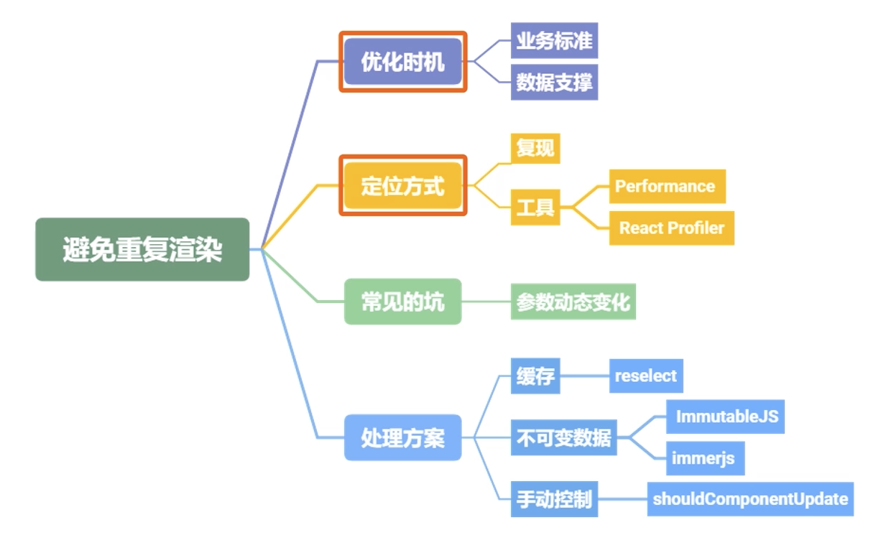
- 如何避免重复渲染分为三个步骤：选择优化时机、定位重复渲染的问题、引入解决方案。
- 优化时机需要根据当前业务标准与页面性能数据分析，来决定是否有必要。如果卡顿的情况在业务要求范围外，那确实没有必要做；如果有需要，那就进入下一步——定位。
- 定位问题首先需要复现问题，通常采用还原用户使用环境的方式进行复现，然后使用 Performance 与 React Profiler 工具进行分析，对照卡顿点与组件重复渲染次数及耗时排查性能问题。
- 通常的解决方案是加 PureComponent 或者使用 React.memo 等组件缓存 API，减少重新渲染。但错误的使用方式会使其完全无效，比如在 JSX 的属性中使用箭头函数，或者每次都生成新的对象，那基本就破防了。针对这样的情况有三个解决方案：缓存，通常使用 reselect 缓存函数执行结果，来避免产生新的对象；不可变数据，使用数据 ImmutableJS 或者 immerjs 转换数据结构；手动控制，自己实现 shouldComponentUpdate 函数，但这类方案一般不推荐，因为容易带来意想不到的 Bug，可以作为保底手段使用。通过以上的手段就可以避免无效渲染带来的性能问题了。

### 如何提升 React 代码可维护性？

- 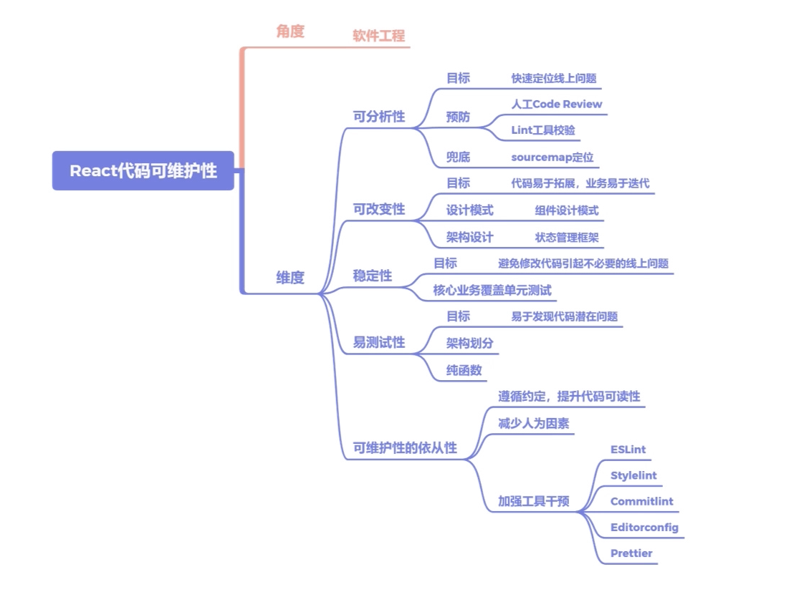
- 如何提升 React 代码的可维护性，究其根本是考虑如何提升 React 项目的可维护性。从软件工程的角度出发，可维护性包含了可分析性、可改变性、稳定性、易测试性与可维护性的依从性，接下来我从这五个方面对相关工作进行梳理。可分析性的目标在于快速定位线上问题，`可以从预防与兜底两个维度展开工作，预防主要依靠 Lint 工具与团队内部的 Code Review。Lint 工具重在执行代码规划，力图减少不合规的代码；而 Code Review 的重心在于增强团队内部的透明度，做好业务逻辑层的潜在风险排查。兜底主要是在流水线中加入 sourcemap，能够通过线上报错快速定位源码。`
- 可改变性的目标在于使代码易于拓展，业务易于迭代。工作主要从设计模式与架构设计展开。设计模式主要指组件设计模式，通过容器组件与展示组件划分模块边界，隔绝业务逻辑。整体架构设计，采用了 rematch 方案，rematch 中可以设计的 model 概念可以很好地收敛 action、reducer 及副作用，同时支持动态引入 model，保障业务横向拓展的能力。Rematch 的插件机制非常利于做性能优化，这方面后续可以展开聊一下。
- 接下来是稳定性，目标在于避免修改代码引起不必要的线上问题。在这方面，主要通过提升核心业务代码的测试覆盖率来完成。因为业务发展速度快、UI 变化大，所以基于 UI 的测试整体很不划算，但背后沉淀的业务逻辑，比如购物车计算价格等需要长期复用，不时修改，那么就得加测试。举个个人案例，在我自己的项目中，核心业务测试覆盖率核算是 91%，虽然没完全覆盖，但基本解决了团队内部恐惧线上出错的心理障碍。
- 然后是易测试性，目标在于发现代码中的潜在问题。在我个人负责的项目中，采用了 Rematch 的架构完成模块分离，整体业务逻辑挪到了 model 中，且 model 自身是一个 Pure Object，附加了多个纯函数。纯函数只要管理好输入与输出，在测试上就很容易。
- 最后是可维护性的依从性，目标在于建立团队规范，遵循代码约定，提升代码可读性。这方面的工作就是引入工具，减少人为犯错的概率。其中主要有检查 JavaScript 的 ESLint，检查样式的 stylelint，检查提交内容的 commitlint，配置编辑器的 editorconfig，配置样式的 prettier。总体而言，工具的效果优于文档，团队内的项目整体可保持一致的风格，阅读代码时的切入成本相对较低。

### React Hook 的使用限制有哪些？

- 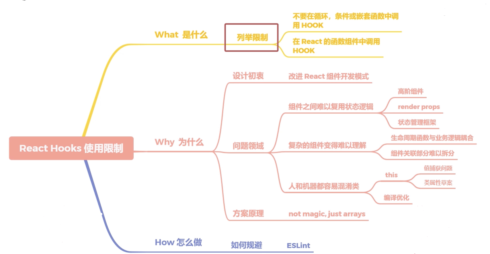
- React Hooks 的限制主要有两条：
  - `不要在循环、条件或嵌套函数中调用 Hook`；
    - 因为 Hooks 的设计是基于数组实现。在调用时按顺序加入数组中，如果使用循环、条件或嵌套函数很有可能导致数组取值错位，执行错误的 Hook。当然，实质上 React 的源码里不是数组，是链表。这些限制会在编码上造成一定程度的心智负担，新手可能会写错，为了避免这样的情况，可以引入 ESLint 的 Hooks 检查插件进行预防。
  - `在 React 的函数组件中调用 Hook。`
- 那为什么会有这样的限制呢？就得从 Hooks 的设计说起。Hooks 的设计初衷是为了改进 React 组件的开发模式。在旧有的开发模式下遇到了三个问题。组件之间难以复用状态逻辑。过去常见的解决方案是高阶组件、render props 及状态管理框架。复杂的组件变得难以理解。生命周期函数与业务逻辑耦合太深，导致关联部分难以拆分。人和机器都很容易混淆类。常见的有 this 的问题，但在 React 团队中还有类难以优化的问题，他们希望在编译优化层面做出一些改进。这三个问题在一定程度上阻碍了 React 的后续发展，所以为了解决这三个问题，Hooks 基于函数组件开始设计。然而第三个问题决定了 Hooks 只支持函数组件。那为什么不要在循环、条件或嵌套函数中调用 Hook 呢？

### hooks 如何根组件绑定

- hooks 通过 memoizedState 属性 绑定到 fiber 节点上

### useEffect 与 useLayoutEffect 区别在哪里？

- 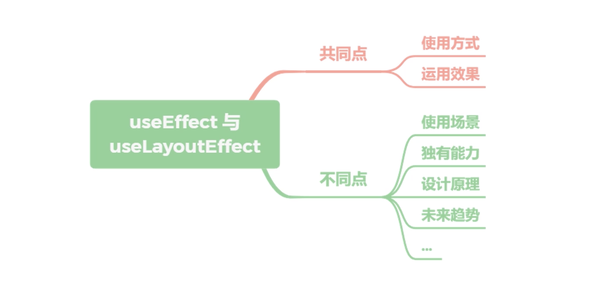
- 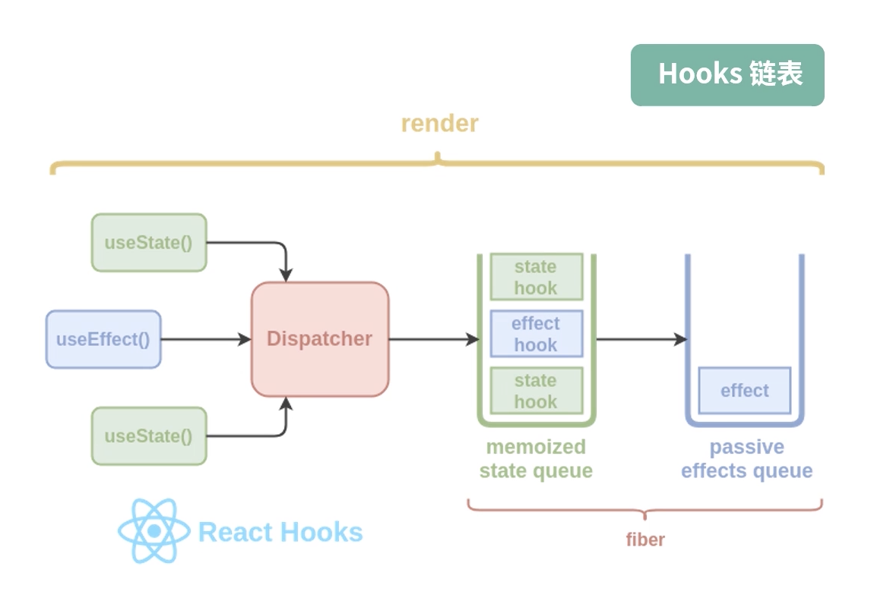
- useEffect 与 useLayoutEffect 的区别在哪里？这个问题可以分为两部分来回答，共同点与不同点。它们的共同点很简单，底层的函数签名是完全一致的，都是调用的 mountEffectImpl，在使用上也没什么差异，基本可以直接替换，也都是用于处理副作用。那不同点就很大了，`useEffect 在 React 的渲染过程中是被异步调用的，用于绝大多数场景，而 LayoutEffect 会在所有的 DOM 变更之后同步调用，主要用于处理 DOM 操作、调整样式、避免页面闪烁等问题。也正因为是同步处理，所以需要避免在 LayoutEffect 做计算量较大的耗时任务从而造成阻塞。在未来的趋势上，两个 API 是会长期共存的，暂时没有删减合并的计划，需要开发者根据场景去自行选择。React 团队的建议非常实用，如果实在分不清，先用 useEffect，一般问题不大；如果页面有异常，再直接替换为 useLayoutEffect 即可。`
- 这里还有一个很有意思的地方，React 的函数命名追求“望文生义”的效果，这里不是贬义，它在设计上就是希望你从名字猜出真实的作用。比如 componentDidMount、componentDidUpdate 等等虽然名字冗长，但容易理解。从 LayoutEffect 这样一个命名就能看出，它想解决的也就是页面布局的问题。

### React Hook 的设计模式

- 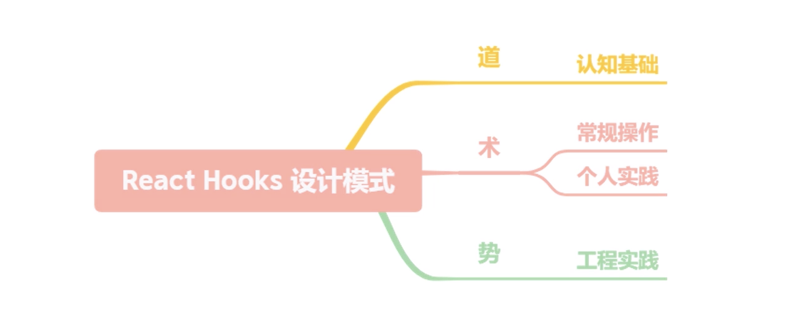
- `React Hooks 并没有权威的设计模式，很多工作还在建设中，在这里我谈一下自己的一些看法。`
- `首先用 Hooks 开发需要抛弃生命周期的思考模式，以 effects 的角度重新思考。过去类组件的开发模式中，在 componentDidMount 中放置一个监听事件，还需要考虑在 componentWillUnmount 中取消监听，甚至可能由于部分值变化，还需要在其他生命周期函数中对监听事件做特殊处理。在 Hooks 的设计思路中，可以将这一系列监听与取消监听放置在一个 useEffect 中，useEffect 可以不关心组件的生命周期，只需要关心外部依赖的变化即可，对于开发心智而言是极大的减负。这是 Hooks 的设计根本。`
- `在这样一个认知基础上，我总结了一些在团队内部开发实践的心得，做成了开发规范进行推广。`
- `第一点就是 React.useMemo 取代 React.memo，因为 React.memo 并不能控制组件内部共享状态的变化，而 React.useMemo 更适合于 Hooks 的场景。`
- `第二点就是常量，在类组件中，我们很习惯将常量写在类中，但在组件函数中，这意味着每次渲染都会重新声明常量，这是完全无意义的操作。其次就是组件内的函数每次会被重新创建，如果这个函数需要使用函数组件内部的变量，那么可以用 useCallback 包裹下这个函数。`
- `第三点就是 useEffect 的第二个参数容易被错误使用。很多同学习惯在第二个参数放置引用类型的变量，通常的情况下，引用类型的变量很容易被篡改，难以判断开发者的真实意图，所以更推荐使用值类型的变量。当然有个小技巧是 JSON 序列化引用类型的变量，也就是通过 JSON.stringify 将引用类型变量转换为字符串来解决。但不推荐这个操作方式，比较消耗性能。`
- `这是开发实践上的一些操作。那么就设计模式而言，还需要顾及 Hooks 的组合问题。在这里，我的实践经验是采用外观模式，将业务逻辑封装到各自的自定义 Hook 中。比如用户信息等操作，就把获取用户、增加用户、删除用户等操作封装到一个 Hook 中。而组件内部是抽空的，不放任何具体的业务逻辑，它只需要去调用单个自定义 Hook 暴露的接口就行了，这样也非常利于测试关键路径下的业务逻辑。`

### React-Router 的实现原理及工作方式分别是什么

- 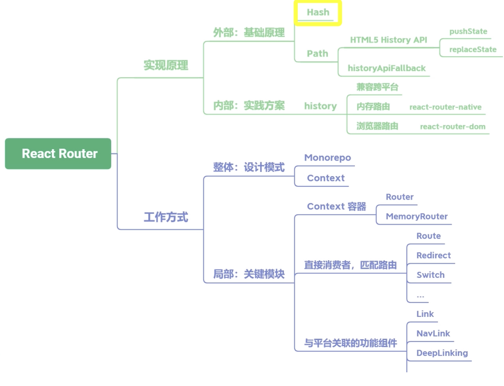
- `React Router 路由的基础实现原理分为两种，如果是切换 Hash 的方式，那么依靠浏览器 Hash 变化即可；如果是切换网址中的 Path，就要用到 HTML5 History API 中的 pushState、replaceState 等。在使用这个方式时，还需要在服务端完成 historyApiFallback 配置。`

- `在 React Router 内部主要依靠 history 库完成，这是由 React Router 自己封装的库，为了实现跨平台运行的特性，内部提供两套基础 history，一套是直接使用浏览器的 History API，用于支持 react-router-dom；另一套是基于内存实现的版本，这是自己做的一个数组，用于支持 react-router-native。`

- `React Router 的工作方式可以分为设计模式与关键模块两个部分。从设计模式的角度出发，在架构上通过 Monorepo 进行库的管理。Monorepo 具有团队间透明、迭代便利的优点。其次在整体的数据通信上使用了 Context API 完成上下文传递。`

- `在关键模块上，主要分为三类组件：第一类是 Context 容器，比如 Router 与 MemoryRouter；第二类是消费者组件，用以匹配路由，主要有 Route、Redirect、Switch 等；第三类是与平台关联的功能组件，比如 Link、NavLink、DeepLinking 等。`

### React 中你常用的工具库有哪些？

- 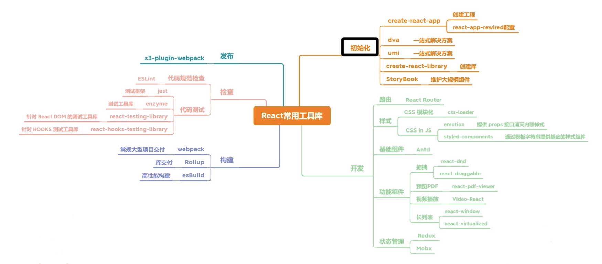
- 常用的工具库都融入了前端开发工作流中，所以接下来我以初始化、开发、构建、检查及发布的顺序进行描述。
- 首先是初始化。初始化工程项目一般用官方维护的 create-react-app，这个工具使用起来简单便捷，但 create-react-app 的配置隐藏比较深，修改配置时搭配 `react-app-rewired` 更为合适。国内的话通常还会用 `dva` 或者 `umi` 初始化项目，它们提供了一站式解决方案。`dva 更关心数据流领域的问题，而 umi 更关心前端工程化。`其次是初始化库，一般会用到 create-react-library，也基本是零配置开始开发，底层用 rollup 进行构建。如果是维护大规模组件的话，通常会使用 StoryBook，它的交互式开发体验可以降低组件库的维护成本。
- 再者是开发，开发通常会有路由、样式、基础组件、功能组件、状态管理等五个方面需要处理。路由方面使用 `React Router` 解决，它底层封装了 HTML5 的 history API 实现前端路由，也支持内存路由。样式方面主要有两个解决方案，分别是 CSS 模块化和 CSS in JS。CSS 模块化主要由 css-loader 完成，而 CSS in JS 比较流行的方案有 emotion 和 styled-components。emotion 提供 props 接口消灭内联样式；styled-components 通过模板字符串提供基础的样式组件。基础组件库方面，一般管理后台使用 Antd，因为用户基数庞大，稳定性好；面向 C 端的话，主要靠团队内部封装组件。功能组件就比较杂了，比如用于实现拖拽的有 `react-dnd` 和 `react-draggable`，react-dnd 相对于 react-draggable，在拖放能力的抽象与封装上做得更好，下层差异屏蔽更完善，更适合做跨平台适配；PDF 预览用过 `react-pdf-viewer`；视频播放用过 `Video-React`；长列表用过 `react-window 与 react-virtualized`，两者的作者是同一个人，react-window 相对于 react-virtualized 体积更小，也被作者推荐。最后是状态管理，主要是 `Redux 与 Mobx`，这两者的区别就很大了，Redux 主要基于全局单一状态的思路，Mobx 主要是基于响应式的思路，更像 Vue。`
- 然后是构建，构建主要是 webpack、Rollup 与 esBuild。webpack 久经考验，更适合做大型项目的交付；Rollup 常用于打包小型的库，更干净便捷；esBuild 作为新起之秀，性能十分优异，与传统构建器相比，性能最大可以跑出 100 倍的差距，值得长期关注，尤其是与 webpack 结合使用这点，便于优化 webpack 构建性能。
- `其次是检查。检查主要是代码规范与代码测试编写。代码规范检查一般是 ESLint，再装插件，属于常规操作。编写代码测试会用到 jest、enzyme、react-testing-library、react-hooks-testing-library：jest 是 Facebook 大力推广的测试框架；enzyme 是 Aribnb 大力推广的测试工具库，基本完整包含了大部分测试场景；react-testing-library 与 react-hooks-testing-library 是由社区主推的测试框架，功能上与 enzyme 部分有所重合。`
- `最后是发布，我所管理的工程静态资源主要托管在 CDN 上，所以需要在 webpack 中引入上传插件。这里我使用的是 s3-plugin-webpack，主要是识别构建后的静态文件进行上传。`
