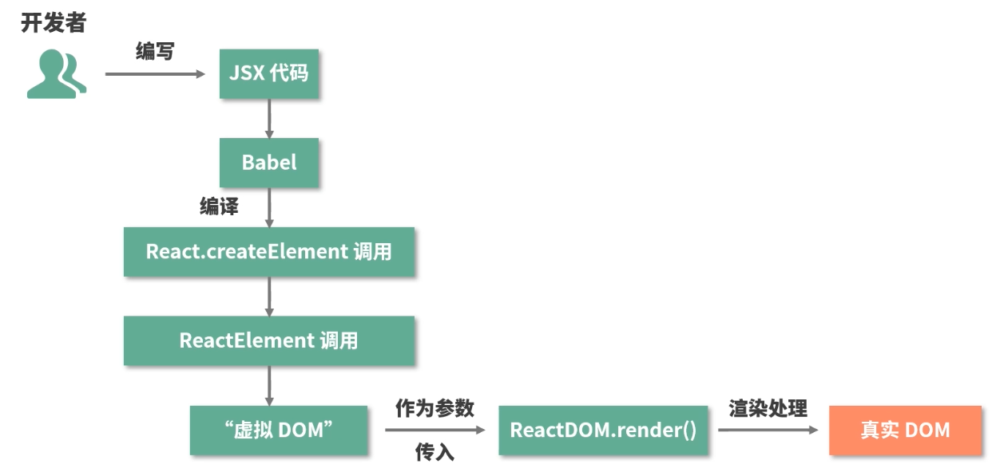

# react 进阶

## JSX

### JSX 的本质，他和 js 之间到底是什么关系

- javascript 的语法扩展，充分具备 javascript 的能力，

### JSX 语法是如何在 js 中生效的

- JSX 会被 babel 编译成 React.creareElement()
- babel 是一个工具链， 主要用于将 es6 语法转换为 es5 语法 以便在旧版本浏览器中运行
- React.creareElement() 调用的语法糖 这个方法返回一个 React Element 的 js 对象

### React.createElement


- React.createElement 只是一个参数中介 将处理好的参数最终返回给 ReactElement

### ReactElement

- 将 React.createElement 进行处理组装 变成一个 element 对象
- 返回的 element 对象传递给 React.createElement 方法返回给开发者 此时 返回的是一个 vdom
- ReactDOM.render() 将 vdom 转换成真实 dom

### JSX -> DOM



### 为什么要用 JSX 不用会有什么后果

- 相比 React.createElement(),使用 JSX 可以保留 html 结构清晰层次分明的观感，并且充分具备 js 的能力。

### JSX 背后的功能模块是什么，这个功能模块都做了哪些事情

- JSX -> Babel 编译成 React.createElement -> React.createElement 得到一系列参数传递给 ReactElement -> ReactElement 组装出 Element 也就是 vdom 最终传递给 ReactDOM.render -> ReactDOM.render 函数将 vdom 转换成真实 dom

## 生命周期

### react 15 生命周期


### react 16 生命周期


### 生命周期背后的设计思想

- render 是组件的灵魂 生命周期是组件的躯干

### 组件生命周期


- componentReceiveProps 并不是由 props 的变化触发的 而是由父组件的更新触发的
- react 组件会根据 shouldComponentUpdate 的返回值来决定是否执行该方法之后的生命周期，进而决定是否对组件进行 re-renders（重渲染）

### react 的组件为什么要加 key key 不一致时为什么组件会被删除？

### 15->16 生命周期的变化

- 废弃了 componentWillMount 新增了 getDerivedStateFromProps，
  - getDerivedStateFromProps 不是 componentWillMount 的替代品
  - getDerivedStateFromProp(props 父组件传进来的,state 子组件自身的） 有且只有一个用途 ： 通过改变 props 派生 更新 state
  - getDerivedStateFromProp 需要返回一个对象 以供 react 组件更新
    - 返回的对象针对里面的属性变化做定向更新
  - componentDidUpdate 为什么非死不可 主要还是挡了 fiber 的路
  - getSnapshotBeforeUpdate(prevProps,prevState) 与消失的 componentWillUpdate
- 15 render 方法必须返回单个元素 而 16 允许我们返回元素数组和字符串

### Fiber

- 丝、纤维等意思 是比线程还要纤细的过程 意在对渲染过程实现更加精细的控制
- 从架构角度 Fiber 是 React16 对 React 核心算法的一次重写
- 从编码角度 fiber 是 react 内部所定义的一种数据结构
- Fiber 会使原本的同步渲染过程 变成异步的
- Fiber 会讲一个大的更新任务拆解为许多个小任务
- Fiber 架构的重要特征就是可以被打断的异步渲染模式
- 根据是否可以被打断 react 生命周期 氛围 render （可以被打断，这个阶段用户不可见 就算打断重启 0 感知） 与 commit 阶段（总是同步执行，原因是渲染页面 如果被打断将会带来页面卡顿的视觉效果）

## 兄弟组件通信 EventEmiter

```js
class EventEmiter {
  constructor() {
    // eventMap 用来存储事件和监听函数之间的关系
    this.eventMap = {};
  }
  on(type, handler) {
    // handler 必须是一个函数，如果不是直接报错
    if (!handler instanceof Function) {
      throw new Error('哥 你错了 请传一个函数');
    }
    // 判断 tyoe 事件对应的队列是否存在
    if (!this.eventMap[type]) {
      // 若不存在 新建该队列
      this.eventMap[type] = [];
    }
  }
  // 别忘了我们前面说过触发时是可以携带数据的，params就是数据的载体
  emit(type, params) {
    // 假设该事件是有订阅的（对应的时间队列存在）
    if (this.eventMap[type]) {
      // 将事件队列里的 handler 一次执行出队
      this.eventMap[type].forEach((handler, index) => {
        // 注意别忘了读取 params
        handler(params);
      });
    }
  }
  off(type, handler) {
    if (this.eventMap(type)) {
      this.eventMap[type].splice(this.eventMap[type].indexOf(handler) >>> 0, 1);
    }
  }
}
// 实例化 myEventEmitter
const myEvent = new myEventEmitter();
// 编写一个简单的 handler
const testHander = function (params) {
  console.log(`test事件被触发了，testHandler接收到的入参是${params}`);
};
// 监听test事件
myEvent.on('test', testHandler);

// 在触发 test 事件的同时， 传入希望testHandler感知的参数
myEvent.emit('test', 'newState');
```

### context api

- 组件树全局通信的方式
- 16.3 之前 并不提倡被使用
- 16.3 开始之后 对 context api 进行了改进 新的 contextapi 具备更强的可用性
- 

```js
// 三要素
const AppContext = React.createContext()
const {Provider, Consumer} = AppContext

// -------------------------------------

<Provider value={title:this.state.title, content:this.state.content}>
  <Title />
  <Content />
</Provider>

// -------------------------------------

<Consumer>
  {value => <div>{value.title}</div>}
</Consumer>
```

- 新的 context api 解决了什么问题
  - 代码不够优雅 不易分辨出谁是 Provider 谁是 Consumer
  - 如果组件提供的一个 Context 发生了变化，而中间父组件的 shouldComponentUpdate 返回 false，那么使用到该值的后代组件不会进行更新。使用了 Context 的组件则完全失控，所以基本上没有办法能够可靠的更新 context，新的 context 即便组件的 shouldComponentUpdate 返回 false，它仍然可以“穿透”组件继续向后代组件进行传播，进而确保了数据生产者和数据消费者之间的数据的一致性。

### redux 数据流框架

- 是 js 状态容器，它提供可预测的状态管理，（原生 js、vue、react 都可以用），存放公共数据的仓库

  - stroe 单一数据源 只读
  - action 是对变化的描述
  - reducer 是一个函数 负责对新的变化进行分发和处理
  - `redux实现组件间通信思路：在redux对整个工作过程中，数据流是严格单向的 是的数据能够自由而有序的在任意组件之间穿梭`
  - store -> view -> action -> reducer -> store
  - redux 工作流

    - createStore 完成 store 对象的创建
    - 基于 reducer 去创建 store 的时候 就是给 store 设置更新规则

    ```js
    import { createStore } from 'redux'

    const store = createStore(
      reducer,
      initial_state, // 初始状态内容
      applyMiddleware(middleware1, middleware2,...) //指定中间件
    )
    ```

    - reducer 的作用是将新的 state 返回给 store

    ```js
    const reducer = (state, action) => {
      // 此处是各种样的state处理逻辑
      return new_state;
    };
    ```

    - action 的作用是通知 reducer 让改变发生

    ```js
    const action = {
      type: 'ADD_ITEM',
      payload: '<li>text</li>',
    };
    ```

### 类组件 与 函数组件 的不同

- 类组件需要继承 class 函数组件不需要
- 类组件可以访问生命周期方法 函数组件不能
- 类组件可以获取到实例化后的 this，并基于这个 this 做各种各样的事情，而函数组件不可以
- 类组件中可以定义并维护 state 状态，而函数组件不可以
- 在 hooks 出现之前类组件的能力边界强于函数组件，应该更多去关注两者的不同 进而把不同的特性与不同的场景做连接
- 最大的不同：`函数组件会捕获render内部的状态，这是两类组件最大的不同`
- 是面向对象 与 函数式编程 这两套不同思想的差异
- 函数组件更加契合 react 框架的设计理念

### 类组件

- 是面向对象编程思想的一种表征
- 封装：将一类属性和方法，聚拢到一个 class 里去
- 继承：新的 class 可以通过继承现有的 class 实现对某一类属性和方法的复用
- 类组件 大而全的背后 是不可忽视的学习成本
- 编写的逻辑封装后是和组件粘在一起的这就使得类组件内部的逻辑难以实现拆分和复用。虽然强大绝非万能

### hooks 设计动机与工作模式

- hooks 是 react 团队在开发实践中逐渐认知到的一个改进点
- 背后涉及对类组件和函数组件两种组件形式的思考和侧重
- 本质：是一套是函数式组件更强大更灵活的勾子 底层是链表

### useState 为函数组件引入状态

- 早期的函数组件缺乏定义和维护 state 的能力，useState 就是一个为函数组件引入状态的 api

### useEffect 允许函数组件执行副作用操作

- 在一定程度上为函数组件弥补了生命周期的缺失
- 传入回调函数 参数 2 不传 每次 render 都会执行
- 传入回调函数函数切返回值不为函数 仅在挂在阶段执行一次
- 传入回调函数且返回值是一个函数 仅在挂载和卸载阶段执行
  - 返回的函数被称为 `清除函数`
  - 回调函数本身是 A 返回值函数是 B 挂载执行 A 卸载执行 B
- 传入回调函数且返回值是一个函数 参数 2 不传 每一次都触发 且卸载阶段也触发
  - 每次渲染执行 A 卸载执行 B
- 传入回调函数 传入一个非空的数组 数组中有状态变化的时候执行 A

### 为什么需要 react hooks

- 告别难以理解的 class
  - this
  - 生命周期
- 解决业务逻辑难以拆分的问题
- 使状态逻辑服用变得简单可行
- 函数组件从设计思想上来看 更加契合 React 的理念 react 组件是一个接收状态输出 ui 的函数
- hooks 能够帮助我们实现业务逻辑的聚合避免复杂的组件和冗余的代码
- 状态复用：hook 将复杂的问题变简单
  - 复用状态逻辑 靠的是 HOC 高阶组件 和 render Props 常见问题是“嵌套地狱”
- 局限性
  - hooks 暂时还不能完全地为函数组件不起类组件的能力
    - getSnapshotBeforeUpdate
    - componentDidCatch
  - 轻量几乎是函数组件的基因 这可能会使它不能够很好的消化复杂
  - hooks 在使用层面有严格的规则约束

### react hooks 的使用原则

- 只在 react 函数中调用 hook
- 不要再循环、条件或嵌套函数中调用 hook
  - `要确保hooks在每次渲染时都保持同样的执行顺序` hooks 渲染是通过一次便利来定位每个 hooks 内容的。如果前后两次读到的链表在顺序上出现差异，那么渲染的结果自然是不可控的
  - 首次渲染 hooks 调用链路
    - mountState 构建链表并渲染 
  - 更新渲染 hooks 调用链路
    - updateState 按顺序去遍历之前构建好的链表 取出对应的数据信息进行渲染

### 虚拟 dom

- 走 数据驱动视图 这条基本调路 操作真实 dom 性能损耗大 操作假 dom 不就好了
- 模版引擎 与 虚拟 dom 是递进关系
- 虚拟 dom 是前端开发者们为了追求更好的`研发体验`和`研发效率` 而创造出来的高阶产物，能够在提供更爽更搞笑的研发模式的同时仍然保持一个还不错的性能
- 虚拟 dom 的掠食主要是在于 js 计算的耗时，dom 操作的能耗和 js 计算的能耗根本不在一个量级
- `跨平台问题`
- 批量更新：在通用虚拟 dom 库里是由 batch 函数来处理的
  - batch 的作用是缓冲每次生成的补丁集 进行集中化的 dom 批量更新

### react 15 栈调和（stack Reconclier）过程

- 通过如 ReactDOM 等类库使之与真实的 dom 同步 这一过程叫做`协调（调和）`
- 调和是 `使一致` 的过程
- Diff 是 `找不同` 的过程
- Diff 策略的设计思想
  - 若两个组件属于同一个类型 他们将拥有相同的 dom 输型结构
  - 处于同一层级的一组子节点 可用通过设置 key 作为唯一标识从而维持各个节点在不同渲染过程中的稳定性
- Diff 逻辑的拆分与解读
  - diff 算法性能突破的关键点在于 `分层对比`
  - 类型一致的节点才有继续 diff 的必要性
  - key 属性的设置 可以帮我们尽可能重用同一层及内的节点

### setState 工作流

- setState -> shouldComponentUpdate -> componentWillUpdate -> render -> componentDidUpdate
- 在 setTimeout、setInterval 等函数中包括在 dom 原生事件中，它都表现为同步
- 异步的动机和原理 批量更新的艺术 （nextTick、event loop ）
  - 每来一个 setState 就把它塞进一个队列里攒起来等时机成熟 再把攒起来等 state 结果做合并 最后只针对最新的 state 值走一次更新流程
- setTimeout 里的 setState 是同步的原因是 setTimeout 帮助 setState 逃脱了 react 的管控 在 react 管控下的 setState 一定是异步的
  - 在 reactMount.js 组件初始化的时候调用了 batchedUpdates 因为组件初始化的生命周期里面会使用 setState
  - 在 reactEventListener.js 事件监听里面也调用了 batchedUpdates 因为事件里面也可能会调用 setState
  - 在事件执行开始时 isBatchUpdates 直接为 true 也就是锁上了 setState 的执行只能是异步的 而 setTimeout 里面本身是异步的 isBatchUpdates 无法约束 setTimeout 里面的代码 所以 setState 同步执行了
    

```js
// setState
ReactComponent.protytype.setState = function (partialState, callback) {
  this.updater.enqueueSetState(this, partialState);
  if (callback) {
    this.updater.enqueueCallback(this, callback, 'setState');
  }
};
```

```js
  // enqueueSetState 将新的state装入状态队列里，使用enqueueUpdate处理即将要更新的组件实例
  enqueueSetState:function(publicInstance, partialState) {
  // 根据this拿到对应的组件实例
  var internalInstance = getInternalInstanceReadyForUpdate(publicInstance,'setState')
  // 这个 queue 对应的就是一个组件实例的state 数组
  var queue = internalInstance._pendingStateQueue || (internalInstance._pendingStateQueue = [])
  queue.push(partialState)
  // enqueueSetState 用来处理当前的组件实例
  enqueueUpdate(internalInstance)
 }
```

```js
// enqueueUpdate batchingStrategy react内部专门用来管控批量更新的对象
function enqueueUpdate(component) {
  ensureInjected();
  // 注意这一句是问题的关键，isBatchingUpdates标识着当前是否处于批量创建/更新组件的阶段
  if (!batchingStrategy.isBatchingUpdates) {
    // 若当前没有处于批量创建/更新组件的阶段，则立即更新组件
    batchingStrategy.batchedUpdates(enqueueUpdate, component);
    return;
  }
  // 否则，先把组件塞入 dirtyComponents 队列里，让它“再等等”
  dirtyComponents.push(component);
  if (component._updateBatchNumber == null) {
    component._updateBatchNumber = updateBatchNumber + 1;
  }
}
```

```js
  // batchingStrategy源码 锁 当锁上时代表此时正在进行批量更新 其他任务都必须进入dirtyComponent里等待 react面对大量状态仍然能够进行有序处理的更新机制
  var ReactDefaultBatchingStrategy = {
    // 全局唯一的锁标识
    isBatchingUpdates:false
    // 发起更新动作的方法
    batchedUpdates:function(callback,a,b,c,d,e){
      // 缓存锁变量
      var alreadyBatchingStrategy = ReactDefaultBatchingStrategy.isBatchingUpdates
      // 把锁锁上
      ReactDefaultBatchingStrategy.isBatchingUpdates = true

      if(alreadyBtachingStrategy) {
        callback(a,b,c,d,e)
      } else {
        // 启动事务， 将callback放进事务里执行
        transaction.perform(callback,null,a,b,c,d,e)
      }
    }
  }
```

### transaction（事务） 机制

- 在 react 源码中分布的非常广泛
- 出现了 initialize、perform、close、closeAll 或者 notifyAll 这样的方法名 很可能就在一个 transaction 机制中
- transaction 在 react 源码中表现为一个核心类
- transaction 是创建一个黑盒，该黑盒能够封装任何的方法
- 

### ReactDefaultBatchingStrategy 批量更新策略事务

- 有两个 wrapper（包装）

```js
var RESET_BATCHED_UPDATES = {
  initialize: emptyFunction,
  close: function () {
    ReactDefaultBatchingStrategy.isBatchingUpdates = false;
  },
};
var FLUSH_BATCHED_UPDATES = {
  initialize: emptyFunction,
  close: ReactUpdates.flushBatchedUpdates.bind(ReactUpdates),
};
```

- 在 callback 执行完之后 RESET_BATCHED_UPDATES 将 isBatchingUpdates 设置为 false ， FLUSH_BATCHED_UPDATES 将执行 flushBatchedUpdates 然后里面会循环所有 dirtyComponent，然后逐一执行 updateComponet 执行所有的生命周期方法 实现组件的更新

### 对 react 的定位

- react 是用 js 构建`快速相应`的大型 web 应用程序的首选方式。它在 facebook 和 Instagram 上表现优秀

### Stack Reconciler 到底有着怎样根深蒂固的局限性（卡顿）

- 如果渲染县城和 js 县城同时工作那么渲染的结果将是难以预测的，`js线程和渲染线程必须是互斥的，其中一个线程执行的时候另一个线程只能挂起等待`，具有相似特征的还有事件线程浏览器 eventloop 机制决定了事件任务是由一个异步队列来维持的`当事件被触发时不会立刻执行事件任务，而是由事件线程把它添加到任务队列的末尾，等待js同步代码执行完毕后在空闲的时间里执行出队`
- 主要问题：js 对朱线程的超时占用问题
- 栈调和机制下的 diff 算法，其实是树的深度优先遍历的过程 子节点的所有子节点都比较完毕之后在比较兄弟节点 这个过程是同步的 不可以被打算 所以栈调和需要的调和事件会很长 意味着 js 会长时间霸占主线程进而导致 渲染卡顿/卡死、交互长时间无响应等问题

### Fiber 是如何解决问题的

- 丝、纤维等意思 是比线程还要纤细的过程 意在对渲染过程实现更加精细的控制
- 从架构角度 Fiber 是 React16 对 React 核心算法的一次重写
- 从编码角度 fiber 是 react 内部所定义的一种数据结构
- 从工作流角度来看，Fiber 节点保存了组件需要更新的状态和副作用
- 应用目的：实现`增量渲染`:把一个渲染任务分成多个渲染任务 然后分到多个帧里面进行渲染，目的是为了实现任务的可中断、可恢复，并给不同的任务赋予不同的优先级，最终达成更加丝滑的用户体验
- 可中断、可恢复、优先级
  - 15 Reconciler 找不同 -> Renderer 渲染不同
  - 16 scheduler 调度更新的优先级 -> Reconciler 找不同 -> Renderer 渲染不同
  - 当任务 A 在执行的之后 进来一个优先级更高的任务 B A 会被中断 开始执行 B 当 B 执行好之后 下次执行任务会重新执行 A 的渲染任务

### Fiber 架构对生命周期的影响


- render 的工作单元有着不同的优先级 react 可以根据优先级的高低去实现工作单元的打断和恢复

### ReactDOM.render 调用栈

- ReactDOM.render 的函数体中调用了 legacyRenderSubtreeIntoContainer

```js
return legacyRenderSubtreeIntoContainer(
  null,
  element,
  container,
  false,
  callback,
);
```

- 
- 
- fiberRoot 本质你一个 FiberRootNode 对象 包含一个 current 属性
- current 是 FiberNode 正式 fiber 节点对应的对象类型
- fiberRoot 是 真实 dom 的节点， rootFiber 作为虚拟 dom 的根节点
- updateContainer
  - 请求当前 Fiber 节点的 lane（优先级）
  - 结合 lane（优先级）创建当前 Fiber 节点的 update 对象并将其入队
  - scheduleUpdateOnFiber 方法 调度当前节点 rootFiber
- reactDom.render 发起对首次渲染链路中，这些意义都不大，因为这个渲染过程是同步的 scheduleUpdateOnFiber 里面调用了 perfoemSyncWorkOnRoot 方法
- perfoemSyncWorkOnRoot 是 render 阶段的起点 render 阶段的任务就是完成 Fiber 树的构建 他是整个渲染链路中最核心的一环

### react 的启动方式

- legacy 模式：`ReactDOM.render(<App />, rootNode)` 同步渲染链路
  - 仍然是一个深度优先搜索的过程 在这个过程中 beginWork 将创建新的 Fiber 节点
  - 而 completeWork 则负责将 Fiber 节点映射为 DOM 节点
- blocking 模式: `ReactDOM.createBlockingRoot(rootNode).render(<App />)`
- concurrent 模式：`ReactDOM.createRoot(rootNode).render(<App />)` 异步渲染链路

### react 如何知道当前的 lane 优先级

- mode 属性 决定着这个工作流是一气呵成 （同步）的还是分片执行（异步）的

```js
function requestUpdateLane(fiber) {
  // 获取 mode 属性
  var mode = fiber.mode;
  // 结合 mode 属性判断当前的
  if ((mode & BlockingMode) === NoMode) {
    return SyncLane;
  } else if ((mode & ConcurrentMode) === NoMode) {
    return getCurrentPriorityLevel() === ImmediatePriority$1
      ? SyncLane
      : SyncBatchedLane;
  }

  // ...

  return lane;
}
```

### Fiber 一定是异步渲染吗

- Fiber 架构的设计确实是为了 Concurrent 而存在
- Fiber 架构在 React 中并不能够和异步渲染画 严格的等号
- 是一种同时兼容了同步渲染与异步渲染的设计

### workInProgress 节点创建

- performSyncWorkOnRoot -> renderRootSync -> prepareFreshStack 重制一个新的堆栈环境 -> createWorkInProgress -> createFiber 的返回值 是 workInProgress
- workInProgress 的 alternate 将只想 current
- current 的 alternate 将反过来指向 workInProgress
- 
- createFiber 产生一个 FiberNode 实例 也就是 fiber 节点的对象类型
- workInProgress 节点其实就是 current 节点（即 rootFiber)的副本
- fiberRoot 对象（FiberRootNode 实例）-> current -> rootFiber 对象（FiberNode 实例）<—> alternte <-> rootFiber 对象（FiberNode 实例）-> APP（FiberNode 实例）
- workLoopSync
  - 通过 while 循环反复判断 worlInProgress 是否为空
  - 触发对 beginWork 的调用 进而实现对新 Fiber 节点的创建

```js
function workLoopSync() {
  // 若 workInProgress不为空
  while (workInProgress !== null) {
    // 针对他执行 performUnitOfWork方法
    performUnitOfWork(workInProgress);
  }
}
```

### 为什么制造 current 树 和 workProgress 树 两棵看起来没区别的 fiber 树

- 因为一帧里面 fiber 没办法同时处理
- workProgress 树 代表当前正在 render 中的树
- current 树 代表已经存在的树

### beginWork

- beginWork 的入参是一对用 alternate 连接起来的 workInProgress 和 current 节点
- beginWork 的核心逻辑是根据 fiber 节点（workInProgress）的 tag 属性的不同调用不同的节点创建函数
- `"update+类型名"`的方法很多 但是逻辑都比较相似 通过调用 reconcileChildren 方法 生成当前节点的子节点

```js
function reconcileChildren(current, workInProgress, nextChildren, renderLanes) {
  // 判断current 是否为null
  if (current === null) {
    // 若current为null， 则进入mountChildrenFibers 的逻辑
    workInProgress.child = mountChildFibers(
      workInProgress,
      null,
      nextChildren,
      renderLanes,
    );
  } else {
    // 若current不为null， 则进入reconcileChildFibers的逻辑
    workInProgress.child = reconcileChildrenFiers(
      workInProgress,
      current.child,
      nextChildren,
      renderLanes,
    );
  }
}
```

```js
var recondileChildFibers = ChildReconciler(true);
var mountChildFibers = ChildReconciler(false);
```

### ChildReconciler

- recondileChildFibers 和 mountChildFibers 的不同，在于对副作用的处理不同

```js
function placeSingleChild(newFiber) {
  if (shouldTrackSideEffects && newFiber.alternate === null) {
    newFIber.flags = Placement;
  }
  return newFiber;
}
```

- 给 fiber 节点打上一个 flags（effectTag）的标记
- Placement 的意思是需要新增 dom 节点
- 副作用的定义：数据获取、订阅、或者修改 DOM 等动作
- ChildReconciler 中定义了大量如 placeXXX、deleteXXX、updateXXX、reconcileXXX 等这样的函数，这些函数覆盖了对 Fiber 节点的创建、增加、删除、修改等动作，将直接或间接地被 reconcileChildFibers 所调用
- ChildReconnciler 的返回值是一个名为 ireconcileChildFibers 的函数，这个函数是一个逻辑分发起，它将根据入参的不同，执行不同 Fiber 节点操作，最终返回不同的目标 Fiber 节点

### Fiber 节点创建过程


### Fiber 节点间是如何连接的呢

- child 代表子节点
- return 代表父节点
- sibling 代表当前节点的第一个兄弟节点

### completeWork

- 调用链路：performUnitOfWork -> completeUnitOfWork -> completeWork
- 内部是三个关键动作
  - 创建 DOM 节点 createInstance
  - 将 dom 节点插入到 dom 树 appendAllChildren
  - 为 dom 节点设置属性 FinalizeInitialChildren
- completeWork 针对渲染 h1 标签 - hostComponent 也就是原声 dom 类型
  - getHostContext() 为 dom 节点创建做准备
  - createInstance() 创建 dom 节点
  - appendAllChildren() 把创建好的 dom 节点挂载到 dom 树上去
  - FinalizeInitialChildren 为 dom 节点设置属性
- complete 的执行是严格自底向上的 子节点的兄弟节点总是先于父节点执行

```js
function performUnitOfWork(unitOfWork) {
  // ...
  // 获取入参节点对应的current节点
  var current = unitOfWork.alternate;

  var next;

  if (xxx) {
    //...
    // 创建当前节点的节点
    next = beginWork$1(current, unitOfWork, subtreeRenderLanes);
  }
  // ...

  if (next === null) {
    // 调用completeUnitOfWork
    completeUnitOfWork(unitOfWork);
  } else {
    // 将当前节点更新为新创建出的Fiber节点
    workInProgress = next;
  }
  // ...
}
```

### completeUnitOfWork

- 开启收集 EffectList（副作用链） 的“大循环”
- 做了三件事
  - 针对传入的当前机诶单 调用 completeWork
  - 将当前节点的副作用链插入到其父节点对应的副作用链中
  - 以当前节点为起点，循环遍历其兄弟节点及其父节点

### render 阶段的工作目标是什么呢

- 找出界面中需要处理的更新

### EffectList 副作用链

- 价值：让 commit 只负责实现更新，而不负责寻找更新 坐享其成直接拿到 render 阶段的工作成功
- 副作用链可以理解为`render阶段的工作集合`
- 数据结构为链表 由 fiber 节点组成
  - 这些 fiber 节点需要满足两个特性
    - 都是当前 fiber 节点的后代节点
    - 都有待处理的副作用
- fiber 节点的 effectList 代表其子节点所要进行的更新，completeWork 是自底向上执行的 所以 fiberRoot 节点的 effectList 就是本次 render 得出的所有更新
- 设计与实现
  - EffectList 在 fiber 节点中是通过 firstEffect 和 lastEffect 来维护的
  - 为 firstEffect、lastEffect 各赋值一个引用 completedWork（正在被执行 completeWork 相关逻辑的节点）
- 创建过程
  - App FiberNode 的 flags（effectTag）属性为 3 大于 performedWork，因此会进入 effectList 的创建逻辑
  - 创建 effectList 时，并不是为当前 Fiber 节点创建，而是为它的父节点创建 App 节点的父节点是 rootFiber，rootFiber 的 effectList 此时为空
  - rootFiber 的 firstEffect 和 lastEffect 指针都会指向 App 节点、App 节点由此成为 effectList 中的唯一一个 FiberNode

### commit 阶段

- 会在 performSyncWorkOnRoot 中被调用 commitRoot(root)
- root 不是 rootFiber 而是 fiberRoot 实例 fiberRoot 的 current 指向 rootFIber 因此可以拿到 effectList
- 三个阶段
  - before mutation 阶段
    - 这个节点 Dom 节点还没有被渲染到界面上去
    - 过程中会触发 getSnapshotBeforeUpdate 、 useEffect
  - mutation 负责 dom 节点的渲染 渲染过程中会遍历 effectList 根据 flags 的不同进行不同的 dom 操作
  - layout 处理 dom 渲染完毕之后的收尾逻辑
    - componentDidMount、componentDidUpdate、useLayoutEffect
    - fiberRoot 的 current 指针指向 WorkInProgress Fiber 树

### 函数 名词 阶段性理解测验

- performSyncWorkOnRoot
  - performSyncWorkOnRoot 是 render 阶段的起点 render 阶段的任务就是完成 Fiber 树的构建 他是整个渲染链路中最核心的一环
- workLoopSync
  - while 循环判断 workInProgress 是否为空， 如果为空 触发对 beignWork 的调用 进而实现对新 fiber 节点的创建
- performUnitOfWork
  - workLoopSync 里面如果判断 workInProgress 为空就会执行 performUnitOfWork
  - performUnitOfWork -> completeUnitOfWork -> completeWork
- beginWork
  - 探寻阶段
  - 核心逻辑是根据 fiber 节点（workInProgress）的 tag 属性的不同调用不同的节点创建函数
  - 根据 ReactElement 对象创建所有的 fiber 节点 最终构造出 fiber 树形结构（设置 return 和 sibling 指针）
  - 设置 fiber.flags(二进制形式变量，用来标记 fiber 节点的增删改状态等待 completeWork 阶段处理)
  - 设置 fiber.stateNode 局部状态 ( 如 Class 类型节点：fiber.stateNode = newClass() )
  - updateXXX 函数
- completeWork
  - 回溯阶段
  - 给 fiber 节点创建 dom 实例 将 fiber.stateNode 指向这个 dom 实例
  - 将当前节点的副作用队列 添加到父节点的副作用队列之后 给父节点更新 firstEffect 和 lastEffect 指针
  - 识别 beginWork 阶段设置的 fiber.flags 判断当前 fiber 是否有副作用如果有将当前 fiber 加到父节点的副作用队列中，等待 commit 阶段处理
- completeUnitOfWork
  - 处理 beginWork 阶段已经生成的 fiber 节点

