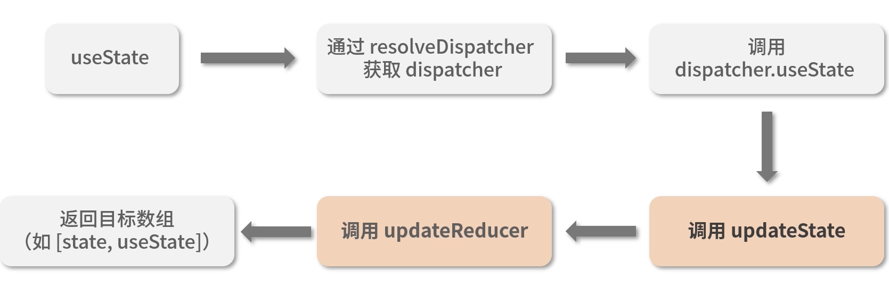
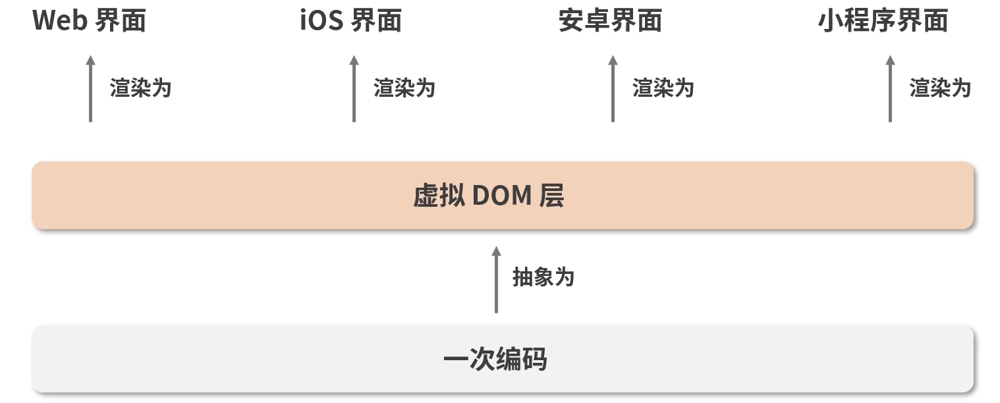

# react 进阶

## JSX

### JSX 的本质，他和 js 之间到底是什么关系

- javascript 的语法扩展，充分具备 javascript 的能力，

### JSX 语法是如何在 js 中生效的

- JSX 会被 babel 编译成 React.creareElement()
- babel 是一个工具链， 主要用于将 es6 语法转换为 es5 语法 以便在旧版本浏览器中运行
- React.creareElement() 调用的语法糖 这个方法返回一个 React Element 的 js 对象

### React.createElement


- React.createElement 只是一个参数中介 将处理好的参数最终返回给 ReactElement

### ReactElement

- 将 React.createElement 进行处理组装 变成一个 element 对象
- 返回的 element 对象传递给 React.createElement 方法返回给开发者 此时 返回的是一个 vdom
- ReactDOM.render() 将 vdom 转换成真实 dom

### JSX -> DOM


### 为什么要用 JSX 不用会有什么后果

- 相比 React.createElement(),使用 JSX 可以保留 html 结构清晰层次分明的观感，并且充分具备 js 的能力。

### JSX 背后的功能模块是什么，这个功能模块都做了哪些事情

- JSX -> Babel 编译成 React.createElement -> React.createElement 得到一系列参数传递给 ReactElement -> ReactElement 组装出 Element 也就是 vdom 最终传递给 ReactDOM.render -> ReactDOM.render 函数将 vdom 转换成真实 dom

## 生命周期

### react 15 生命周期


### react 16 生命周期


### 生命周期背后的设计思想

- render 是组件的灵魂 生命周期是组件的躯干

### 组件生命周期


- componentReceiveProps 并不是由 props 的变化触发的 而是由父组件的更新触发的
- react 组件会根据 shouldComponentUpdate 的返回值来决定是否执行该方法之后的生命周期，进而决定是否对组件进行 re-renders（重渲染）

### react 的组件为什么要加 key key 不一致时为什么组件会被删除？

### 15->16 生命周期的变化

- 废弃了 componentWillMount 新增了 getDerivedStateFromProps，
  - getDerivedStateFromProps 不是 componentWillMount 的替代品
  - getDerivedStateFromProp(props 父组件传进来的,state 子组件自身的） 有且只有一个用途 ： 通过改变 props 派生 更新 state
  - getDerivedStateFromProp 需要返回一个对象 以供 react 组件更新
    - 返回的对象针对里面的属性变化做定向更新
  - componentDidUpdate 为什么非死不可 主要还是挡了 fiber 的路
  - getSnapshotBeforeUpdate(prevProps,prevState) 与消失的 componentWillUpdate
- 15 render 方法必须返回单个元素 而 16 允许我们返回元素数组和字符串

### Fiber

- Fiber 是 React16 对 React 核心算法的一次重写
- Fiber 会使原本的同步渲染过程 变成异步的
- Fiber 会讲一个大的更新任务拆解为许多个小任务
- Fiber 架构的重要特征就是可以被打断的异步渲染模式
- 根据是否可以被打断 react 生命周期 氛围 render （可以被打断，这个阶段用户不可见 就算打断重启 0 感知） 与 commit 阶段（总是同步执行，原因是渲染页面 如果被打断将会带来页面卡顿的视觉效果）

## 兄弟组件通信 EventEmiter

```js
class EventEmiter {
  constructor() {
    // eventMap 用来存储事件和监听函数之间的关系
    this.eventMap = {};
  }
  on(type, handler) {
    // handler 必须是一个函数，如果不是直接报错
    if (!handler instanceof Function) {
      throw new Error('哥 你错了 请传一个函数');
    }
    // 判断 tyoe 事件对应的队列是否存在
    if (!this.eventMap[type]) {
      // 若不存在 新建该队列
      this.eventMap[type] = [];
    }
  }
  // 别忘了我们前面说过触发时是可以携带数据的，params就是数据的载体
  emit(type, params) {
    // 假设该事件是有订阅的（对应的时间队列存在）
    if (this.eventMap[type]) {
      // 将事件队列里的 handler 一次执行出队
      this.eventMap[type].forEach((handler, index) => {
        // 注意别忘了读取 params
        handler(params);
      });
    }
  }
  off(type, handler) {
    if (this.eventMap(type)) {
      this.eventMap[type].splice(this.eventMap[type].indexOf(handler) >>> 0, 1);
    }
  }
}
// 实例化 myEventEmitter
const myEvent = new myEventEmitter();
// 编写一个简单的 handler
const testHander = function (params) {
  console.log(`test事件被触发了，testHandler接收到的入参是${params}`);
};
// 监听test事件
myEvent.on('test', testHandler);

// 在触发 test 事件的同时， 传入希望testHandler感知的参数
myEvent.emit('test', 'newState');
```

### context api

- 组件树全局通信的方式
- 16.3 之前 并不提倡被使用
- 16.3 开始之后 对 context api 进行了改进 新的 contextapi 具备更强的可用性
- 

```js
// 三要素
const AppContext = React.createContext()
const {Provider, Consumer} = AppContext

// -------------------------------------

<Provider value={title:this.state.title, content:this.state.content}>
  <Title />
  <Content />
</Provider>

// -------------------------------------

<Consumer>
  {value => <div>{value.title}</div>}
</Consumer>
```

- 新的 context api 解决了什么问题
  - 代码不够优雅 不易分辨出谁是 Provider 谁是 Consumer
  - 如果组件提供的一个 Context 发生了变化，而中间父组件的 shouldComponentUpdate 返回 false，那么使用到该值的后代组件不会进行更新。使用了 Context 的组件则完全失控，所以基本上没有办法能够可靠的更新 context，新的 context 即便组件的 shouldComponentUpdate 返回 false，它仍然可以“穿透”组件继续向后代组件进行传播，进而确保了数据生产者和数据消费者之间的数据的一致性。

### redux 数据流框架

- 是 js 状态容器，它提供可预测的状态管理，（原生 js、vue、react 都可以用），存放公共数据的仓库

  - stroe 单一数据源 只读
  - action 是对变化的描述
  - reducer 是一个函数 负责对新的变化进行分发和处理
  - `redux实现组件间通信思路：在redux对整个工作过程中，数据流是严格单向的 是的数据能够自由而有序的在任意组件之间穿梭`
  - store -> view -> action -> reducer -> store
  - redux 工作流

    - createStore 完成 store 对象的创建
    - 基于 reducer 去创建 store 的时候 就是给 store 设置更新规则

    ```js
    import { createStore } from 'redux'

    const store = createStore(
      reducer,
      initial_state, // 初始状态内容
      applyMiddleware(middleware1, middleware2,...) //指定中间件
    )
    ```

    - reducer 的作用是将新的 state 返回给 store

    ```js
    const reducer = (state, action) => {
      // 此处是各种样的state处理逻辑
      return new_state;
    };
    ```

    - action 的作用是通知 reducer 让改变发生

    ```js
    const action = {
      type: 'ADD_ITEM',
      payload: '<li>text</li>',
    };
    ```

### 类组件 与 函数组件 的不同

- 类组件需要继承 class 函数组件不需要
- 类组件可以访问生命周期方法 函数组件不能
- 类组件可以获取到实例化后的 this，并基于这个 this 做各种各样的事情，而函数组件不可以
- 类组件中可以定义并维护 state 状态，而函数组件不可以
- 在 hooks 出现之前类组件的能力边界强于函数组件，应该更多去关注两者的不同 进而把不同的特性与不同的场景做连接
- 最大的不同：`函数组件会捕获render内部的状态，这是两类组件最大的不同`
- 是面向对象 与 函数式编程 这两套不同思想的差异
- 函数组件更加契合 react 框架的设计理念

### 类组件

- 是面向对象编程思想的一种表征
- 封装：将一类属性和方法，聚拢到一个 class 里去
- 继承：新的 class 可以通过继承现有的 class 实现对某一类属性和方法的复用
- 类组件 大而全的背后 是不可忽视的学习成本
- 编写的逻辑封装后是和组件粘在一起的这就使得类组件内部的逻辑难以实现拆分和复用。虽然强大绝非万能

### hooks 设计动机与工作模式

- hooks 是 react 团队在开发实践中逐渐认知到的一个改进点
- 背后涉及对类组件和函数组件两种组件形式的思考和侧重
- 本质：是一套是函数式组件更强大更灵活的勾子 底层是链表

### useState 为函数组件引入状态

- 早期的函数组件缺乏定义和维护 state 的能力，useState 就是一个为函数组件引入状态的 api

### useEffect 允许函数组件执行副作用操作

- 在一定程度上为函数组件弥补了生命周期的缺失
- 传入回调函数 参数 2 不传 每次 render 都会执行
- 传入回调函数函数切返回值不为函数 仅在挂在阶段执行一次
- 传入回调函数且返回值是一个函数 仅在挂载和卸载阶段执行
  - 返回的函数被称为 `清除函数`
  - 回调函数本身是 A 返回值函数是 B 挂载执行 A 卸载执行 B
- 传入回调函数且返回值是一个函数 参数 2 不传 每一次都触发 且卸载阶段也触发
  - 每次渲染执行 A 卸载执行 B
- 传入回调函数 传入一个非空的数组 数组中有状态变化的时候执行 A

### 为什么需要 react hooks

- 告别难以理解的 class
  - this
  - 生命周期
- 解决业务逻辑难以拆分的问题
- 使状态逻辑服用变得简单可行
- 函数组件从设计思想上来看 更加契合 React 的理念 react 组件是一个接收状态输出 ui 的函数
- hooks 能够帮助我们实现业务逻辑的聚合避免复杂的组件和冗余的代码
- 状态复用：hook 将复杂的问题变简单
  - 复用状态逻辑 靠的是 HOC 高阶组件 和 render Props 常见问题是“嵌套地狱”
- 局限性
  - hooks 暂时还不能完全地为函数组件不起类组件的能力
    - getSnapshotBeforeUpdate
    - componentDidCatch
  - 轻量几乎是函数组件的基因 这可能会使它不能够很好的消化复杂
  - hooks 在使用层面有严格的规则约束

### react hooks 的使用原则

- 只在 react 函数中调用 hook
- 不要再循环、条件或嵌套函数中调用 hook
  - `要确保hooks在每次渲染时都保持同样的执行顺序` hooks 渲染是通过一次便利来定位每个 hooks 内容的。如果前后两次读到的链表在顺序上出现差异，那么渲染的结果自然是不可控的
  - 首次渲染 hooks 调用链路
    - mountState 构建链表并渲染 
  - 更新渲染 hooks 调用链路
    - updateState 按顺序去遍历之前构建好的链表 取出对应的数据信息进行渲染

### 虚拟 dom

- 走 数据驱动视图 这条基本调路 操作真实 dom 性能损耗大 操作假 dom 不就好了
- 模版引擎 与 虚拟 dom 是递进关系
- 虚拟 dom 是前端开发者们为了追求更好的`研发体验`和`研发效率` 而创造出来的高阶产物，能够在提供更爽更搞笑的研发模式的同时仍然保持一个还不错的性能
- 虚拟 dom 的掠食主要是在于 js 计算的耗时，dom 操作的能耗和 js 计算的能耗根本不在一个量级
- `跨平台问题`
- 批量更新：在通用虚拟 dom 库里是由 batch 函数来处理的
  - batch 的作用是缓冲每次生成的补丁集 进行集中化的 dom 批量更新

### react 15 栈调和（stack Reconclier）过程

- 通过如 ReactDOM 等类库使之与真实的 dom 同步 这一过程叫做`协调（调和）`
- 调和是 `使一致` 的过程
- Diff 是 `找不同` 的过程
- Diff 策略的设计思想
  - 若两个组件属于同一个类型 他们将拥有相同的 dom 输型结构
  - 处于同一层级的一组子节点 可用通过设置 key 作为唯一标识从而维持各个节点在不同渲染过程中的稳定性
- Diff 逻辑的拆分与解读
  - diff 算法性能突破的关键点在于 `分层对比`
  - 类型一致的节点才有继续 diff 的必要性
  - key 属性的设置 可以帮我们尽可能重用同一层及内的节点
