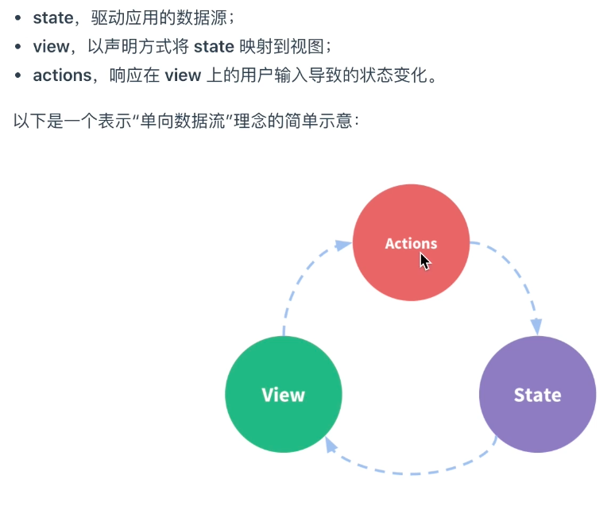

# Vue 知识点

## 数据响应式

- 通过Proxy代理模式
- proxy 所谓代理 是你要取得某样东西的中介，而不是直接作用在这个对象上，这就类似我们网购东西某需要在网店平台上购买，而不是直接向厂家购买
- Proxy 对象就是这样的媒介，要操作这个对象的话某需要经过这个媒介的同意
```js
function observe(obj) {
      if (typeof obj !== 'object' || obj === null) {
        return
      }
      const handler = {
        get: function (target, key) {
          const val = target[key]
          if (typeof val === 'object' && val !== null) {
            return new Proxy(val, handler)
          }
          console.log('get value')
          return Reflect.get(target, key)
        },
        set: function (target, key, val) {
          console.log('change value')
          return Reflect.set(target, key, val)
        }
      }
      return new Proxy(obj, handler)
    }
```
- 通过 object.definePropert()
```javascript
function render() {
  console.log('模拟视图渲染');
}
let data = {
  name: '浪里行舟',
  location: { x: 100, y: 100 },
};
observe(data);
function observe(obj) {
  // 我们来用它使对象变成可观察的
  // 判断类型
  if (!obj || typeof obj !== 'object') {
    return;
  }
  Object.keys(obj).forEach((key) => {
    defineReactive(obj, key, obj[key]);
  });
  function defineReactive(obj, key, value) {
    // 递归子属性
    observe(value);
    Object.defineProperty(obj, key, {
      enumerable: true, //可枚举（可以遍历）
      configurable: true, //可配置（比如可以删除）
      get: function reactiveGetter() {
        console.log('get', value); // 监听
        return value;
      },
      set: function reactiveSetter(newVal) {
        observe(newVal); //如果赋值是一个对象，也要递归子属性
        if (newVal !== value) {
          console.log('set', newVal); // 监听
          render();
          value = newVal;
        }
      },
    });
  }
}
data.location = {
  x: 1000,
  y: 1000,
}; //set {x: 1000,y: 1000} 模拟视图渲染
data.name; // get 浪里行舟
```

- vue 通过设定对象属性的 setter/getter 方法来监听数据的变化，通过 getter 进行依赖收集，每个 setter 就是一个观察者，在数据卞公的时候通知订阅者更新视图
- 侦测 Vue 中 data 中的数据

```javascript
class Vue {
  /* Vue构造类 */
  constructor(options) {
    this._data = options.data;
    observer(this._data);
  }
}
```

- 订阅者 dep
  - 收集依赖需要为依赖找一个存储依赖的地方，为此我们创建了 Dep,它用来收集依赖、删除依赖和向依赖发送消息等
  - 的主要作用是用来存放 Watcher 观察者对象

```javascript
class Dep {
  constructor() {
    /* 用来存放Watcher对象的数组 */
    this.subs = [];
  }
  /* 在subs中添加一个Watcher对象 */
  addSub(sub) {
    this.subs.push(sub);
  }
  /* 通知所有Watcher对象更新视图 */
  notify() {
    this.subs.forEach((sub) => {
      sub.update();
    });
  }
}
```

- 观察者 watcher
  - 依赖收集的目的是将观察者 Watcher 对象存放到当前闭包中的订阅者 Dep 的 subs 中

```javascript
class Watcher {
  constructor(obj, key, cb) {
    // 将 Dep.target 指向自己
    // 然后触发属性的 getter 添加监听
    // 最后将 Dep.target 置空
    Dep.target = this;
    this.cb = cb;
    this.obj = obj;
    this.key = key;
    this.value = obj[key];
    Dep.target = null;
  }
  update() {
    // 获得新值
    this.value = this.obj[this.key];
    // 我们定义一个 cb 函数，这个函数用来模拟视图更新，调用它即代表更新视图
    this.cb(this.value);
  }
}
```

- Vue 数据双向绑定是通过数据劫持结合发布者-订阅者模式的方式来实现的。利用了 Object.defineProperty() 这个方法重新定义了对象获取属性值(get)和设置属性值(set)。

## vue nextTick

- 在下次 dom 更新循环结束之后执行延迟回调，可用于获取更新后的 dom 状态
- 在 Vue 生命周期的 created()钩子函数进行的 DOM 操作一定要放在 Vue.nextTick()的回调函数中

## vue 生命周期的作用是什么

- 提供的钩子函数方便在各个阶段进行操作

## 第一次页面加载会触发哪几个钩子

- beforeCreated created boforeMount mounted

## 简述每个周期具体适合哪些场景

- beforeCreated new 了一个 vue 的实例之后，只有一些默认生命周期钩子和默认事件 一般进行的操作不多 可以写 loading 事件
- created 此时 data 和 methods 已经初始化完毕 可以触发 methods 的方法 或者发起异步请求获取数据 或者结束 loading 事件
- mounted 模版已经编译完成页面出现 可以获取 dom 节点
- updataed 适合对数据做统一的处理

## created 和 mounted 的区别

- created 在模板渲染成 html 前调用，即通常初始化某些属性值，然后再渲染成视图
- mounted 在模板渲染成 html 后调用，通常是初始化页面完成后，再对 html 的 dom 节点进行一些需要的操作。

## vue 获取数据在哪个周期函数

- 在 created 时就可以获取数据了

## mvvm

- MVVM 是 Model-View-ViewModel
- view 负责显示
- model 负责 javascript
- viewModel 负责把 Model 和 view 连接起来，把 model 的数据同步到 view，把 view 的修改同步回 model
- viewModel 通过数据绑定和事件绑定
```html
  <input type="text" id="input">
  <p id="p"></p>
  <script>
    var input = document.getElementById('input')
    var p = document.getElementById('p')
    var obj = {
      name: ''
    }
    Object.defineProperty(obj, 'name', {
      set: function (val) {
        input.value = val
        p.innerHTML = val
      },
      get: function (val) {
        return val
      }
    })
    input.addEventListener('input', function (e) {
      obj.name = e.target.value
    })
  </script>

```
## vue-router 是什么?它有哪些组件

- vue-router 是 vue 官方的路由管理器
- `<router-link to="">` 路由的路径
- `<router-link :to="{ name:'/路由名' }">` 命名路由
- `<router-view>` 路由的显示 占位符

## active-class 是哪个组件的属性？

- 是 vue-router 的组件 绑定样式的属性 当 routerlink 标签被点击时将会应用这个样式

## 怎么定义 vue-router 的动态路由? 怎么获取传过来的值

- /user/:id
- $route.params.变量名
- 当动态路由的动态参数切换时 实际上路由已经发生改变但是组件并没有重新加载所以需要使用watch监听$route的变化 或者用beforeRouteUpdate 监听
## 使用元信息控制路由访问权限
- 给路由添加meta属性
```js
router.beforeEach((to,from,next)=>{
  if(to.meta.requiredLogin && !store.state.user.isLogin){ // 未登录且必须登录才能访问的耶main 跳转到登录页面
    next({name:'Login'})
  }else if(to.meta.redirectAlreadyLogin && store.state.user.isLogin){ // 已经登录访问登录页面跳转首页
    next('/')
  }else{
    next()
  }
})
```
## router addRoute动态鉴权
- 在vuex里保存一个状态 isLogin：false
```js
// router.js
export const asyncRoutes = [
  {
    path:'/dashboard',
    component:Dashboard
  }
]
// 组件中

```
## router 的滚动行为
```js
const router = new VueRouter({
  mode:'history',
  routes,
  scrollBehavior(to,from,savedPosition){
    if(savedPosition){
      console.log(savedPosition)
      return savedPosotion
    }else{
      const position = {}
      position.selector = to.hash
      if(to.hash === '#nav'){
        position.offset = { y:110 }
      }
      return position
    }
  }
})
```
## vue-router 有哪几种导航钩子?

- beforeEach 前置守卫
- afterEach 后置钩子
- beforeEnter 单独路由独享钩子
- beforeRouteEnter 在渲染该组件的对应路由被 confirm 前调用
- beforeRouteUpdate 在当前路由改变，但是依然渲染该组件是调用
- beforeRouteLeave 导航离开该组件的对应路由时被调用

## `$route` 和 $router 的区别

- router 是 vueRouter 的实例 this.$router.push 会往 history 栈中添加一个新的记录
- route 是正在跳转的路由对象

## vue-router 响应路由参数的变化

- 可以给 router-vieåw 添加一个不同的 key

## vue-router 传参

- this.`$router`.push({path:`/user/${userId}`}) 接收参数 this.$route.params.userId
- 使用 params 传递 router.push({name:'user',params:{userId:123}})
- 使用 query 传递 router.push({path:'register',query:{plan:'private'}})
- `和name配对的是params，和path配对的是query`

## vue 优点

- 响应式变成
- 组件化
- 双向数据绑定
- 虚拟 dom

## vue 父组件向子组件传递数据？

- props

## 子组件像父组件传递事件

- this.$emit('事件名‘)

## 兄弟组件中传递参数
- event Bus
- 两个组件分别import main.js当中的{eventBus} 进行`$emit` 订阅 `$on` 发布
## 如何让 CSS 只在当前组件中起作用

- 当前组件`<style>`写成`<style scoped>`

## `<keep-alive></keep-alive>`的作用是什么?

- 比如有一个列表和一个详情，那么用户就会经常执行打开详情=>返回列表=>打开详情…这样的话列表和详情都是一个频率很高的页面，那么就可以对列表组件使用<keep-alive></keep-alive>进行缓存，这样用户每次返回列表的时候，都能从缓存中快速渲染，而不是重新渲染
- 被keep-alive 包裹的组件 再次进入会进入到activied钩子函数 不会再次触发created

## 如何获取 dom

- ref this.$refs.名称
- 加 id 选择器获取节点
-

## vue-loader 是什么？使用它的途径有哪些？

- 加载和解析.vue 文件的插件
- 把 js、css、template 分别提取出来交给对应的 loader 去处理

## 为什么使用 key

- 无：key 属性时，状态默认绑定的是位置；有：key 属性时，状态根据 key 的属性值绑定到了相应的数组元素

## axios 解决跨域

- 通过 vue.config.js 文件 修改配置
  - 设置 devServer 设置代理服务器 然后 changeOrigin 设置允许

```javascript
module.exports = {
  devServer: {
    proxy: {
      '/api': {
        // 此处的写法，目的是为了 将 /api 替换成 https://www.baidu.com/
        target: 'https://www.baidu.com/',
        // 允许跨域
        changeOrigin: true,
        ws: true,
        pathRewrite: {
          '^/api': '',
        },
      },
    },
  },
};
```

## vue-cli 项目中 src 目录每个文件夹和文件的用法

- assets 文件夹是放静态资源
- components 是放组件
- router 是定义路由相关的配置
- view 视图
- app.vue 是一个应用主组件
- main.js 是入口文件

## 分别简述 computed 和 watch 的使用场景
- computed 1.具有缓存的特性 依赖某个数据的变化而watch不依赖。2.computed一般用于同步的格式化数据的场景，watch处理一些数据或者派发一些异步事件
- computed 当一个值受多个属性影响的时候------------购物车商品结算
- watch 当一条数据的更改影响到多条数据的时候---------搜索框 
- watch 当借款额度只有1w 输入了2w 强行转回1w 并提示msg
```js
watch:{
  Amount:function(newVal,oldVal){
    if(newVal>5000){
      alert('最大额度可借5000元')
      this.Amount = 5000
    }
  }
}
```
-  https://www.cnblogs.com/dream111/p/13499020.html

## v-on 可以监听多个方法吗

- 可以

```html
<button v-on="{mouseenter: onEnter,mouseleave: onLeave}">鼠标进来1</button>
<button @mouseenter="onEnter" @mouseleave="onLeave">鼠标进来2</button>
```

## vue 组件中 data 为什么必须是一个函数

- data 是一个函数的时候，每一个实例的 data 属性都是独立的
- Object 是引用数据类型，如果不用 function 返回，每个组件的 data 都是内存的同一个地址，一个数据改变了其他也改变了；

JavaScript 只有函数构成作用域(注意理解作用域，只有函数{}构成作用域,对象的{}以及 if(){}都不构成作用域),data 是一个函数时，`每个组件实例都有自己的作用域，每个实例相互独立，不会相互影响。`

## vue 事件对象的使用

- @click="show($event)"

## 单页面应用和多页面应用区别及优缺点

- 初次加载时耗时多 不利于 seo
- 用户体验好，快，内容的改变不需要重新加载整个页面，基于这一点 spa 对服务器压力较小 前后端分离 页面效果会比较炫酷（比如切换页面内容时的专场动画）

## assets 和 static 的区别

- assets 和 static 两个都是用于存放静态资源文件。

- 放在 static 中的文件不会进行构建编译处理，也就不会压缩体积，在打包时效率会更高，但体积更大在服务器中就会占据更大的空间

- 放在 assets 中的文件会进行压缩体积、代码格式化，压缩后会放置在 static 中一同上传服务器。

- 因此建议样式文件放在 assets 中进行打包，引入的第三方文件放到 static 中，因为引入的文件已经做过打包处理。

## 列举常用的指令

- v-for
- v-bind
- v-show
- v-if v-show
- v-model
- v-on

## vue 常用的修饰符

- v-model
  - .lazy 光标离开才触发
  - .trim 过滤输入框首尾的空格
  - .number 选输入数字就会限制输入只能是数字，先字符串就相当于没有加 number
- 事件修饰符
  - .stop 阻止事件冒泡
  - .prevent 阻止默认行为
  - .self 只触发元素本身的方法
  - .once 事件只触发一次 无论点击多少次 执行一次之后都不会再次执行
  - .sync 对 props 进行双向绑定
  ```javascript
  //父
  <text-document
  :title.sync="title"
  ></text-document>
  //子
  this.$emit('update:name', e.target.value);
  ```
  - .keyCode 监听按键的指令 具体可以查看 vue 的键码

## 数组更新检测

- push() 、pop() 、shift() 、unshift() 、splice() 、sort() 、reverse()

## Vue.set 视图更新

- 在 vue 文档中写着如果在实例创建之后添加新的属性到实例上，它不会触发视图更新
  数据发生变化视图不更新 那就要 Vue.set 方法来设置

```javascript
  data() {
      return {
          items: [
              { message: "one", id: "1" },
              { message: "two", id: "2" },
              { message: "three", id: "3" }
          ]
      };
  },
  mounted(){
      this.items[0]={message:"测试",id:"4"};  //此时对象的值更改了，但是视图没有更新
      this.$set(this.items,0,{message:"测试",id:"4"})； //$set可以触发更新视图
      console.log(this.items)
  }
```

## 自定义指令详解

## vue 的两个核心点

- 数据驱动 : 在 vue 中，数据的改变会驱动视图的自动更新。传统的做法是需要手动改变 DOM 来使得视图更新，而 vue 只需要改变数据。
- 组件 : 组件化开发，优点很多，可以很好的降低数据之间的耦合度。将常用的代码封装成组件之后（vue 组件封装方法），就能高度的复用，提高代码的可重用性。一个页面/模块可以由多个组件所组成。

## vue 和 jQuery 的区别

- jOuery 首先要获取到 DOM 对象,然后对 DOM 对象进行值的修改等操作，而 Vue 不直接对 DOM 元素进行渲染，它更多的是把值和对象（js）进行绑定，然后再修改 js 对象的值
- 简单来说就是 Vue 帮我们做了 DOM 操作，节省了很多代码，它只需要做好对数据的单向绑定，就是我们常说的 DOM 对象绑定，如果当 js 对象的值也会跟着 dom 元素的值改变而改变，叫做双向数据绑定

## 引进组件的步骤

- 采用 es6 import...from...语法
- commonjs 采用 require 方法引入组件

## Vue-cli 打包命令是什么？打包后悔导致路径问题，应该在哪里修改

- npm run build
- vue.config.js assetsPublicPath 属性

## 跨组件双向数据绑定

- watch 监听 和 过渡属性

```javascript

<template>
  <input type="text" v-model="model">
</template>

<script>
  export default {
    props: {
      value: {
        type: String,
        default: '',
      },
    },

    data () {
      return {
        model: '',
      }
    },

    watch: {
      value: {
        immediate: true,
        handler (newVal) {
          this.model = newVal
        },
      },

      model (newVal) {
        this.$emit('input', newVal)
      },
    },
  }
</script>
```

- 计算属性 setter getter

```javascript

<template>
    <input type="text" v-model="model">
</template>

<script>
  export default {
    props: {
      value: {
        type: String,
        default: '',
      },
    },

    computed: {
      model: {
        get () {
          return this.value
        },
        set (newVal) {
          this.$emit('input', newVal)
        },
      },
    },
  }
</script>
```

## delete 和 Vue.delete 删除数组的区别

- delete 删除 数组长度不变
- vue.delete 删除 直接删除键值 数组长度改变

## SPA 首屏加载慢如何解决

- 第三方库启用 cdn
- elementUi 按需加载
- 路由懒加载
- 首页内容定制
- 图片资源的压缩

## Vue-router 跳转和 location.href 有什么区别

- location.href 是跳转 刷新了页面
- vue-router 是按需加载 dom 没有刷新页面

## 你们 vue 项目是打包了一个 js 文件，一个 css 文件，还是有多个文件？

- 根据 vue-cli 脚手架规范，一个 js 文件，一个 CSS 文件

## vue 遇到的坑，如何解决的？

## Vue 里面 router-link 在电脑上有用，在安卓上没反应怎么解决？

- babel polypill 插件解决

## Vue2 中注册在 router-link 上事件无效解决方法

- @click.native

## RouterLink 在 IE 和 Firefox 中不起作用（路由不跳转）的问题

- 只用 a 标签 不用 button 标签
- 使用 button 标签的和 Router.navigate 方法

## axios 的特点有哪些

- 支持 promise 的 api
- 拦截请求和响应
- 自动换成 json
- axios 发送 params 用于 get 请求 发送 data 用于 post、put 请求

## 请说下封装 vue 组件的过程？

- 使用 Vue.extend()创建一个组件

```javascript
var myCom = Vue.extend({
  template: '<div>这是我的组件</div>'
```

- 使用 Vue.component()方法注册组件

```javascript
//全局注册
Vue.component('my-com', {
  template: '<div>这是我的组件</div>',
});
//局部注册
var app = new Vue({
  el: '#app',
  components: {
    'my-com': myCom,
  },
});
```

- 子组件需要的数据，可以在 props 中接受定义
- 子组件修改好数据之后，想把数据传递给父组件，可以使用 emit()方法

## vue mock 数据

- 通过 vue-cli 初始化 mock 项目
- 利用了 webpack-dev-server 实现的 mock 功能
- npm i axios body-parser -S

## vue 封装通用组件

- 数据从父组件传入 props 传入参数，不建议对它进行操作，如果要操作，请先在子组件深拷贝
- 在父组件处理事件 比如某些子组件的 click 事件，避免高耦合，逻辑最好放在父组件中，子组件只是一个承载体
- 具名插槽 slot 的应用 现在有一个需求，在同一个子组件中，我在不同的场景需要用到不同的按钮，那么在封装组件的时候就不用去写按钮，只用在合适的未知留一个 slot，把按钮的位置留出来，然后再父组件中写入

## vue 初始化页面闪动问题

- vue 在渲染之前，style="display: none;"让页面不显示 vue 渲染完成了，:style="display: block;"让页面显示

```javascript
<div class="app" style="display: none;" :style="{display: 'block'}">
  {{message}}
</div>
```

## vue 禁止弹窗后的屏幕滚动

- @touchmove.prevent @mousewheel.prevent
- @touchmove 是触摸移动事件
- @mousewheel 是鼠标滚轮事件

## vue 更新数组时触发视图更新的方法

- Vue.set, vm.$set, replace

### 1.

- 当某个属性被双向绑定的时候需要是一个数组 但是数据库保存的时候是一个字符串 在提交保存接口时转换数组为字符串 双向绑定这个地方就会报错
  解决方案是 将表单对象做一下深拷贝 用 lodash \_\_.cloneDeep(表单对象)

### 2.当需要对象合并的时候需要用到 lodash \_.merge(对象 1，对象 2)

### 3.项目优化策略

    生成打包报告
    第三方库启用cdn
    elementUi 按需加载
    路由懒加载
    首页内容定制

# vuex

- state : 状态中心
- mutations：更改状态
- actions：异步更改状态
- getters:获取状态
- modules:将 state 分成多个 modules，便于管理

## 使用 vuex 的目的

- 在组件外部管理状态
- 防止多个组件在共享状态时 单向数据流被迫开
- 当多个视图要依赖同一个状态的时候 使用 vuex 可以满足

## state

- 驱动应用的单向数据流
- 在计算属性当中去返回
- 通过 this.$store.state 来获取
- 通过 mapState 辅助函数将 getter 映射到局部计算属性当中

```javascript
computed: mapState([
  'count', //映射 this.count为store.state.count
]);
```

## getter

- 可以看作是 state 的计算属性
- 在计算属性当中去返回

```javascript
mapGetters({
  doneCount: 'doneTodosCount', //映射`this.doneCount`为`store.getters.doneTodosCount`
});
```

## mutation

- mutation 是 store 中修改状态的唯一方法
- mutation 和事件很像 拥有一个字符串类型的事件名称 和 一个对应的 handler 函数
- 每个 mutation 接收 state 为第一个参数，在看有无其他参数传入
- 向 store.commit 传入额外的参数，叫做 mutation 的 载荷（payload），在大多数情况下，载荷应该是一个对象，这样可以包含多个字段并且记录的 mutation 会更易读
- 通过 this.$store.commit 触发

## action

- Action 类似于 mutation，不同在于：
  - 1.Action 提交的是 mutation，而不是直接变更状态。
  - 2.Action 可以包含任意异步操作。
- 通过 this.$store.dispatch('action 的名称')
- 通过 mapAcitons 辅助函数

## module

- Vuex 允许我们将 store 分割成模块（module）解决 store 对象臃肿

```javascript
const moduleA = {
  state: { ... },
  mutations: { ... },
  actions: { ... },
  getters: { ... }
}

const moduleB = {
  state: { ... },
  mutations: { ... },
  actions: { ... }
}

const store = new Vuex.Store({
  modules: {
    a: moduleA,
    b: moduleB
  }
})
store.state.a // -> moduleA 的状态
store.state.b // -> moduleB 的状态
```

## provide 和 inject

- provide 是一个函数 返回子孙组件想要的数据
- inject 是一个字符串数据 触发祖先组件的 provide 获取数据

## vue.observable()

- 用于设置监控属性，这样就可以监控 viewModule 中的属性值的变化，从而就可以动态的改变某个元素的值，监控属性的类型不变量而是一个函数，通过返回一个函数给 viewModule 对象中的属性，从而来监控该属性。
- https://segmentfault.com/a/1190000019292569?utm_source=tag-newest

## vue3

- defineComponent
- h 函数
  - 参数 1 接收一个字符串、对象、函数 字符串的时候就是标签名
  - 参数 2 接收对象、或者数组

```javascript
const img = require();
const App = defineComponent({
  render() {
    return h('div', { id: 'app' }, [
      h('img', {
        alt: 'vue logo',
        src: img,
      }),
      h(Helloworld, {
        msg: 'welcome to your vue.js +typescript app',
        age: 12,
      }),
    ]);
  },
});
```

- setup
  - 在 beforecreate 之后 created 之前执行

```javascript
//vue2 计数器组件
export default {
  data: () => ({
    count: 0,
  }),
  methods: {
    increment() {
      this.count++;
    },
  },
  computed: {
    double() {
      return this.count * 2;
    },
  },
};
// --------------
import { ref, computed } from 'vue';
export default {
  setup() {
    const count = ref(0);
    const double = computed(() => count * 2);
    function increment() {
      count.value++;
    }
    return {
      count,
      double,
      increment,
    };
  },
};
```

- jsx

- watchEffect
- teleport

## Ajv

- format 校验类型
- addFormat 自定义校验规范
## 在不实用proxy的前提下 实现defineProperty可以新增数据
  - 将被遍历的数据的长度设置成1000 