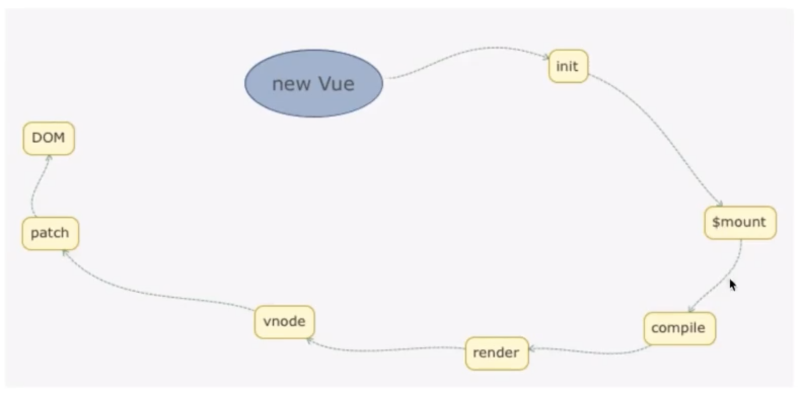

# vue2 原理

## 入口及构建

### Flow

- facebook 出品 js 类型检查工具 类似 typescript 的工具
- libdef 识别第三方插件 一些类型或者自定义类型
- .flowconfig flow 的配置文件
  

### 源码目录结构

<!--  -->

- compiler
  - 编译相关 模版解析成 ast 语法树 ast 语法树优化 代码生成等
  - 编译的工作借助辅助插件 如 webpack（离线）、vue-loader 推荐 webpack 因为编译消耗性能所以更推荐离线编译
- core（重点）
  - Vue.js 的核心代码 包括内置组件、全局 Api 封装、Vue 实例化、观察者、虚拟 DOM、工具函数等
- platform
  - Vue.js 的入口 分别有运行在 web 和 native（借助 weex）的两个入口
- server
  - 服务端渲染代码 运行在服务端 node.js 与 运行在浏览器的 Vue.js 不一样
- sfc
  - 把.vue 文件内容解析成一个 js 对象
- shared
  - 定义了一些工具方法，并在服务端与浏览器端共享

### 源码构建

- 构建过程（/script/build.js） 1.获得所有配置 2.过滤配置-将不需要打包的过滤（process.argv[2]就是 package.json 里面 script 命令-- 后面的有参数就过滤掉 没参数就默认过滤 weex） 3.调用 build 函数做真正的构建过程
- 配置项（/script/config.js）Object.keys(builds).map(genConfig) genConfig 构造出一个新的 config 对象 此对象是适用于 rollup 打包的对象（在 build.js 里面的 buildEntry 方法里面使用）
- 入口文件关系应声（/script/alias.js)

### 入口分析

- Vue 实例初始化 本质上就是一个用 Function 实现的 Class，然后它的原型 prototype 以及它本身都扩展了一系列的方法和属性

```js
// Vue 本质上是一个用Function 实现的class
function Vue(options) {
  if (process.env.NODE_ENV !== 'production' && !(this instanceof Vue)) {
    warn('Vue is a constructor and should be called with the `new` keyword');
  }
  this._init(options);
}
```

- vue 实例化的时候 通过 mixin 方法给原型挂在了很多原型方法 通过 globalApi 给 vue 挂在了很多静态方法
- Vue 不使用 class 构建的原因是什么
  - 因为 Vue 需要实现 mixin 会将 Vue 的实例当作参数去传入 并将各个功能分散到各个模块去处理 使用 class 不易于维护
  - class 关键字创建的函数不能通过 call,bind,apply 改变 this 指向，function 可以，Vue 源码中很多地方都涉及到 this 指向的修改

### 源码调试

- package.json 里面修改 dev 指令为 "dev": "rollup -w -c scripts/config.js --sourcemap --environment TARGET:web-full-dev",
- 原指令为 "dev": "rollup -w -c scripts/config.js --environment TARGET:web-full-dev",
- npm run dev 生成一个 dist 文件夹下的新 vue 文件
- 将新 vue 文件引入测试文件中 在 chrome 调试

## 数据驱动

### new Vue()的时候发生了什么

- 进入到 Vue 的构造函数 触发了 this.\_init 方法
- 在 core/instance/init.js 里面 在 Vue 的原型上定义了 Vue.prototype.\_init 方法
- init 方法里面主要合并了 vue 的配置项 options ，初始化生命周期，初始化事件中心，初始化渲染，初始化 data、props、computed、watcher ， 检查配置项当中是否有 el 属性 如果有的话会调用$mount 来挂载 vm
- 初始化 data 在 init.js 同级有个 state.js 主要是进行初始化 data 的操作
  - 初始化时会先检查是否 props 有就先初始化 props 因为 props 和 data 都是要通过 vm 对象来获取的
  - methods 也是在 data 之前初始化的 data 初始化完毕之后 computed 被初始化 再初始化 watch

### Vue 实例挂载实现

- vue 实例是通过$mount 挂载
- compiler 版 $mount 实现步骤

### entry-runtime-with-compiler.js

- 将 runtime/index 中的 mount 方法 缓存 `const mount = Vue.prototype.$mount`
- 再重新定义一个 moun 方法
- 判断配置项当中是否有 render 函数
- 如果没有 判断是否存在 template 若存在获取 template 的 dom 节点 若不存在将 el 转换成一个 string 类型的 template
- 运行 compileToFunctions 方法编译出一个 render 函数
- 当有 render 的时候 运行 mount mount 来自 mountComponent

### core/instance/lifecycle.js -> mountComponent

- 定义 updateComponent 函数 本质上借助渲染 Watcher -> observer/watcher.js
- updateComponent 实际上执行一次真实的渲染 不论是首次渲染还是更新渲染 都要借助渲染 Watcher

### vm.\_render() -> src/core/instance/render.js

- 用来把实例渲染成一个虚拟 Node
- 在 renderMixin 方法中 在 vue 的原型上定义了\_render 方法 它的返回值是一个 VNode
- 该方法的核心是执行了 render.call(vm.\_renderProxy, vm.$createElement)
- vm.\_renderProxy
  - 在开发环境是一个 proxy 对象 ->core/instance/init.js 执行 initProxy() ->core/instance/proxy.js
    - hasProxy 判断当前浏览器是否支持 Proxy 对象 主要是对对象访问做劫持
    - warnNonPresent 方法
  ```js
  // core/instance/proxy.js
  const warnNonPresent = (target, key) => {
    warn(
      `Property or method "${key}" is not defined on the instance but ` +
        'referenced during render. Make sure that this property is reactive, ' +
        'either in the data option, or for class-based components, by ' +
        'initializing the property. ' +
        'See: https://vuejs.org/v2/guide/reactivity.html#Declaring-Reactive-Properties.',
      target,
    );
  };
  ```
  - 但是在生产环境就是 vm 对象->core/instance/init.js 对 vm.\_renderProxy 有赋值操作
- vm.$createElement 当手写 render 函数的时候被调用

```js
// 手写render函数
// main.js
import Vue from 'vue';

var app = new Vue({
  el: '#app',
  render(createElement) {
    return createElement(
      'div',
      {
        attrs: {
          id: 'app',
        },
      },
      this.message,
    );
  },
  data() {
    return {
      message: 'hello Vue',
    };
  },
});
```

- 此时手写的 render 函数 不会经过$mount 方法寻找 template 再去生成 render 函数 而是直接将#app 节点替换掉 所以 el 不可以写在 body 上

### Virtual DOM

- Virtual DOM 就是用一个原生的 JS 对象去描述一个 DOM 节点 相比直接创建一个 DOM 代价小很多
- 在 vue.js 中 VNode 是用一个 Class 去描述 定义在 src/core/vdom/vnode.js
- vue 是借鉴 开源库 snabbdom 实现的 并加入 vue.js 特色的东西
- VNode 是对真实 DOM 的一种描述 核心是几个关键属性：标签名、数据、子节点、键值
- 当我们使用 for in 遍历一个 dom 节点的属性时 从原型链的角度去观察 就会发现实际一个 dom 对象是非常庞大的

### VNode 创建过程

- 利用 vm.$createElement 来创建 VNode

### vm.$createElement -> src/core/vdom/create-element.js

- createElement 方法会后返回 \_createElement 方法
- \_createElement 的参数
  - context 上下文环境
  - tag 标签
  - data 主要是 Vnode 的数据 Data
  - children Vnode 的子节点
  - normalizationType Vnode 的子节点规范 用于区分编译生成的 render 还是用户手写的
- children 的规范化
  - Vnode 本身是一个树形结构
  - 根据 normalizationType 参数的不同 调用 normalizeChildren(children) 或者 simpleNormalizeChildren(children) 区别是 render 手动生成 和 render 编译生成
    - simpleNormalizeChildren 编译生成的 render 返回已经是一个 Vnode 除非是函数式组件 返回了一个数组 将它拉平
    - normalizeChildren 最终返回一个类型为 VNode 的 array
      - 场景 1 是用户手写的时候 当 children 只有一个节点 允许调用 createTextVnode 创建一个文本节点的 VNode
      - 场景 2 当编译 slot、v-for 的时候会产生嵌套数组的情况 调用 normalizeArrayChildren  如果是单个节点 createTextVnode 成一个 Vnode 如果是数组那么递归调用 normalizeArrayChildren 进行处理
- Vnode 的创建
  - 当传入的 tag 是一个基本标签时 实例化 VNode 得到一个 VNode

### \_update -> src/core/instance/lifecycle.js

- vm.$mount 的最后会通过 watcher 调用 updateComponent 方法最后都会调用道\_update 方法
- 当首次渲染或者更新试图的时候都会执行**patch**方法
- **patch** 四个参数
  - 第一个参数 oldVnode  可以是一个 dom 或者 VNode
  - 第二个参数是 VNode 表示执行 render 函数之后的返回的 Vnode
  - 第三个参数判断是否是服务端渲染
  - 第四个参数 removeOnly

### 一句话概括 一个渲染过程‘

- 渲染 data init.js 初始化 data 把 data 挂在到 vm 上 执行$mount 方法->mount 里的 render 函数生成 VNode，然后调用\_update 里面有**patch**方法 里面有 createElm 方法渲染 VNode createChildren 生成一个真实的节点 insert 对节点 最后都是调用 appendChild 方法
  

## 组件化

### createComponent -〉src/core/vdom/create-component.js

- 三个关键步骤
  - 构造子类构造函数
    - src/core/global-api/index.js 写到 Vue.options.\_base = Vue
    - ```js
      // src/core/instance/init.js
      vm.$options = mergeOptions(
        resolveConstructorOptions(vm.constructor),
        options || {},
        vm,
      );
      ```
    - Vue.extend -> core/global-api/extend.js
      - 组合式继承 Vue
      - mergeOptions
      - 初始化 prop
      - 初始化 computed
      - 继承组件、指令、过滤器
      - 将组建缓存在 options 里 避免重复 extend 同一个组件
  - installComponentHooks
    - installComponentHooks 的执行过程就是把 componentVNodeHooks 里面定义的钩子函数合并到 data.hook 中
  - 实例化 VNode
    - 与常规 VNode 的区别就是 组件 VNode 没有 Children，text，elm 等参数 但是在倒数第二个参数 componentOptions 当中有这些参数

### 组件 patch 的过程

- 了解组件 patch 的整体流程
  - createComponent -> 子组件初始化 -> 自组件 render -> 子组件 patch
- 了解组件 patch 流程中的 avtiveInstance、vm.$vnode、vn.\_vnode 等
  - avtiveInstance 每次渲染的时候 把当前 vm 赋值 主要是用于编排组件的父子关系 prevavtiveInstance 与 avtiveInstance 是父子关系
  - vm.$vnode 父级的 VNode 也可能是占位符 vnode 比如组件名那种标签就是占位符 vnode
  - vm.\_vnode 渲染 Vnode 指的是根 Vnode -> div#app
- 了解嵌套组件的插入顺序

  - 先子后父

- 调用 createElm 创建元素节点
- 进入 createComponent 方法 src/core/vdom/patch.js 在里面执行 init 钩子函数 就是 vdom 的 createComponent 方法里面合并钩子函数的时候就 含有 init 方法
- init 钩子 通过 createComponentInstanceForVnode  方法创建了一个 Vue 实力 然后调用$mount 方法挂载子组件
- createComponentInstanceForVnode 在里面构造了内部组件的参数   然后调用 vnode.componentOptions.Ctor 实际上就是 new Sub(options) 实例化子组件对象
- init src/core/instance/inject.js
  - 在初始化过程中 因为渲染组件的时候 isComponent 此时为 true 所以最终会进入到 initInternalComponent 方法中 目的是初始化内部组件
  - initInternalComponent 把通过 createComponentInstanceForVnode  函数传入的几个参数 parent、parentVnode 合并到$options 里·1
  - 由于组件渲染不存在 vm.$option.el 所以组件的mount是自己接管的 完成实例化之后执行child.$mount(hydrating ? vnode.elm : undefined, hydrating) 实际上是 child.$mount(undefined, false) 最终会调用 mountComponent 方法里的 render 函数 生成组件的 VNode 对象
  - render 之后返回一个渲染 vnode 会调用\_update 方法 进入 patch 回到 createElm 方法中再次调 用 createComponent 此时传入的 vnode 是组件渲染的 Vnode 此时返回值为 false 然后就是将 Vnode 渲染成真实 dom 的过程

### 合并配置

## 响应性

```js
// 响应性
function convert(Obj) {
  Object.keys(obj).forEach((key) => {
    let internalValue = obj[key];
    Object.defineProperties(obj, key, {
      get() {
        console.log(`getting key "${key}":${internalValue}`);
        return internalValue;
      },
      set(newValue) {
        console.log(`setting key "${key}" to: ${newValue}`);
        internalValue = newValue;
      },
    });
  });
}
```

## 依赖跟踪

```js
window.Dep = class Dep {
  constructor() {
    this.subscribers = new Set();
  }

  depend() {
    // 表示当前正在执行的代码  收集依赖项
    if (acriveUpdata) {
      // 当依赖发生更新
      this.subscribers.add(activeUpdate); // 把这个依赖加入到订阅者列表中
    }
  }

  notify() {
    // 表示依赖发生改变

    this.subscribers.forEach((sub) => sub()); // 获取订阅函数然后执行它
  }
};
let activeUpdate; //

function autorun(update) {
  //接收一个更新函数或者表达式
  //
  function wrappedUpdate() {
    // 当依赖关系发生改变 依然执行update
    activeUpdate = wrappedUpdate;
    update();
    activeUpdate = null;
  }
  wrappedUpdate();
}
autorun(() => {
  Dep.depend();
});
```

## 迷你观察者

```js
// 实质是创建了一个对象，当我们访问一个属性，它收集依赖，调用dep.depend,当我们通过赋值改变属性值，他调用deo.notify触发改变
class Dep {
  constructor() {
    this.subscribers = new Set();
  }

  depend() {
    // 表示当前正在执行的代码  收集依赖项
    if (activeUpdate) {
      // 当依赖发生更新
      this.subscribers.add(activeUpdate); // 把这个依赖加入到订阅者列表中
    }
  }

  notify() {
    // 表示依赖发生改变
    this.subscribers.forEach((sub) => sub()); // 获取订阅函数然后执行它
  }
}

function observe(obj) {
  Object.keys(obj).forEach((key) => {
    let internalValue = obj[key];

    const dep = new Dep();
    Object.defineProperty(obj, key, {
      // 在getter收集依赖项，当出发notify时重新运行
      get() {
        dep.depend();
        return internalValue;
      },

      // setter用于调用notify
      set(newVal) {
        const changed = internalValue !== newVal;
        internalValue = newVal;
        if (changed) {
          dep.notify();
        }
      },
    });
  });
  return obj;
}
let activeUpdate = null;
function autorun(update) {
  // 接收一个更新函数或者表达式
  const wrappedUpdate = () => {
    // 当依赖关系发生改变 依然执行update
    activeUpdate = wrappedUpdate;
    update();
    activeUpdate = null;
  };
  wrappedUpdate();
}
```

## 插件 Vue.use()

- 插件的本质是一个函数

```js
  function(Vue,options){
    // ...plugin code
  }
```

- 编写插件涉及到 `Vue.mixin API`
  - `Vue.mixin(options)` mixin 的本质上是可重复使用的代码片段 是一个全局 api
- $.options 属性
  - 很多人可能不太清楚$.options属性，其实每个组件都有$.options 属性它表示实例组件的配置项，配置项可以是组件自身的配置也可以是继承过来的配置项或者是 vue.mixin 混入的。

# vue3 原理

- defineComponent
  - 传入一个对象 再返回一个对象
