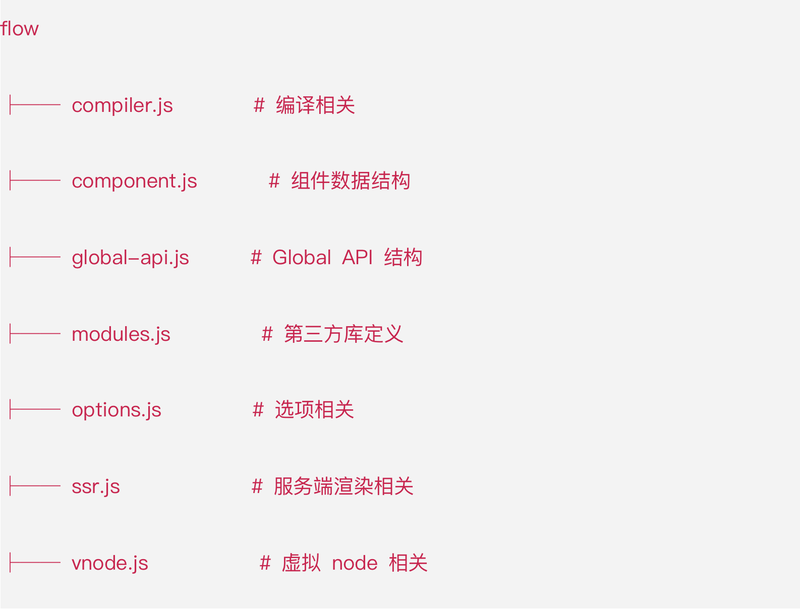
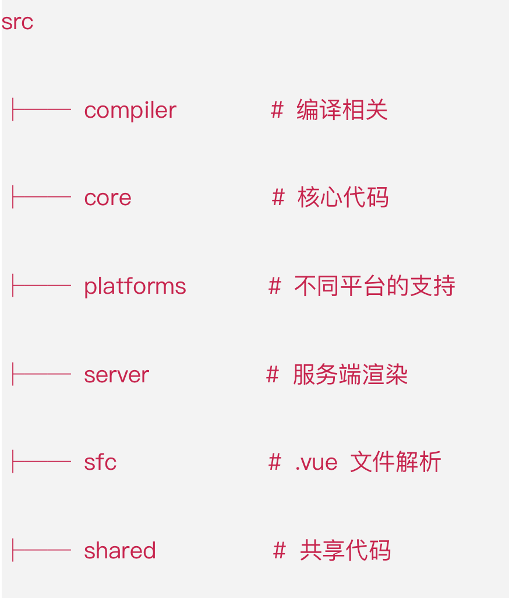

# vue2 原理
## Flow
  - facebook 出品js类型检查工具 类似typescript的工具
  - libdef 识别第三方插件 一些类型或者自定义类型
  - .flowconfig flow的配置文件


## 源码目录结构
<!--  -->
- compiler
  - 编译相关 模版解析成ast语法树 ast语法树优化 代码生成等
  - 编译的工作借助辅助插件 如 webpack（离线）、vue-loader 推荐webpack 因为编译消耗性能所以更推荐离线编译
- core（重点）
  - Vue.js的核心代码 包括内置组件、全局Api封装、Vue实例化、观察者、虚拟DOM、工具函数等
- platform
  - Vue.js的入口 分别有运行在web和native（借助weex）的两个入口
- server
  - 服务端渲染代码 运行在服务端node.js 与 运行在浏览器的Vue.js不一样
- sfc
  - 把.vue文件内容解析成一个js对象
- shared
  - 定义了一些工具方法，并在服务端与浏览器端共享

## 源码构建
  - 构建过程（/script/build.js） 1.获得所有配置 2.过滤配置-将不需要打包的过滤（process.argv[2]就是package.json里面script命令-- 后面的有参数就过滤掉 没参数就默认过滤weex） 3.调用build函数做真正的构建过程
  - 配置项（/script/config.js）Object.keys(builds).map(genConfig) genConfig构造出一个新的config对象 此对象是适用于rollup打包的对象（在build.js里面的buildEntry方法里面使用）
  - 入口文件关系应声（/script/alias.js)

## 入口分析
  - Vue实例初始化 本质上就是一个用 Function 实现的 Class，然后它的原型 prototype 以及它本身都扩展了一系列的方法和属性
## 源码调试
  - package.json里面修改dev指令为 "dev": "rollup -w -c scripts/config.js --sourcemap --environment TARGET:web-full-dev",
  - 原指令为 "dev": "rollup -w -c scripts/config.js --environment TARGET:web-full-dev",
  - npm run dev 生成一个dust文件夹下的新vue文件
  - 将新vue文件引入测试文件中 在chrome调试
## 响应性
```js
// 响应性
function convert(Obj) {
  Object.keys(obj).forEach(key => {
    let internalValue = obj[key]
    Object.defineProperties(obj, key, {
      get() {
        console.log(`getting key "${key}":${internalValue}`)
        return internalValue
      },
      set(newValue) {
        console.log(`setting key "${key}" to: ${newValue}`)
        internalValue = newValue
      }
    })
  })
}
```
## 依赖跟踪
```js
window.Dep = class Dep {
  constructor() {
    this.subscribers = new Set()
  }

  depend() { // 表示当前正在执行的代码  收集依赖项
    if (acriveUpdata) { // 当依赖发生更新
      this.subscribers.add(activeUpdate) // 把这个依赖加入到订阅者列表中
    }
  }

  notify() { // 表示依赖发生改变

    this.subscribers.forEach(sub => sub())// 获取订阅函数然后执行它
  }
}
let activeUpdate // 

function autorun(update) { //接收一个更新函数或者表达式
  //
  function wrappedUpdate() { // 当依赖关系发生改变 依然执行update
    activeUpdate = wrappedUpdate
    update()
    activeUpdate = null
  }
  wrappedUpdate()
}
autorun(() => {
  Dep.depend()
})
```

## 迷你观察者
```js
// 实质是创建了一个对象，当我们访问一个属性，它收集依赖，调用dep.depend,当我们通过赋值改变属性值，他调用deo.notify触发改变
class Dep {
  constructor() {
    this.subscribers = new Set()
  }

  depend() {  // 表示当前正在执行的代码  收集依赖项
    if (activeUpdate) { // 当依赖发生更新
      this.subscribers.add(activeUpdate)  // 把这个依赖加入到订阅者列表中
    }
  }

  notify() { // 表示依赖发生改变
    this.subscribers.forEach(sub => sub()) // 获取订阅函数然后执行它
  }
}

function observe(obj) {
  Object.keys(obj).forEach(key => {
    let internalValue = obj[key]

    const dep = new Dep()
    Object.defineProperty(obj, key, {
      // 在getter收集依赖项，当出发notify时重新运行
      get() {
        dep.depend()
        return internalValue
      },

      // setter用于调用notify
      set(newVal) {
        const changed = internalValue !== newVal
        internalValue = newVal
        if (changed) {
          dep.notify()
        }
      }
    })
  })
  return obj
}
let activeUpdate = null
function autorun(update) { // 接收一个更新函数或者表达式
  const wrappedUpdate = () => { // 当依赖关系发生改变 依然执行update
    activeUpdate = wrappedUpdate 
    update()
    activeUpdate = null
  }
  wrappedUpdate()
}
```
## 插件 Vue.use()
- 插件的本质是一个函数 
```js
  function(Vue,options){
    // ...plugin code
  }
```
- 编写插件涉及到 `Vue.mixin API`
  - `Vue.mixin(options)` mixin的本质上是可重复使用的代码片段 是一个全局api
- $.options属性 
  - 很多人可能不太清楚$.options属性，其实每个组件都有$.options属性它表示实例组件的配置项，配置项可以是组件自身的配置也可以是继承过来的配置项或者是vue.mixin混入的。
# vue3 原理
- defineComponent
  - 传入一个对象 再返回一个对象
