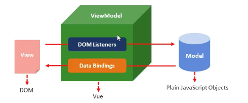
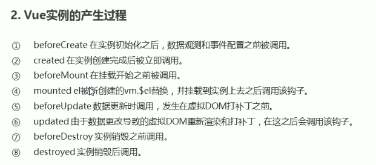
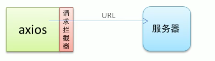
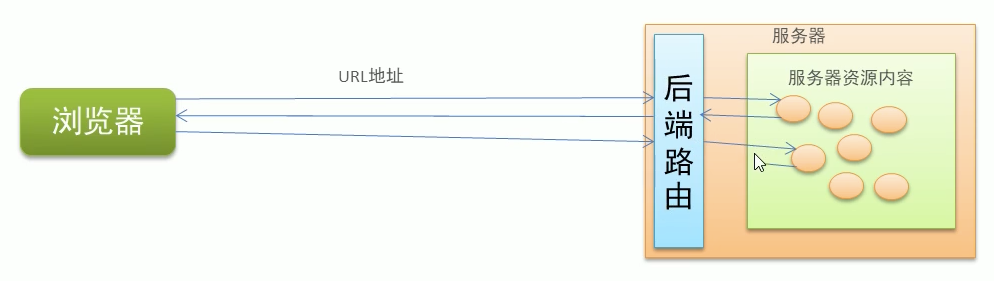
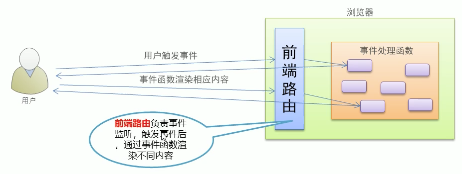
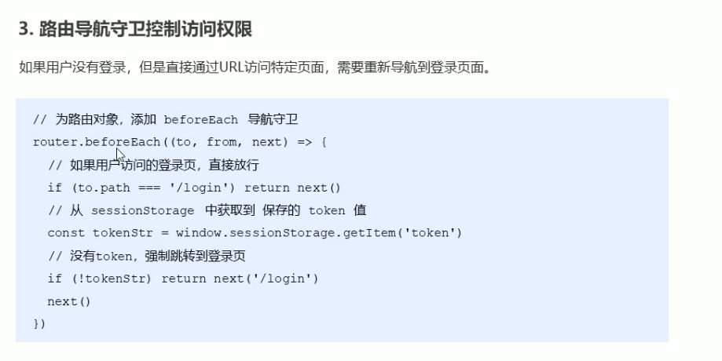
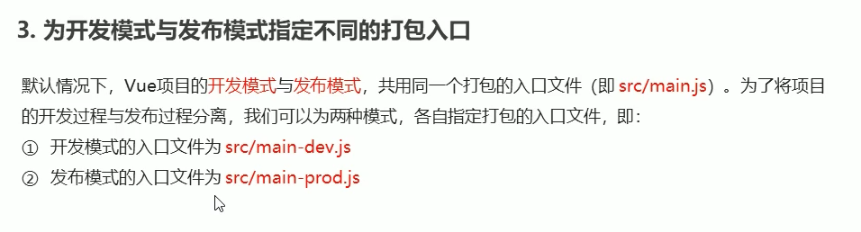
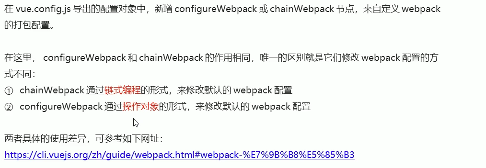
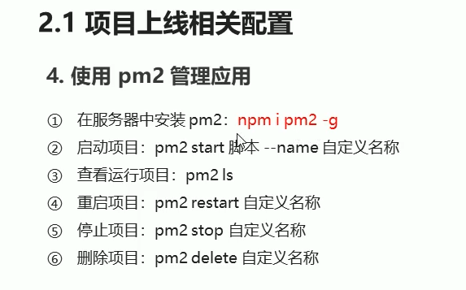

# vue 学习笔记
### 1.v-cloak 闪动

<style>
  [v-cloak]{
    display:none
  }
</style>
```html
<div v-cloak>{{msg}}</div>
```

### 2.v-text 无闪动

### 3.v-html 插入html

局限性：xss跨站脚本攻击 存在安全隐患 跨域不可 本网站的ajax🉑️

### 4.v-pre 显示原始信息 跳过编译过程

#<div v-pre>{{msg}}</div>

### 5.数据响应式

数据的变化导致页面内容的变化

### 6.v-once 使页面上的内容只编译一次

#<div v-once>{{info}}</div>

如果显示的信息后续不需要修改 使用v-once

好处 这样可以提高性能

### 7.双向数据绑定

v-model

<input type='type' v-model='uname'/>

### 8.MVVM设计思想
  在前端页面中，把Model用纯JavaScript对象表示，View负责显示，两者做到了最大限度的分离。

  把Model和View关联起来的就是ViewModel。ViewModel负责把Model的数据同步到View显示出来，还负责把View的修改同步回Model。

  M（model）

  V（view）

  VM（View-Model）

  

  DOM Listerners 事件绑定

  Data Bindings 数据绑定

  把不同的业务代码放到不同的模块中 再通过特定的逻辑组织到一块

### 9.事件绑定

#### v-on

<input @click="num++" type='button' />”

<input @click="handle">

<input @click="handle1(123,$event)"> 

事件绑定-参数传递

1.如果时间直接绑定函数名称，那么磨人会传递事件对象作为时间函数的第一个参数

2.如果时间绑定函数调用，那么事件对象必须作为最后一个参数显示传递，并且事件对象的名称必须是$event

mothods:{

​    handle:function(p,p1,event){

​     console.log(p,p1)

​    Console.log(event.target.innerHTML)

​    },

​    handle1:function(p,p1,event){

​     console.log(p,p1)

​    Console.log(event.target.innerHTML)

​    }

}

### 10.样式绑定

<style>
  .active{}
  .error{}
</style>

#<div :class="[activeClass,errorClass]"></div>

#<div :class="{active:isActive}"></div>

### 11.v-for

<script>
  var vm = new Vue({
    el:'#app',
    data:{
      obj = {
        uname:'list',
        age:12,
        gender:'male'
      }
    }
  })
</script>
#<div v-if='index>1' v-for='(value,key,index) in obj'>{{ value+'-----'+key+'-----'+index}}</div>

### 12.@click.prevent 阻止事件的默认行为


### 13.让select标签多选 

#<select v-model='occupation' multuple="true"></select> 

### 14.v-model.number 将文本框的字符串转换成数值 可以直接运算

v-model.trim 去掉文本框开始与结尾的空格

### 15. v-model.lazy 

将input事件改为change事件

input事件：每次文本每次改变时都触发

change事件：当文本框失去焦点时触发


### 16自定义指令

钩子函数：

- `bind`：只调用一次，指令第一次绑定到元素时调用。在这里可以进行一次性的初始化设置。
- `inserted`：被绑定元素插入父节点时调用 (仅保证父节点存在，但不一定已被插入文档中)。
- `update`：所在组件的 VNode 更新时调用，**但是可能发生在其子 VNode 更新之前**。指令的值可能发生了改变，也可能没有。但是你可以通过比较更新前后的值来忽略不必要的模板更新 (详细的钩子函数参数见下)。
- `componentUpdated`：指令所在组件的 VNode **及其子 VNode** 全部更新后调用。
- `unbind`：只调用一次，指令与元素解绑时调用。

Vue.directive('focus',{

​            inserted:function(el){

​                //el表示指令所绑定的元素

​                el.focus();

​            }

​        })

### 17.带参数的自定义指令

Vue.directive('color',{

​            inserted:function(el,binding){

​                //el表示指令所绑定的元素

​                // el.focus();

​                console.log(binding.value.color);

​                el.style.backgroundColor = binding.value.color;

​            }

​        })

#<input v-color='{color:"pink"}'></input>

### 18.局部指令

new Vue({

​            el:'#root',

​            directives:{

​                color:{

​                    bind:function(el,binding){

​                        el.style.backgroundColor = binding.value.color;

​                    }

​                }

​            }

​        })

### 19.计算属性

表达式的计算逻辑可能会比较复杂，使用计算属性可以使模版内容更加简洁

计算属性与方法的区别

​	计算属性是基于它们的依赖进行缓存的 节省性能 同样的结果没必要计算两次

​	方法不存在缓存

#<div>{{ msgs }}</div>

computed:{

​                msgs:function(){

​                    return this.msg.split('').reverse().join('')

​                }

​            },

### 20.侦听器

侦听器的应用场景

数据变化时执行异步或开销较大的操作

### 21.过滤器

Vue.filter('upper',function(value){

​            return value.charAt(0).toUpperCase() + value.slice(1);

​        })

#<div>{{ msg | upper }}</div>

#<div>{{ msg | upper ｜lower}}</div> 级联操作

#<div :abc=“msg | upper”>测试数据</div>

局部过滤器

filter:{

​       upper(){

​            return value.charAt(0).toUpperCase() + value.slice(1);

​        }

  },

带参数的过滤器

Vue.filter('format',function(value,argl){

​    //value就是过滤器传递过来的参数

​     if(arg == 'yyyy-MM-dd'){

​                return value.getFullYear() + '-' + (value.getMonth() + 1) + '-' + value.getDate()

​            }

})

#<div>{{date | format('yyyy-MM-dd')}}</div>

Data:{

​    Return {

​         Date:new Date()

​    }

}

日期过滤函数

function dateFormat(date,format){

​                if(typeof date == 'string'){

​                    var mts = date.match(/(\/Date\((\d+)\)\/)/) 

​                    if(mts && mts.length >= 3){

​                        date = parsetInt(mts[2])

​                    }

​                }

​                date = new Date(date)

​                if(!date || date.toUTCString() == 'Invalid Date'){

​                    return ""

​                }

​                var map = {

​                    "M":date.getMonth() + 1, //月份

​                    "d":date.getDate(), //日

​                    "h":date.getHours(), //小时

​                    "m":date.getMinutes(), //分

​                    "s":date.getSeconds(), //秒

​                    "q":Math.floor((date.getMonth() + 3) / 3), //季度

​                    "S":date.getMilliseconds(), //毫秒

​                }

​                format = format.replace(/([yMdhmsqS])+/g,function(all,t){

​                    var v = map[t];

​                    if(v !==undefined){

​                        if(all.length > 1){

​                            v = '0' + v;

​                            v = v.substr(v.length - 2)

​                        }

​                        return v

​                    }else if(t === 'y'){

​                        return (date.getFullYear() + '').substr(4 - all.length);

​                    }

​                    return all;

​                })

​                return format;

​            }

### 22.生命周期

vue实例对象的生命周期 
  - Vue 实例有一个完整的生命周期，也就是从开始创建、初始化数据、编译模板、挂载 Dom、渲染→更新→渲染、销毁
  - 每个组件或者实例都会经历、初始化、运行中、销毁
1.挂载 （初始化相关属性）

​    1⃣️ beforeCreate 实例被创建之后 这个时候数据还没有挂载上去所以一般不操作这个函数

​    2⃣️ created 挂载数据绑定好事件之后触发 一般在这里做初始数据的获取

​    3⃣️ beforeMount 编译模版之后触发

​    4⃣️ mounted 模版已经渲染完毕

​         被调用代表初始化已经完成了 初始化之后页面当中的模版内容已经存在了 模版内容存在了就可以向里面填充数据 

​        调用后台接口 获取数据 渲染

2.更新（元素或组件的变更操作）

​    1⃣️ beforeUpdate 数据更改后触发

​    2⃣️ updated 数据更新完毕后触发

 3.销毁（销毁相关属性）

​    1⃣️ beforeDestry 调用$destory

​    2⃣️ destroyed




### 22.vue的数组

​    1.变异方法（修改原有的数据）

​	push() pop() Shift() inshift() splice() sort() reverse()

​    2.替换数组（生成新的数组）

​    filter() concat() slice()

 ### 23.动态处理响应式数据

Vm.list[1] = 'lemon';//非响应式数据形式

Vue.set(vm.list,2,'lemon') ;//响应式 向数组中修改元素

vm.$set(vm.list,2,'lemon') 

vm.info.name = 'sda' //向对象中添加额外的属性 不是响应式的

vm.$set(vm.info,'name','male') //响应式

### 24.filter过滤器

​    1 input的 disabled属性 这么绑 :disabled='flag' flag是布尔值

​    2 this.books.filter(function(item){

​             return item.id == this.id

})//产生符合条件的项

​    3 var index = this.books.findIndex(function (item) {

​                        return item.id == id;

​                    }) //获得索引

### 25.组件注册

Vue.conponent(组件名称,{

​     Data:组件数据，

​     template：组件模版内容

})

组件的命名可以是驼峰式

组件需要注意的地方

​    1.data是一个函数

​    2.组件模版的内容必须是单个的根元素

​    3.组件模版内容可以是模版字符串

### 26.组件间数据交互

​    1.组件内部通过props接受传递过来的值

​        Vue.component('menu-item',{

​            Props:['title'],

​            Template:'<div>{{ title }}</div>'

​        })

​    2.父组件通过属性将值传递给子组件

​        #<meny-item title="来自父组建的数据"></menu-item>

​         #<meny-item :title="title"></menu-item>

​    3.props属性名规则

​        在props中使用驼峰形式，模版中需要使用短横线的形式

​        字符串形式的模版中没有这个限制

​    Vue.component('menu-item',{

​        //在javascript中是驼峰式的

​        props：['menuTitle'],

​        Template:'<div>{{ menuTitle }}</div>'

​    })

​    <menu-item menu-title="nihau"></menu-item>

​    4.子组件向父组建传值

​        props传递数据原则：单向数据流

​        子组件通过自定义事件向父组件传递信息

​     1⃣️

​         父：<menu-item :parr='parr' @enlarge-text='handle'></menu-item> 

​         子：<button @click='$emit("enlarge-text")'>扩大父组件中字体大小</button>

​      2⃣️

​          父：<menu-item :parr='parr' @enlarge-text='fontSize += $event'></menu-item> 

​          子：<button @click='$emit("enlarge-text",0.1)'>扩大父组件中字体大小</button>

### 27.非父子组件间传值

​    兄弟组件间通信通过事件中心

​    1.单独的事件中心管理组件间的通信

​        Var eventHub = new Vue()

​    2.监听事件与销毁事件

​        eventHub.$on('add-todo',addTodo)

​        eventHub.$off('add-todo')

​    3.触发事件

​        eventHub.$emit('add-todo',id)

### 28.组件插槽基本用法

​    1.插槽位置

​    Vue.component('alert-box',{

​        Template:`

​            <div class="demo-alert-box"><strong>Error!</strong><slot></slot></div>

​        `

​    })

​    2.插槽内容

​    <alert-box>Something bad happened.</alert-box>

### 29.作用域插槽

### 30.blur失去焦点时触发事件

### 31.异步调用

​    异步效果分析

​        1⃣️定时任务

​        2⃣️Ajax

​        3⃣️事件函数

​    多次异步钓鱼哦那个的依赖分析

​        多次异步调用的结果顺序不确定

​        异步调用越过如果存在依赖需要

### 31.Promise概述（处理回调函数嵌套变为线性

​    Promise是异步编程的一种解决方案，从语法上讲，Promise是一个对象，从它可以获取异步操作的消息

​    使用Promise主要有以下好处：

​        可以避免多层异步调用嵌套问题（回调地狱）

​        Promise对象提供了简介的API，使得控制异步操作更加容易

### 32.Promise 基本用法

​    实例化Promise对象，构造函数中传递函数，该函数中用于处理异步任务

​    resolve 和 reject 两个参数用于处理成功和失败两种情况，并通过p.then获取处理结果

​    var p = new Promise（function（resolve，reject）{

​        // 成功时调用resolve（）

​        // 失败时调用reject（）

​    });

​    p.then(function(ret){

​        // 从resolve得到正常结果        

​    }，function(ret){

​        // 从reject得到错误信息

​    })

### 33.promise常用的api

​    p.then()得到异步任务的正确结果

​    p.catch()获取异常信息

​    p.finally()成功与否都会执行（尚且不是正式标准）

### 34.Promise的对象方法

​    Promise.all()

​    Promise.race()

### 35.接口调用fetch用法

​    更加简单的数据获取方式，功能更强大、更灵活，可以看做是xhr的升级版

​    基于Promise实现

​    语法结构

​        fetch(url).then(fn2)

​            .then(fn3)

​            .catch(fn)

​     demo

​        

```
//fetch api 的基本用法
fetch('http://localhost:3000/fdata').then(function(data){
    //text()方法属于fetch api的一部分，并且返回一个Promise对象，用于获取后台返回的数据
    return data.text();
}).then(function(data){
    console.log(data);
})
```

### 36.axios的基本特性

 axios是一个基于Promise用于浏览器和node.js的HTTP客户端。

 它具有一下特征：

​     支持浏览器和node.js

​     支持Promise

​     能拦截请求和响应

​     自动转换JSON数据

### 37.axios的参数传递

​    1.get传递参数

​        通过url传递参数

​        通过params选项传递参数

​        Axis.get('/adata?id=123')

​            .then(ret=>{

​             console.log(ret.data)

​            })

### 38.axios的响应结果

​    响应结果的主要属性

​    data：实际响应回来的数据

​    headers：响应头信息

​    status：响应状态码

​    statusText：响应状态信息

### 39.axios 拦截器

​    1.请求拦截器

​        在请求发出之前设置一些信息



### 40.async/await的基本用法

​	1.async/await 是es7引入的新语法，可以更加方便的进行异步操作

​    2.async关键字用于函数上（async函数的返回值是Promise实例对象）

​    3.await关键字用于async函数当中（await可以得到异步的结果）

​    async function queryData(id){

​        const ret = await axis.get('/data');

​        return ret;

​    }

​    queryData.then(ret =>{

​        console.log(ret)

​    })

### 41.async/await的基本用法

async/await是es7引入的新语法，可以更加方便的进行异步操作

async关键字用于函数上，（async函数的返回值是Promise实力对象）

await关键字用于async函数当中（await可以得到一步的结果）

### 42.路由

路由是一个比较广义和抽象的概念，路由的本质就是对应关系

​    1.后段路由 

​         概念：根据不同的用户url请求，返回不同的内容

​         本质：url请求地址与服务器资源之间的对应关系



​     1.1.spa

​        后端渲染 性能问题 如果表单很多 刷新很多用户体验不好

​        ajax前段渲染 局部渲染提高性能但是不支持浏览器的前进后退操作

​        spa单页面应用程序：整个网站只有一个页面 内容的变化通过ajax局部更新时间、同时支持浏览器地址栏的前进和后退操作

​         spa实现原理之一：基于url地址的hash（hash的变化会导致浏览器记录访问历史的变化、但是hash的变化不会触发新的url请求）

​        在实现spa的过程中 ，最核心的技术点就是前段路由

​    2.前端路由

​        概念：根据不同的用户时间，显示不同的页面内容

​        本质：用户时间与水岸处理函数之间的对应关系



### 43.vue router

​    支持HTML5历史模式或hash模式

​    支持嵌套路由

​     支持路由参数

​     支持编程式路由

​     支持命名路由

### 44.模块化

​    1.1    模块化概述：传统开发模式的主要问题 1⃣️命名冲突2⃣️文件依赖

​				通过模块化解决上述问题 模块化就是把单独的一个功能封装到一个模块文件中，模块时间相互隔离，但是可以通过特定的接口公开内部成员，也可以依赖别的模块

### 45.commonJS规范

​	1⃣️模块分为单文件模块与包

​	2⃣️模块成员导出：module.exports和exports

​	3⃣️模块成员导入：require（‘模块标识符’）

### 46.ES6模块化规范标准

​	1⃣️ 每个js文件都是一个独立的模块

​	2⃣️导入模块成员使用import关键字

​	3⃣️暴露模块成员使用export关键字

### 47 babel

 	1⃣️  npm install --save-dev @babel/core. @babel/cli @babel/preset-env @babel/node

​	2⃣️ npm install --save @babel/polyfill

​	3⃣️ 项目根目录创建文件babel.config.js	

​	4⃣️ babel.config.js

​	const presets =[

​		["@babel/env",{

​			targets:{

​				edge:"17",

​				firefox:"60",

​				chrome:"67",

​				safari:"11.1",

​			}

​		}]

​	]

Module.exports = {presets};

​	5⃣️通过 npx babel-node index.js执行代码


### 60.git 创建分枝

每次写一个功能时就创建一个分支

git checkout -b login

### 61. vue路由导航守卫



### 62.vue为开发模式与发布模式指定不同的打包入口



### 63.configureWebpack 和 chainWebpack




### 64.vue nextTick
  - 在Vue生命周期的created()钩子函数进行的DOM操作一定要放在Vue.nextTick()的回调函数中 与之对应的就是mounted()钩子函数，因为该钩子函数执行时所有的DOM挂载和渲染都已完成，此时在该钩子函数中进行任何DOM操作都不会有问题
  - 在数据变化后要执行的某个操作，而这个操作需要使用随数据改变而改变的DOM结构的时候，这个操作都应该放进Vue.nextTick()的回调函数中。