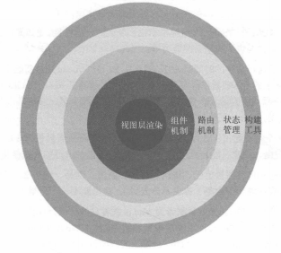
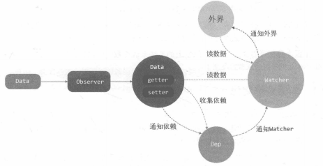
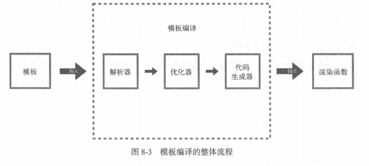
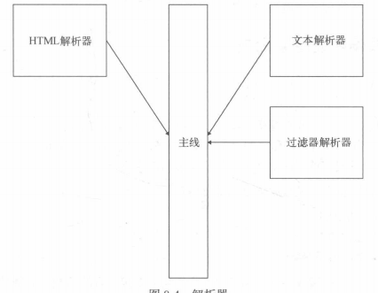
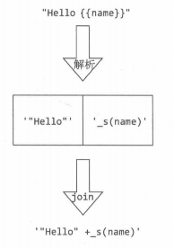
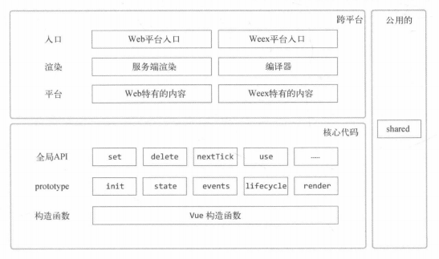
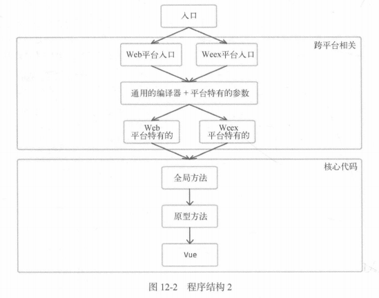

vue.js 深入浅出

## vue 简介

### 什么是 vue

- **_渐进式_** ：如果已经有一个现成的服务端应用，也就是非单页应用，可以将 vue.js 作为该应用的一部分嵌入其中，带来更加丰富的交互体验

- 渐进式框架 -> 框架分层

  

- **_虚拟 dom_** ：80%的场景下变得更快 剩下 20%反而更慢了

  - 虚拟 dom 进行比对的最少单位是 组件 而不是某一个 dom 节点

## 第二章 Object 的变化侦测

- **_变化侦测_**：侦测数据的变化 当数据变化时 会通知视图进行相应的更新
  - 推 push
  - 拉 pull
  - angular 和 react 的变化侦测都是 拉 angular 中是脏检查 react 使用虚拟 dom
  - vue 是 推
    - vue 以组件为单位收集依赖 依赖是指状态绑定的依赖
    - 虚拟 dom 进行比对的最少单位是 组件 而不是某一个 dom 节点

### 如何追踪变化

- defineReactive 方法是对 defineProperty 的封装 作用是定义一个响应式数据 也就是在这个函数中进行变化追踪

### 如何收集依赖

- 在 defineProperty 的 getter 中去收集依赖，在 setter 中去触发依赖

### 依赖收集在哪里

- dep 类 ： 收集、删除依赖 向依赖发送通知
- defineReactive 当中新建一个 dep 数组 每个 getter 收集到的依赖存放在 dep 数组中 set 的时候 遍历 dep 触发收集到的依赖

### 依赖是谁

- watcher 类：watcher 是一个中介的角色 数据发生变化时通知它 然后它再通知其他地方

### 递归侦测所有 key

- Observer 类：作用是将一个数据内的所有属性（包括子属性）都转换成 getter/setter 的形式，然后去追踪他们的变化
  - 将一个正常的 object 变成一个被侦测的 Object
  - defineReactive 中新增 new Observer(val)来递归子属性，这样我们就可以把 data 中的所有属性包括子属性都转换成 getter/setter 的形式来侦测变化

### 关于 Object 的问题

- defineProperty 的 getter/setter 只能追踪一个数据是否被修改，无法追踪新增属性和删除属性 是由于 es6 之前 js 没有提供元编程的能力，无法侦测到一个新属性被添加到了对象中，也无法侦测到一个属性从对象中删除了
- 那么新增属性和删除 vue 提供了 $set 和 $delete 两个方法来解决

### Data、Observer、Dep、Watcher 之间的关系



- Data 通过 Observer 转换成了 getter/setter 的形式来追踪变化
- 当外界通过 watcher 读取数据的时，会触发 getter 从而将 watcher 添加到依赖中
- 当数据发生了变化时，会触发 setter，从而向 Dep 中的依赖（Watcher）发送通知
- Watcher 接收到通知后，会向外界发送通知，变化通知到外界后可能会触发视图更新，也有可能触发用户的某个回调函数等。

## 第三章 Array 的变化侦测

- push 改变数组不会触发 getter/setter 原因是我们可以通过 Array 原型上的方法来改变数组的内容，所以 Object 那种通过 getter/setter 的实现方式就行不通了

### 如何追踪变化

- **_拦截器_**：通过封装拦截器对 js 的 Array 的原型方法进行封装每当调用原型方法是触发拦截其中封装的原型方法，这样就可以追踪到 Array 的变化

### 拦截器

- Array 的原型中可以改变数组自身内容的方法有 push pop shift unshift splice sort reverse
- 使用 Object.defineProperty 对 原型方法进行封装
- 当使用原型方法对时候 实际上是触发了`mutator`函数 在里面执行原型方法 然后原型方法触发的时候我们可以发送变化通知

```js
const arratProto = Array.prototype;
export const arrayMethods = Object.create(arrayProto)
[('push', 'pop', 'shift', 'unshift', 'splice', 'sort', 'reserve')].forEach(
  function (method) {
    // 缓存原始方法
    const original = arratProto[method];
    Object.defineProperty(arrayMethods, method, {
      value: function mutator(...args) {
        return original.apply(this, args);
      },
      enumerable: false,
      writable: true,
      configurable: true,
    });
  },
);
```

### 使用拦截器覆盖 Array 原型

- 我们不希望拦截器污染到全局的 Array，希望拦截器只覆盖那些响应式数组的原型

```js
export class Observer {
  constructor(value) {
    this.value = value;
    if (Array.isArray(value)) {
      value.__proto__ = arrayMethods; // 新增
    }
  }
}
```

- 利用`__proto__` 巧妙的实现覆盖 value 的原型
- `__proto__` 是 Object.getPrototype 和 Object.setPrototype 的早期实现

### 将拦截器方法挂在到数组的属性上

- 并不是所有的浏览器都支持`__proto__`因此我们需要处理`__proto__`不存在时的情况

```js
import { arrayMethods } from './array'

// __proto__ 是否可用
const hasProto = '__proto__' in {}
const arratKeys = Object.getOwnPropertyNames(arrayMethods)

export class Observer {
  constructor (value){
    this.value = value

    if(Array.isArray(value)) {
    	// 修改
      const augment = hasProto
      	? protoAugment
      	: copyAument
      augment(value, arrayMethods, arrayKeys)
    } else {
      this.walk(value)
    }

    function protoAugment (target, src, keys) {
      target.__proto__ = src
    }

    function copyAugment (target, src, keys) {
      for (let i = 0; l = keys.length; i < l; i++) {
        const key = keys[i]
        def(target, key, src[key])
      }
    }
  }
}
```

- 浏览器支持`__proto__`就调用 protoAugment 也就是拦截器当中包装的原型方法
- 浏览器不支持`__proto__` 就调用 copyAugment 将拦截器当中设置到的原型方法暴力覆盖到 value 上
  - 因为当访问一个对象的方法时，只有其自身不存在这个方法，才会去他的原型上找这个方法

### 如何收集依赖

- Array 的依赖和 Object 一样也是在 getter 中去收集
- 例如 ： this.list
  - list 这个属性作为 key 会触发 defineReactive 函数 在此时的 getter 中去收集依赖

### 依赖列表村在哪儿

- 存放在 Observer 里面
  - 因为存放依赖的地方需要 在 getter 中可以访问到 同时 Array 拦截器也要访问到
  - 那么 getter 与 Array 拦截器访问的就是 list 这个数组的 Observer 的实例（也就是响应式对象）

### 收集依赖

- 在 defineReactive 函数中使用 observe 方法 获得 list 属性这个数组的 响应式对象实例 也就是 Observer 实例
  - observe 方法 传入一个 value 如果是响应式的直接返回 如果不是响应式则返回一个响应式对象 也就是 Observer 实例
- 此时就可以在 getter 当中 通过 list 属性的 Observer 实例去访问到实例当中的 dep 数组 在这个 dep 数组中收集依赖

### 在拦截器中获取 Observer 实例

- 借助工具函数 def 在 value 中增加一个不可枚举的属性 ob 这个 ob 就是当前 observer 的实例
- 因为拦截器是原型方法 所以 可以直接使用 `this.__ob__`来访问 Observer 实例

### 向数组的依赖发送通知

- ob.dep.notify() 使用这个方法 通知依赖（watcher） 数据发生了变化

### 侦测数组中元素的变化

- observerArray 函数

- 循环 value 当中的每一项 通过 observe 方法把 value 数组中的每一个元素都变成可观测的

  ```js
  observerArray (items) {
    for (let i = 0; i<items.length; i++) {
      observe(items[i])
    }
  }
  ```

### 侦测是新增元素的变化

- 获取新增元素 然后对他们使用 Observer 侦测

#### 获取新增元素

- 在拦截器当中对数组的方法进行判断
- 操作数组的方法 push、unshift、splice 可以使数组新增元素

```js
let inserted;
switch (method) {
  case 'push':
  case 'unshift':
    inserted = args;
    break;
  case 'splice':
    inserted = args.slice(2);
    break;
}
```

#### 使用 Observer 侦测新增元素

- 在拦截器上通过 this 访问到`__ob__` 调用 observeArray 方法 对新增的元素进行侦测

  ```js
  if (inserted) ob.observeArray(inserted); // 对新增元素进行侦测
  ```

## 第四章 变化侦测相关的 API 实现原理

### $watch

- 用来观察一个表达式 或 computed 函数在 Vue.js 实例上的变化

```js
vm.$watch('a.b.c', function (newVal, oldVal) {});
```

- 返回一个取消观察函数 用来停止触发回调 const unwatch = vm.$watch()
- unwatch() 用于停止触发回调
- deep:true 为了发现对象内部值的变化
- immediate:true 立即以表达式的当前值触发回调

#### watch 的 内部原理

- vm.$watch 其实是对 Watcher 的一种封装

```js
Vue.prototype.$watch = function (expOrFn, cb, options) {
  const vm = this;
  options = options || {};
  const watcher = new Watcher(vm, expOrFn, cb, options);
  // 判断用户是否使用了immediate参数 如果是用了 则立即执行一次cb
  if (options.immediate) {
    cb.call(vm, watcher.value);
  }
  return function unwatchFn() {
    watcher.teardown();
  };
};
```

- 通过 new Watcher 实现了 watch 的基本功能 当某个值变化时发送通知

- watcher.teardown() 执行之后用来取消观察数据 本质是把 watcher 实例从当前正在观察的状态(dep)的依赖列表中移除

  ```js
  teardown () {
    let i = this.deps.length
    while (i--) {
      this.deps[i].removeSub(this)
    }
  }

  // ............
  export defalult class Dep {
    removeSub (sub) {
      const index = this.subs.indexOf(sub)
      if (index > -1) {
         return this.subs.splice(index, 1)
      }
    }
  }

  ```

- Watcher 需要记录下自己都订阅了谁 也就是哪些 dep 收集了这个 watcher 实例 当 Watcher 不想继续订阅的时候 通知不想订阅的 dep 将自己从他的依赖列表中移除

  - addDep 方法用来记录自己订阅了哪些 dep

```js
export default class Watcher {
  constructor(vm, expOrFn, cb) {
    this.vm = vm;
    // expOrFn 参数支持函数
    if (typeof expOrFn === 'function') {
      this.getter = expOrFn;
    } else {
      this.getter = parsePath(expOrFn);
    }
    this.cb = cb;
    this.value = this.get();
  }

  addDep(dep) {
    const id = dep.id;
    if (!this.depIds.has(id)) {
      // 没有订阅过着过dep的时候
      this.depIds.add(id); // 记录当前watcher订阅了哪些dep
      this.deps.push(dep); // 记录自己都订阅了哪些dep
      dep.addSub(this); // 将自己登月到dep中
    }
  }
}
```

- parsePath 函数 是用来读取 keyPath 中的数据 keyPath 指的是属性路径 例 a.b.c.d 是一个 keyPath 那么从 vm.a.b.c.d 中提取数据
- 执行 new Watcher 后 代码会判断用户是否使用了 immediate 参数 如果是用了 则立即执行一次 cb
- addDep 当中利用 depIds 他是一个 Set 数据类型 用来记录被 watcher 订阅的 dep 避免重复 dep 当中重复收集依赖 重复收集了依赖数据变化时会通知多个 watcher 为了避免这个问题 只有触发第一次 getter 的时候才会收集依赖

```js
this.$watch(
  function () {
    return this.name + this.age;
  },
  function (newValue, oldValue) {
    console.log(newValue, oldValue);
  },
);
```

- 当 expOrFn 不是单个表达式而是一个函数时 例如上图 中 expOrFn 作为一个函数使用 name 和 age 两个属性 那么 watcher 就会订阅两个 dep
- Deep 的实现

```js
export default class Watcher {
  constructor(vm, expOrFn, cb, options) {
    this.vm = vm;

    // 新增
    if (options) {
      this.deep = !!options.deep;
    } else {
      this.deep = false;
    }
    this.deps = [];
    this, (depIds = new Set());
    this.getter = parsePath(expOrFn);
    this.cb = cb;
    this.value = this.get();
  }

  get() {
    window.target = this;
    let value = this.getter.call(vm, vm);
    // 新增
    if (this.deep) {
      traverse(value);
    }
    window.target = indefined;
    return value;
  }
}
```

- 在 window.target = indefined 之前调用了 traverse 方法 确保子集收集的依赖是当前这个 Watcher

- traverse 方法主要是递归 value 所有的子值 来触发他们收集依赖的功能

### $set

- set 其实是 observer 中抛出的方法

- array 处理

```js
export function set(target, key, val) {
  // set对Array的处理
  if (Array.isArray(target) && isValidArrayIndex(key)) {
    // 如果target是一个数组 且key是一个有效索引值
    target.length = Math.max(target.length, key); // 如果索引值大于target的length 将索引值赋值给length
    target.splice(key, 1, val); // 删除原先索引key的值 并在此位置插入key
    return val;
  }
  // key 已经存在于target中
  if (key in target && !(key in Object.prototype)) {
    // key 是一个target里面已有的索引值 key并非是一个对象
    target[key] = val;
    return val;
  }

  // 新增
  const ob = target.__ob__;
  if (target._isVue || (ob && ob.vmCount)) {
    // isVue判断是否是vue的实例 ob.vmCount判断是否是vue的根数据
    process.env.NODE_ENV !== 'production' &&
      warn(
        'Avoid adding reactive properties to a Vue instance or its root $data ' +
          'at runtime - declare it upfront in the data option.',
      );
    return val;
  }
  if (!ob) {
    // 如果target没有ob 说明不是响应式的 就是个普通的js对象 把key value赋值
    target[key] = val;
    return val;
  }
  defineReactive(ob.value, key, val);
  ob.dep.notify(); // 手动通知
  return val;
}
```

### $delete

- Delete 关键字 用于数组时 只会将值变为 empty 或者 undefined 的同时不会更新视图， 而$delete 会直接去掉这个元素 并更新视图

- 手动想依赖发送变化通知

```js
delete this.obj.name;
this.obj.__ob__.dep.notify(); // 手动向依赖发送变化通知
```

- 处理对象

```js
export function del(target, key) {
  const ob = target.__ob__;
  delete target[key];
  ob.dep.notify();
}
```

- 处理数组

```js
export function del(target, key) {
  // 处理数组
  if (Array.isArray(target) && isValidArrayIndex(key)) {
    target.splice(key, 1); // splice方法会自动通知
    return;
  }
  const ob = target.__ob__;
  delete target[key];
  ob.dep.notify();
}
```

- 不可作用在 vue 实例 与 根数据中
- 如果删除的 key 在 target 中不存在 不进行操作 也不发送通知
- 判断 target 是不是响应式数据(ob 存在即响应式) 如果不是 阻止发送通知的语句

```js
export function del(target, key) {
  // 处理数组
  if (Array.isArray(target) && isValidArrayIndex(key)) {
    target.splice(key, 1); // splice方法会自动通知
    return;
  }
  const ob = target.__ob__;
  if (target._isVue || (ob && ob.vmCount)) {
    // isVue判断是否是vue的实例 ob.vmCount判断是否是vue的根数据
    process.env.NODE_ENV !== 'production' &&
      warn(
        'Avoid deleting properties to a Vue instance or its root $data ' +
          '- just set it to null.',
      );
    return;
  }
  if (!hasOwn(target, key)) {
    return;
  }
  delete target[key];
  if (!ob) {
    return;
  }
  ob.dep.notify();
}
```

## 第五章 虚拟 DOM

### 虚拟 dom 简介

- 直接修改真实 dom 属于命令式操作 dom 复杂的交互逻辑会产生不好维护的问题
- 虚拟 dom 的出现意味着 开发者应该将关注点聚焦在状态维护上，而 dom 操作其实是可以省略掉的，然而状态 从始至终都是存在的 jQuery 中的变量 都是状态
- 本质上我们将状态作为输入 并生成 DOM 输出到页面上显示出来，这个过程叫做渲染
- 理论上 所有异步行为都有可能引起状态变化
- vue1 是通过细粒度绑定 来达到只更新与这个状态相关联的 DOM 节点
- 虚拟 DOM 只是解决局部更新 DOM 节点的一种方案 但不是唯一一种
- vue 在 react 虚拟 DOM 的基础上给每个组件增加了 Watcher 当组件内部的状态发生改变的时候通知依赖 实现 vue 可以大概知道那些状态发生了改变 再去比对新旧 vdom 更新视图
- react 的性能优化需要手动去做，而 vue 的性能优化是自动的，但是 vue 的响应式机制也有问题，就是当 state 特别多的时候，Watcher 也会很多，会导致卡顿，所以大型应用（状态特别多的）一般用 react，更加可控。
- render 函数 是将 template 转换成 Vnode 树
- patch 的过程 是比对 新旧 Vnode 树

## 第六章 VNode

- 简单的说 VNode 可以理解成节点描述对象 描述了应该怎样去创建真实的 DOM 节点
- 也就是说组件使用的众多状态中有一个发生了变化，那么整个组件就要重新渲染 但其实并不会每次将整个组件全部渲染 所以就会进行 patch 操作比对出需要重新渲染的 dom

### VNode 的类型 提出一个概念 `有效属性`

- 注释节点
- 文本节点
- 元素及诶单
- 组件节点
- 函数式组件
- 克隆节点

### 注释节点

- createEmptyVNode

```js
export const createEmptyVNode = text => {
  const node = new VNode()
  node.text = text
  node.isCommit = true
  return node
}

// 最终产生的VNode
{
	text: '注释节点',
  isComment: true
}
```

### 文本节点

- createTextVNode

```js
export function createTextVNode(val) {
  return new VNode(undefined, undefined, undefiend, String(val));
}

// 最终产生的VNode
{
  text: 'Hello Berwin';
}
```

### 克隆节点

- 作用于静态节点与插槽节点
- 静态节点 不会更新 避免使用 render 生成新的 VNode 而是直接复制之前的 VNode 一定程度提高性能

```js
export function cloneVNode(vnode, deep) {
  const cloned = new VNode(
    vnode.tag,
    vnode.data,
    vnode.children,
    vnode.text,
    vnode.elm,
    vnode.context,
    vnode.componentOptions,
    vnode.asyncFactory,
  );
  cloned.ns = vnode.ns;
  cloned.isStatic = vnode.isStatic;
  cloned.key = vnode.key;
  cloned.isComment = vnode.isComment;
  cloned.isCloned = true;
  if (deep && vnode.children) {
    cloned.children = cloneNodes(vnode.children);
  }
  return cloned;
}
```

- 克隆与被克隆对象的主要区别是 isCloned 属性 克隆节点的是 true

### 元素节点

- 有效属性
  - tag 例如 p、ul、li、div
  - data 例如 attrs、class、style
  - children 当前节点的字节点列表
  - context 当前组件的 vue 实例

### 组件节点

- 有效属性
  - componentOptions 组件节选项参数 包括 propsData tag children
  - componentInstance 组件的实例

### 函数式组件

- 有效属性

  - functionalContext 组件实例

  - functionalOptions 组件配置项

## 第七章 patch

- 对比两个 Vnode 之间的差异是 patch 的是手段 而不是目的
- patch 的目的是修改 dom 节点 可以理解为渲染视图
- 对现有 DOM 进行修改需要做三件事
  - 创建新建的节点
  - 删除已经废弃的节点
  - 修改需要更新的节点

### 新增节点

- 使用 js 的计算成本来换取 dom 的操作成本

### 创建节点

- 创建一个元素节点看是否有 tag 调用当前环境下的 createElement 来创建真实的元素节点 创建好之后 会看有无子节点 如果有子节点那么创建子节点并插入到这个元素节点里面 以此操作递归 直至没有子元素 最终将此元素 插入到指定的父节点
- 如果没有 tag 那么判断 isComment 是否存在 存在是一个注释节点 不存在是文本节点

### 删除节点

- removeVnodes(vnodes, startIdx, endIdx) 删除指定位置到指定位置到内容

```js
function removeVNodes(vnodes, startIdx, endIdx) {
  for (; startIdx <= endIdx; ++startIdx) {
    const ch = vnodes[startIdx];
    if (isDef(ch)) {
      removeNode(ch.elm);
    }
  }
}
```

- removeNode 删除单个 Vnode

```js
const nodeOps = {
  removeChild(node, child) {
    node.removeChild(child);
  },
};
function removeNode(el) {
  const parent = nodeOps.parentNode(el);
  if (isDef(parent)) {
    nodeOps.removeChild(parent, el);
  }
}
```

### 更新节点

- 新渲染的节点有 text 文本 直接调用 setTextContent 方法把 text 填入
- 如果没有 text 属性 那么说明是一个元素节点
  - 有 children

### 更新子节点

Node.insertBefore()方法

## 第八章 模版编译

- 模版编译的两个过程 将模版编译成 ast 抽象语法树 遍历 ast 标记静态节点 再由 ast 生成渲染函数

  - 解析器

  - 优化器

  - 代码生成器

    

### 解析器

- 将模版解析成 ast



- 文本解析器就是 {{ name }} 像这样的 纯文本不需要解析
- ast 和 vnode 有点相似 都是使用 js 中的对象来表示节点

### 优化器

- 避免一些无用功来提升性能 比如静态节点 除了首次渲染 后续不需要任何重新渲染操作

### 代码生成器

- 将 ast 转换成徐然函数中的内容 这个内容 可以称之为 代码字符串

  例如，一个简单的模版：

  ```html
  <p title="Berwin" @click="c">1</p>
  ```

  生成之后的代码字符串是

  ```js
  `with(this){return _c('p',{attrs:{"title":"Berwin"},on:{"click":c}},[_v("1")])}`;
  ```

  格式化之后是

  ```js
  with (this) {
    return _c(
      'p',
      {
        attrs: { title: 'Berwin' },
        on: { click: c },
      },
      [_v('1')],
    );
  }
  ```

## 第九章 解析器

```html
<div>
  <p>{{name}}</p>
</div>
```

转换成 AST 后的样子

```js
{
  tag:'div',
  type:1,
  staticRoot:false,
  static:false,
  plain:true,
  parent:undefined,
  attrsList:[],
  attrsMap:{},
  children:[
    {
      tag:'p',
      type:1,
      staticRoot:false,
      static:false
      plain:true,
      parent:{tag:'div',...},
    	attrsList:[],
    	attrsMap:{},
      children:[
        {
          type:2,
          text:"{{name}}",
          static:false,
          expression:"_s(name)"
        }
      ]
    }
  ]
}
```

- AST 只是一个用对象描述的 节点树

### 解析器内部原理

```js
parseHTML(template, {
  start(tag, attrs, unary) {
    // 每当解析到标签的开始位置时，触发该函数
  },
  end() {
    // 每当解析到标签的结束为止时，触发该函数
  },
  chars(text) {
    // 每当解析到文本时，触发该函数
  },
  comment(text) {
    // 每当解析道注释时，触发该函数
  },
});
```

```html
<div>
  <p>我是Berwin</p>
</div>
```

- 解析过程：解析到 div 到时候会触发一次 div 的 start 钩子 然后到 p 会触发 p 的 start 钩子 到文本是会触发 chars 钩子到 /p 时会触发 p 的 end 钩子到/div 时会触发 div 的 end 钩子
- 也就是说 会在 start 时 创建元素节点
- 会在 chars 时 创建文本节点
- 在 comment 时 创建注释节点

```js
function createAstElement (tag, attrs, parent) {
  return {
    type:1,
    tag,
    attrsList:attrs,
    parent,
    children:[]
  }
}

parseHTML(template, {
  start (tag, attrs, unary) {
    let element = createASTElement(tag, attrs, currentParent)
  },
  chars (text) {
    let element = {type:3,text}
  },
  comment (text) {
    let element = {type:3.text,isComment:true}
  }
})
```

### 构建 AST 的层级关系

- 维护一个栈 Stack 层级关系也可以理解为 dom 的深度
- 每当 start 被触发的时候 把当前节点推入栈中 每当 end 被触发时 就从栈中弹出一个节点
- 这样可以保证每当出发钩子函数 start 时，栈的最后一个节点就是当前正在构建的节点的父节点

### HTML 解析器的原理

#### 运行原理

- HTML 解析器是一段一段截取进行解析
- 当解析第一段例如是 <div> 那么运行 start 钩子 当解析第二段例如是 空格 运行 chars 钩子 截取到</div> 运行 end 钩子

- 截取的原理 是由正则去匹配 开始标签 结束标签 注释 条件注释 DOCTYPE 文本

### 截取开始标签

```js
const ncname = '[a-zA-Z_][\\w\\-\\.]*';
const qnameCapture = `((?:${ncname}\\:)?${nvname})`;
const startTagOpen = new RegExp(`^<${qnameCapTure}`);
const startTagClose = /^\s*(\/?)>/;

function advance(n) {
  html = html.substring(n);
}

function parseStartTag() {
  // 解析标签名，判断模版是否符合开始标签的特征
  const start = html.match(startTagOpen);
  if (start) {
    const match = {
      tagName: start[1],
      attrs: [],
    };
    advance(start[0].length);

    // 解析标签属性
    let end, attr;
    while (
      !(end = html.match(startTagClose)) &&
      (attr = hrml.match(attribute))
    ) {
      advance(attr[0].length);
      match.attrs.push(attr);
    }

    // 判断该标签是否是自闭合标签
    if (end) {
      match.unarySlash = end[1];
      advance(end[0].length);
      return match;
    }
  }
}
```

### 文本解析器

- 假设 chars 函数被触发之后 我们得到的 text 是一个带变量的文本 hello {{ name }}
- 这个带变量的文本被文本解析器解析之后，得到 expression 变量是这样的 "Hello "+\_s(name) -> \_s 就是 toString 函数的别名
- 假设有一个变量 name 值是 Berwin

```js
var obj = { name: 'Berwin' };
with (obj) {
  function toString(val) {
    return val == null
      ? ''
      : typeof val === 'object'
      ? JSON.stringify(val, null, 2)
      : String(val);
  }
  console.log('Hello ' + toString(name)); // Hello Berwin
}
```

- 加工文本

```js
function parseText(text) {
  const tagRE = /\{\{((?:.|\n)+?)\}\}/g;
  if (!tagRE(text)) {
    return;
  }
}
```



```js
// 上图实现过程
function parseText(text) {
  const tagRE = /\{\{((?:.|\n)+?)\}\}/g;
  if (!tagRE(text)) {
    return;
  }

  const tokens = [];
  let lastIndex = (tagRE.lastIndex = 0);
  let match, index;
  while ((match = tagRE.exec(text))) {
    index = match.index;
    // 先把 {{ 前边的文本添加到tokens 中
    if (index > lastIndex) {
      tokens.push(JSON.stringify(text.slice(lastIndex, index)));
    }
    // 把变量改成_s(x) 这样的形势 也添加到数组中
    tokens.push(`_s(${match[1].trim()})`);

    // 设置lastIndex 来保证下一轮循环时，正则表达式不在重复匹配已经解释过的文本
    lastIndex = index + match[0].length;
  }

  // 当所有变量都处理完毕后，如果最后一个变量右边还有文本，就将文本添加到数组中
  if (lastIndex < text.length) {
    tokens.push(JSON.stringify(text.slice(lastIndex)));
  }
  return tokens.join('+');
}
```

- 解析器的作用是通过模版得到 AST 抽象语法树
- 生成 AST 需要 HTML 解析器，当 HTML 解析器触发不同钩子函数的时，我们可以构建出不同的节点
- 通过栈得到当前正在构建的节点的父节点， 然后将构建出的节点添加到父节点下面
- HTML 解析器运行完毕后 就可以得到一个完整的带 DOM 层级关系的 AST
- HTML 解析器的内部原理是一小段一小段的截取模版字符串， 每截取一小段字符串就会根据截取出来的字符串类型触发不同的钩子函数，直到模版字符串截空停止运行
- 文本分为不带变量和带变量两种，后者需要文本解析器进行二次加工

## 第十章优化器

- 优化器的作用时在 AST 中找出静态子树 并 打上标记
- 标记静态子树有两点好处
  - 每次重新渲染时不需要为静态子树创建新节点
  - 在虚拟 DOM 中打补丁 patching 的过程可以跳过
- 优化器的内部实现主要分为两个步骤
  - 在 AST 中找出所有静态节点并打上标记
  - 在 AST 中找出所有静态根节点并打上标记
- 静态节点的标志是 在 AST 当中的属性 static 为 true
- 如果一个节点下面的的所有子节点都是静态节点 并且父级是一个动态节点 那么这个节点被叫做静态根节点
  - 在 AST 当中的标志是 staticRoot 属性为 true

```js
export function optimize(root) {
  if (!root) return;
  // 第一步 标记所有静态节点
  markStatic(root);
  // 第二步 标记所有静态根节点
  markStaticRoots(root);
}
```

### 找出所有静态节点并标记

```js
function markStatic (node) {
	node.static = isStatic(node)
  if (node.type === 1) { // 1 说明是元素节点
    for (let i = 0; l = node.children.length; i < l; i++) {
      const child = node.children[i]
      markStatic(child)

      // 新增代码
      if(!child.static) { // 在子节点被打完标记后 子节点如果不是静态节点那么父节点也肯定不是 需要将父节点的static 赋值false
        node.static = false
      }
    }
  }
}
```

- isStatic 是如何判断一个节点是否是静态节点的

```js
function isStatic(node) {
  if (node.type === 2) {
    // 带变量的动态文本节点
    return false;
  }
  if (node.type === 3) {
    // 不带变量的纯文本节点
    return true;
  }
  return !!(
    node.pre ||
    (!node.hasBindings && // 没有动态绑定
      !node.if &&
      !node.for && // 没有v-if 或 v-for 或 v-else
      !isBuiltInTag(node.tag) && // 不是内置标签
      isPlatformReservedTag(node.tag) && // 不是组件
      !isDirectChildOfTemplateFor(node) &&
      Object.keys(node).every(isStaticKey))
  );
}
```

- 在标记完静态节点的基础上 找到每个静态子树的第一个静态节点 这个节点就是静态根节点
  - 有一种特殊情况 一个元素节点只有一个文本节点没有子节点 那么不需要标记

```js
function markStaticRoots (node) {
  if(node.type === 1) {
    // 要使节点符合静态根节点的要求，它必须有子节点
    // 这个子节点不能是只有一个静态文本的子节点，否则优化成本将超过收益
    if(node.static && node.children.length && !( // 节点是 静态节点 有子节点 不是单个文本类型的节点
    	node.children.length === 1 &&
      node.children[0].type === 3
    )) {
      node.staticRoot = true // 那么是一个静态根节点
      return
    } else {
      node.staticRoot = false // 反之不是一个静态根节点
    }
    if (node.children) {
      for (let i = 0; l = node.children.length; i < l; i++) {
        markStaticRoots(node.children[i]) // 如果当前节点不是静态节点 那么递归子节点
      }
    }
  }
}
```

## 第十一章 代码生成器

- 作用是将 AST 转传承渲染函数中的内容 这个内容可以成为 `代码字符串`
- 代码字符串可以被包装在函数中执行，这个函数就是渲染函数 render
- render 函数执行之后 会生成 VNode 然后虚拟 DOM 通过 VNode 来渲染视图

将 ast 转换成徐然函数中的内容 这个内容 可以称之为 代码字符串

例如，一个简单的模版：

```html
<p title="Berwin" @click="c">1</p>
```

生成之后的代码字符串是

```js
`with(this){return _c('p',{attrs:{"title":"Berwin"},on:{"click":c}},[_v("1")])}`;
```

格式化之后是

```js
with (this) {
  return _c(
    'p',
    {
      attrs: { title: 'Berwin' },
      on: { click: c },
    },
    [_v('Hello ' + _s(name))],
  );
}
```

- 这其实是一个嵌套函数的调用，函数`_c` 的参数重执行了函数`_v`，函数`_v`当中又执行了函数`_s`
- render 是通过 createElement 生成了一个 Vnode 而 createElement 被用于创建一个元素节点，createTextVNode 创建一个文本节点，createEmptyVNode 注释节点

### 代码生成器的原理

- 节点有不同类型 代码生成器会分别生成不同类型的节点

#### 生成元素节点

- `_c`函数

```js
function genElement (el, state) {
  // 如果el.plain是true，则说明节点没有属性
  cosnt data = el.plain ? undefined : genData(el, state)

  const children = genChildren(el, state)
  code = `_c('${el.tag}'${
  	data ? `,${data}` : '' // data
	}${
  	children ? `,${children}` : '' // children
	})`
  return code
}
```

- 主要是通过对一些条件的判断 将代码拼成字符串

```js
function genData(el: ASTElement, state: CodegenState): string {
  let data = '{';
  // key
  if (el.key) {
    data += `key:${el.key}`;
  }
  // ref
  if (el.ref) {
    data += `ref:${el.ref}`;
  }
  // pre
  if (el.pre) {
    data += `pre:${el.pre}`;
  }
  // 类似的还有很多种情况
  data = data.replace(/,$/, '') + '}';
  return data;
}
```

```js
function genChildren(el, state) {
  const children = el.children;
  if (children.length) {
    return `[${children.map((c) => genNode(c, state)).join(',')}]`;
  }
}

function getNode(node, state) {
  if (node.type === 1) {
    return genElement(node, state);
  } else if (node.type === 3 && node.isComment) {
    return genComment(node);
  } else {
    return genText(node);
  }
}
```

#### 文本节点

```js
function genText(text) {
  return `_v(${text.type === 2 ? tezt.expression : JSON.stringify(text.text)})`;
}
```

#### 注释节点

```js
function genComment(comment) {
  return `_e(${JSON.stringify(comment.text)})`;
}
```

## 第十二章 架构设计与项目结构



- vue.js 整体结构分为三个部分 ： 核心代码、跨平台相关、公用工具函数



## 第十三章 实例方法与全局 API 的实现原理

- vue 的构造函数之后 分别调用了 5 个函数

### initMixin(Vue)

### stateMixin(Vue)

#### $set

#### $watch

#### $delete

### eventMixin(Vue)

#### $on

- 在注册事件时将回调函数收集起来，触发事件时将收集起来的回调函数依次调用

- ```js
  Vue.prototype.$on = function (event, fn) {
    const vm = this
    if(Array, isArray(event)){ // 当传入的event是数组时重复处理每一个元素
      for(let i = 0;k = event.length; i<l;i++){
        this.$on(event[i], fn)
      }
    } else {
      (vm.events[event] || (vm._events[event] = [])).push(fn) // 传入的event是一个对象时 将事件调用者
    }
    return vm
  }
  ```

- vm.\_events 是一个对象 用来存储事件 是执行 new Vue 的时候调用了`_init`方法进行的初始化操作 会在 vue 的实例上创建一个\_event 属性

#### $once

- 实现思路是调用$on 来实现监听自定义事件的功能

- ```js
  Vue.prototype.$once = function (event, fn) {
    const vm = this;
    function on() {
      vm.$off(event, on);
      fn.apply(vm, arguments);
    }
    on.fn = fn;
    vm.$on(event, on);
    return vm;
  };
  ```

#### $emit

- ```js
  Vue.prototype.$emit = function (event) {
    const vm = this;
    let cbs = vm._events[event];
    if (cbs) {
      const args = toArray(arguments, 1); // 将第一个参数之后的参数组合成一个数组
      for (let i = 0; i < cbs.length; i++) {
        try {
          cbs[i].apply(vm, args);
        } catch (e) {
          handleError(e, vm, `event handler for "${event}"`);
        }
      }
    }
  };
  ```

#### $off

- ```js
  Vue.prototype.$off = function (event, fn) {
    const vm = this
    // 移除所有事件监听器
    if (!arguments.length) {
      vm._events = Object.create(null)
      return vm
    }

    // event 支持数组
    if(Array.isArray(event)) {
      for (let i = 0; l = event.length; i<l ; i++) {
        this.$off(event[i], fn)
      }
    }

    const cbs = vm._events[event]
    if(!cbs) { // 如果传入了不存在的事件 直接返回vm
      return vm
    }
    // 移除该事件的所有监听器
    if(arguments.length === 1) { // 如果只有一个参数
      vm._events[event] = null // 移除该事件的所有监听器
      return vm
    }

    // 只移除与fn相同的监听器
    if(fn) {
      const cbs = vm._events[event]
      let cb
      let i = cbs.length
      while(i--) {
        cb = cbs[i]
        if (cb === fn || cb.fn === fn) {
          cbs.splice(i, 1)
          break
        }
      }
    }
    return vm
  }
  ```

### lifecycleMixin(Vue)

#### $forceUpdate

- 作用是`手动`迫使 vue 实例重新渲染 仅仅影响实例本身以及插入插槽内容的子组件 而不是所有自组件

- ```js
  Vue.prototype.$forceUpdate = function () {
    const vm = this;
    if (vm._watcher) {
      vm._watcher.update();
    }
  };
  ```

#### $destory

- 作用是销毁某个实例 使其与其他实例失去关联 清理当前组件与父组件之间的联系 将当前组件实例从父组件的$children 属性中删除

- ```js
  // 删除自己与父组件直接的联系
  const parent = vm.$parent;
  if (parent && !vm._isBeingDestoryed && !vm.$options._abstract) {
    remove(parent.$children, vm);
  }

  export function remove(arr, item) {
    if (arr.length) {
      const index = arr.indexOf(item);
      if (index > -1) {
        return arr.splice(index, 1);
      }
    }
  }
  ```

- 父组件间的连接端掉之后 我们需要销毁实例上的 watcher 也就是去掉依赖追踪

- ```js
  // 从watcher监听的所有状态的依赖列表中删除Watcher
  if (vm._watcher) {
    vm._watcher.teardown();
  }
  ```

- 删除 watch 产生的 watcher `_watchers`属性在 init 的时候产生 用于存放所有 watcher

- ```js
  let i = vm._watchers.length;
  while (i--) {
    vm._watchers[i].teardown();
  }

  vm._isDestroyed = true; // 添加属性表示实例已经销毁

  vm.__patch__(vm._vnode, null); // 将模版中的所有指令解绑

  callHook(vm, 'destroyed'); // 触发 destroyed钩子函数

  vm.$off(); // 移除所有事件监听
  ```

### renderMixin(Vue)

#### $nextTick 作用是将回调延迟到下次 dom 更新周期之后执行

- 下次 DOM 更新周期之后
  - 指的是下次位人物执行时更新 DOM $nextTick 是将回调添加到微任务中
  - 当状态发生变化 watcher 收到通知 触发虚拟 DOM 渲染流程 其中可以达到 有多个 watcher 收到通知 在一次渲染当中将这些 watcher 收到的通知一次性渲染 是因为 watcher 触发渲染的操作时异步的，vue 采用事件循环的机制 每当有 watcher 收到通知判断是否有重复的 watcher 收到通知 如果不重复放到队列当中 等所有的状态修改完毕之后 一次性将整个组件渲染成最新即可
- `事实上更新DOM的回调也是使用vm.$nextTick来注册到微任务中的`

```js
const callbacks = []; //存储用户注册的回调
let pedding = false; // 用来标记是否已经向任务队列中添加了一个任务
function flushCallbacks() {
  pending = false; // 事件被触发时 会设置为false 保证一次循环中 事件只调用一次
  const copies = callbacks.slice(0);
  callbacks.length = 0; // 清空回调列表
  for (let i = 0; i < copies.length; i++) {
    copies[i](); // 执行本次循环的回调
  }
}

let microTimerFunc; // 用于将事件放入微任务
let macroTimerFunc; // 用于将事件放入宏任务
let useMacroTask = false; // 事件应放入对应任务的标记

if (typeof setImmediate !== 'undefined' && isNative(setImmediate)) {
  macroTimerFunc = () => {
    setImmediate(flushCallbacks); // 如果浏览器支持setImmediate 那么利用setImmediate将事件放入宏任务
  };
} else if (
  typeof MessageChannel !== 'undefined' &&
  (isNative(MessageChannel) ||
    MessageChannel.toString() === '[Object MessageChannelConstructor]')
) {
  const channel = new MessageChannel();
  const port = channel.port2;
  channel.port1.onmessage = flushCallbacks;
  macroTimerFunc = () => {
    port.postMessage(1); // 如果浏览器支持MessageChannel 那么利用postMessage将事件放入宏任务
  };
} else {
  macroTimerFunc = () => {
    setTimeout(flushCallbacks, 0); // 如果浏览器不支持以上两种情况 那么利用setTimeout来将事件放入宏任务
  };
}

if (typeof Promise !== 'undefined' && isNative(Promise)) {
  const p = Promise.resolve();
  microTimerFunc = () => {
    p.then(flushCallbacks); // 如果浏览器支持Promise 利用Promise.then 来将事件放入微任务
  };
} else {
  microTimerFunc = macroTimerFunc; // 如果浏览器不支持Promise 那么将事件放入宏任务
}

export function withMacroTask(fn) {
  // 对循环的事件做一层包装 保证回调函数在执行的过程中遇到数据状态改变这些改变导致视图更新的任务被推到macroTask
  return (
    fn._withTask ||
    (fn._withTask = function () {
      useMacroTask = true;
      const res = fn.apply(null, arguments);
      useMacroTask = false;
      return res;
    })
  );
}

export function nextTick(cb, ctx) {
  let _resolve;
  callbacks.push(() => {
    if (cb) {
      cb.call(ctx);
    } else if (_resolve) {
      _resolve(ctx);
    }
  });
  if (!pending) {
    pending = true; // 任务插入队列时 设置为true
    if (useMacroTask) {
      macroTimerFunc(); // 用于将事件插入到宏任务中
    } else {
      microTimerFunc(); // 用于将事件插入到微任务中
    }
  }
  if (!cb && typeof Promise !== 'undefined') {
    // 如果没有提供回调 且环境支持Promise 返回一个Promise
    return new Promise((resolve) => {
      _resolve = resolve;
    });
  }
}

// 测试一下
nextTick(
  function () {
    console.log(this.name); // Berwin
  },
  {
    name: 'Berwin',
  },
);
```

#### $mount 是在跨平台代码中挂载的

```js
// 这种做法叫做函数劫持 在原始功能至上新增一些其他功能
const mount = Vue.prototype.$mount;
Vue.prototype.$mount = function (el) {
  return mount.call(this, el);
};
```

- el 参数支持元素类型或者字符串类型的选择器 第一步通过 el 获取 DOM 元素

  ```js
  const mount = Vue.prototype.$mount
  Vue.prototype.$mount = function (el) {
    el = el && query(el)

    const options = this.$options
    if (!options.render) {
      // 将模版编译成渲染函数并赋值给options.render
      // 新增获取模版相关逻辑
      let template = options.template
      if (template) {
  			// 新增解析模版逻辑
        if(typeof template === 'string') { // 模版是一个字符串
          if(template.charAt(0) === '#') {
            template = idToTemplate(template)
          }
        } else if (template.nodeType) { // 模版是一个DOM元素
          template = template.innerHTML
        } else { // 既不是节点也不是字符串 验证报错template
          if(process.env.NODE_ENV !== 'production') {
            warn('invalid template option:' + template, this)
          }
          return this
        }
      } else if (el) {
        template = getOuterHTML(el) // 返回参数重提供的DOM元素的HTML字符串
      }

      // 新增编译相关逻辑
      if(template) {
        const { render } = compileToFunctions( // 将模版编译成渲染函数 并设置到this.$options上
        	template,
          {...},
          this
        )
        options.render = render
      }
    }
    return mount.call(this, el)
  }

  // 使用query获取DOM元素
  function query (el) {
    if(typeof el === 'string') {
      const selected = document.querySelector(el) // 当el是字符串时利用querySelector获取DOM节点
      if(!selected) { // 如果querySelector 没有获取到DOM节点
        return document.createElement('div') // 则创建一个节点
      }
      return selected // 存在时返回捕获的节点
    } else {
      return el // 返回元素类型的el
    }
  }

  function getOuterHTML (el) {
    if(el.outerHTML) {
      return el.outerHTML
    } else {
  		const container = document.createElement('div')
      container.appendChild(el.cloneNode(true))
      return container.innerHTML
    }
  }

  // 从选择符获取DOM元素 把他的innerHTML作为模版
  function idToTemplate (id) {
    const el = query(id)
    return el && el.innerHTML
  }
  ```

- compileToFunctions

  ```js 
  function compileToFunctions (template, options, vm) {
    options = extend({}, options)

    // 检查缓存
    const key = options.delimiters
    	? String(options.delimiters) + template
    	: template
    if(cache[key]) { // 检查缓存中是否有模版 如果有不重复编译 提高性能
      return cache[key]
    }

    // 编译
    const compiled = compile(template, options) // compile函数会将template编译成代码字符串 并存储在compiled的render属性中

    // 将代码字符串转换成函数
    const res = {}
    res.render = createFunction(compiled.render)

    return (cache[key] = res)
  }
  // 该函数将字符串转换成函数
  function createFunction (code) {
    return new Function(code)
  }
  ```

#### Vue.extend

- 全局 api 和实例方法不同
  - 全局 api 在 Vue 上挂载 Vue.extend
  - 实例方法 在 Vue.prototype 上挂载 Vue.prototype.$mount

```js
let cid = 1;
Vue.extend = function (extendOptions) {
  extendOptions = extendOptions || {};
  const Super = this;
  const SuperId = Super.cid;
  const cachedCtors = extendOptions._Ctor || (extendOptions._Ctor = {});
  if (cachedCtors[SuperId]) {
    //  缓存策略 使用父类的id作为缓存的key
    return cacheCtors[SuperId];
  }
  const name = extendOptions.name || Super.options.name; // 对name对校验
  if (process.env.NODE_ENV !== 'production') {
    if (!/^[a-zA-Z][\w-]*$/.test(name)) {
      warn(
        'Invalid component name: "' +
          name +
          '". Component names ' +
          'can only contain alphanumeric characters and the hyphen, ' +
          'and must start with a letter.',
      );
    }
  }
  const Sub = function VueComponent(options) {
    this._init(options);
  };
  Sub.prototype = Object.create(Super.prototype); // 将父类的原型继承到子类中
  Sub.prototype.constructor = Sub;
  Sub.cid = cid++;

  Sub.options = mergeOptions(
    // 将父类的options继承到子类中
    Super.options,
    extendOptions,
  );
  Sub['super'] = Super;

  if (Sub.options.props) {
    // 此时如果props存在那么初始化props
    initProps(Sub);
  }

  if (Sub.options.computed) {
    // 此时如果computed存在那么初始化computed
    initComputed(Sub);
  }

  Sub.extend = Super.extend;
  Sub.mixin = Super.mixin;
  Sub.use = Super.use;

  // ASSET_TYPES = ['component', 'directive', 'filter']
  ASSET_TYPES.forEach(function (type) {
    Sub[type] = Super[type];
  });

  if (name) {
    Sub.options.components[name] = Sub;
  }

  Sub.superOptions = Super.options; // 父类中用到的属性依次复制进子类
  Sub.extendOptions = extendOptions;
  Sub.sealedOptions = extend({}, Sub.options);

  // 缓存构造函数
  cachedCtors[SuperId] = Sub;
  return Sub;
};
```

### Vue.directive

- Vue.directive 方法的作用是注册或获取全局指令 而不是指令生效 其区别是注册指令需要做的事是将指令保存在某个位置，而让指令生效是指指令从某个位置拿出来执行它

```js
// 用于保存指令的位置
Vue.options = Object.create(null);
Vue.options['directives'] = Object.create(null);

Vue.directive = function (id, definition) {
  if (!definition) {
    // definition 不存在说明是 获取操作 从Vue.options['directives']中按照传入的id寻找
    return this.options['directives'][id];
  } else {
    // definition 存在 说明是 注册操作
    if (typeof definition === 'function') {
      // 判断definition 是否是函数
      definition = { bind: definition, update: definition };
    }
    this.options['directives'][id] = definition;
    return definition;
  }
};
```

- 判断 definition 是否存在 不存在是获取从 Vue.options['directives']里面按照 ID 去找
- 如果存在说明是一个注册指令的操作 判断 definition 是不是函数 是函数将它赋值成对象
- 如果不是直接按照 id 为 key 赋值给 options 的 directives 属性

### Vue.filter

```js
Vue.filter = function (id, definition) {
  if (!definition) {
    return this.options['filters'][id];
  } else {
    this.options['filter']['id'] = definition;
    return definition;
  }
};
```

### Vue.component

```js
Vue.options['component'] = Object.create(null);

Vue.component = function (id, definition) {
  if (!definition) {
    return this.options['components'][id];
  } else {
    if (isPlainObject(definition)) {
      definition.name = definition.name || id;
      definition = Vue.extend(definition);
    }
    this.options['components']['id'] = definition;
    return definition;
  }
};
```

### Vue.use

- 安装 vue 插件时用的，如果插件是一个对象必须提供 install 方法，如果插件是一个函数那么这个函数会被作为 install 方法
- 实现逻辑
  - 插件的类型 可以是 install 方法 也可以是包含 install 方法的对象
  - 插件只能被安装一次 保证插件列表不能有重复的插件

```js
Vue.use = function (plugin) {
  const installedPlugins =
    this._installedPlugins || (this._installedPlugins = []);
  if (installedPlugins.indexOf(plugin) > -1) {
    // 判断是否已经注册过这个插件 如果注册过直接终止
    return this;
  }

  // 其他参数
  const args = toArray(arguments, 1); // 除了第一个参数之外其他参数赋值给args
  args.unshift(this); // 把Vue添加到args的前面 保证install方法被执行时的第一个参数是Vue 其余参数是注册插件时传入的参数
  if (typeof plugin.install === 'function') {
    // 如果install属性是函数 说明是对象注册
    plugin.install.apply(plugin, args);
  } else if (typeof plugin === 'function') {
    // 如果plugin是函数 说明是函数注册
    plugin.apply(null, args);
  }
  installedPlugins.push(plugin);
  return this;
};
```

- 获取已安装的插件
- 判断传入的插件是否安装过 安装过 终止
- 整理参数 把 argument 除了第一个参数以外的参数 抽离 然后把 Vue 插到第一个 组合成新的 args
- 判断插件注册类型 是对象 执行对象中的 install 方法 是函数 直接执行此函数当作 install 方法
- 把插件存入已安装插件列表
- 返回 Vue

### Vue.mixin

```js
// 为自定义的选项myOption注入一个处理器
Vue.mixin({
  created: function () {
    var myOption = this.$options.myOption;
    if (myOption) {
      console.log(myOption);
    }
  },
});
new Vue({
  myOption: 'hello!',
});

// 原理实现

import { mergeOptions } from '../util/index';

export function initMixin(Vue) {
  Vue.mixin = function (mixin) {
    this.options = mergeOptions(this.options, mixin);
    return this;
  };
}
```

### Vue.compile

```js
Vue.compile = compileToFunctions;
```

### Vue.version

```js
var version = Number(Vue.version.split('.')[0]);

if (version === 2) {
  // Vue.js v2.x.x
} else if (version === 1) {
  // Vue.js v1.x.x
} else {
  // 不支持的Vue.js版本
}
```

- vue 的版本号是借助 rollup

## 第十四章 生命周期


- 初始化阶段 -> 初始化 props、methods、data、computed、watch、provide、inject

  - new Vue()
  - 初始化 events 初始化 lifecycle

  - 触发 beforeCreate
  - 初始化 injection reactivity
  - 触发 created

- 模版编译阶段

  - 判断 el 选项
    - 否 当 vm.$mount(el)被调用时判断 是否有 template
    - 是 判断是否有 template
  - 判断是否有 template
    - 有 通过 template 获取模版
    - 没有 通过 el 现象获取模版
  - 将模版编译为渲染函数 render 函数

- 挂载阶段 将实例挂载到 DOM 元素上 挂载过程中会开启 Watcher 持续追踪依赖变化

  - 触发 beforeMount
  - 创建 vm.$el 并替换 el
  - 触发 mounted
  - 已挂载
    - 状态发生变化时
    - 触发 beforeUpdate
    - 使用虚拟 dom 重新渲染
    - 触发 updated

- 卸载阶段

  - 调用 vm.$destroy()
  - 触发 beforeDestroy
  - 卸载依赖追踪，子组件与事件监听器
  - 触发 destroyed

### 初始化实例属性

- $ 开头的属性是 外部属性 提供给 vue 的用户
- \_ 开头的属性是 内部属性 提供给 vue 内部使用

### 初始化事件

- 为什么不适用注册模版中的浏览器事件
  - v-on 写在组件标签上时间会注册到子组件的 vue.js 事件系统中
  - v-on 如果写在平台标签上事件会被注册到浏览器事件中

### 初始化 inject

```js
export function initInjections(vm) {
  const result = resolveInject(vm.$options.inject, vm);
  if (result) {
    observerState.showldConvert = false;
    Object.keys(result).forEach((key) => {
      defineReactive(vm, key, result[key]);
    });
    observerState.shouldConvert = true;
  }
}
```

区域用户当前组件设置的 inject 的 key 然后循环 key meigekey 从当前组件开始不断向父组件查找是否有值 找到了就停止循环

```js
export function resolveInject(inject, vm) {
  if (inject) {
    const result = Object.create(null);
    const keys = hasSymbol // 环境支持sumbol
      ? Reflect.ownKeys(inject).filter((key) => {
          // ownKeys 会遍历出不可迭代的属性
          return Object.getOwnPropertyDescriptor(inject, key).enumerable; // 筛选可迭代的属性
        })
      : Object.keys(inject); // 环境不支持symbol时 Obejct.keys只遍历可迭代的属性
    for (let i = 0; i < keys.length; i++) {
      const key = keys[i];
      const provideKey = inject[key].from;
      let source = vm;
      while (source) {
        if (source._provided && providekey in source._provided) {
          // 如果原始属性在_provided中能找到值 那么设置到result中
          result[key] = source._provided[providekey];
          break;
        }
        source = source.$parent;
      }
      // 默认值设置
      if (!source) {
        if ('default' in inject[key]) {
          const provideDefault = inject[key].default;
          result[key] = typeof provideDefault === 'function';
        }
      }
    }
    return result;
  }
}
```

- provide 注入内容时 其实是将内容注入到当前组件实例的\_provide 中，所以 inject 可以从父组件实例的\_provide 中获取注入的内通
