# 工程化
## yarn 与 npm的区别
  - 速度 npm是队列执行逐个安装 yarn是同步执行速度更快
  - yarn安装版本统一
  - yarn输出要更简洁些
## git工作流
  - master 主分支
  - develop 主开发分支
    - 包含即将发布的代码
  - feature 新功能分支 
    - 一个新功能对应一个分支 对于功能的拆分需要比较合理 以避免
  - release 发布分支 
    - 发布的时候用的分支 一般测试的时候发现bug在这个分支进行修复
  - hotfixhotfix分支 紧急修复bug

## webpack的作用
  - webpack是一个现代javascript应用程序的静态模块打包器，当webpack处理应用程序时，它会递归地构建一个依赖关系图，其中包含应用程序需要的每个模块，然后将所有这些模块打包成一个或者多个bundle
## webpack 的拆分配置
- 在build目录下设置 webpack.base.config.js webpack.dev.config.js webpack.prod.config.js
- 
```js
// package.json
"scripts": {
    "build": "webpack --config ./build/webpack.prod.config.js",
    "build:dev": "webpack --config ./build/webpack.dev.config.js"
  },
```
- 
### webpack

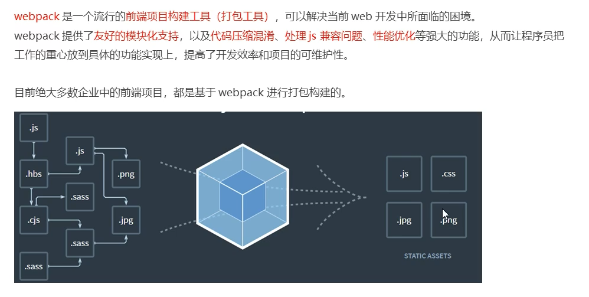

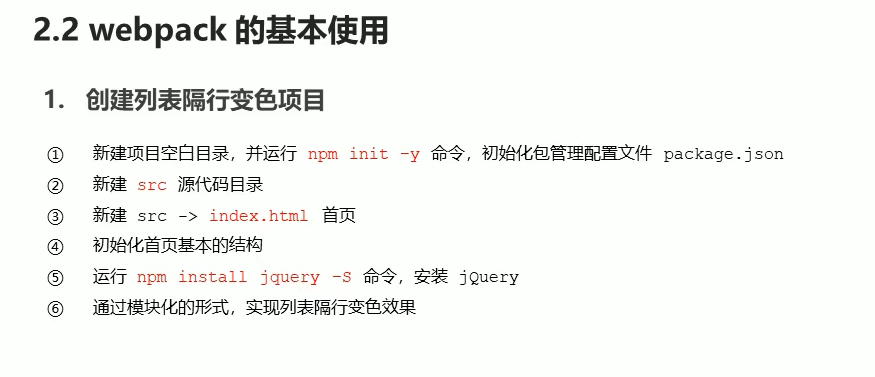

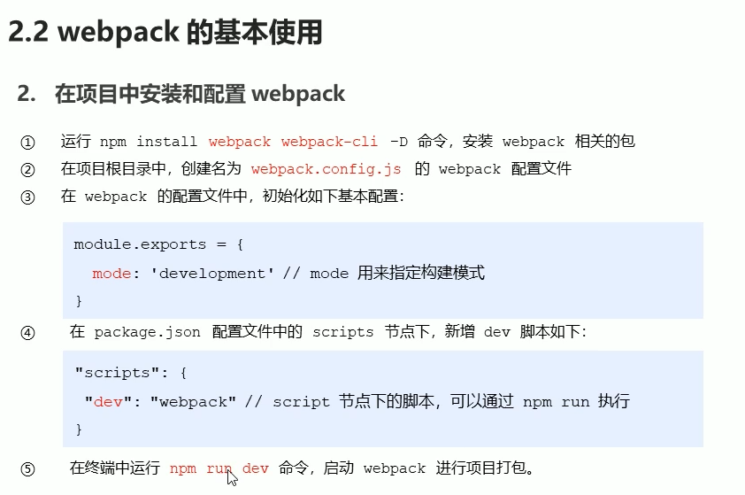

### webpack 配置

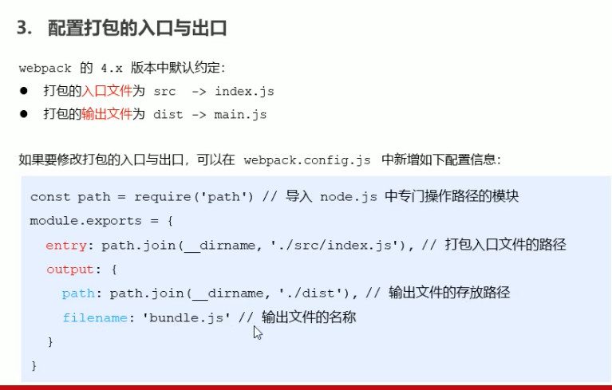

### webpack自动打包功能

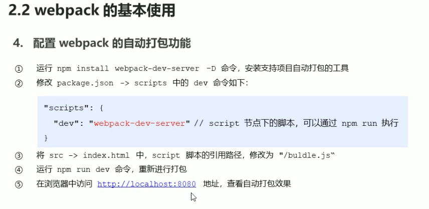

### webpack配置插件

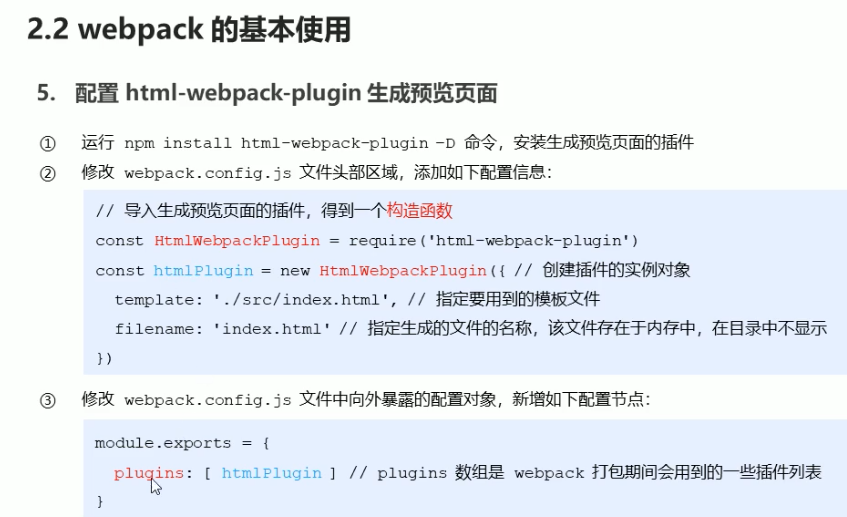

### webpack 打包完成后自动打开浏览器显示项目

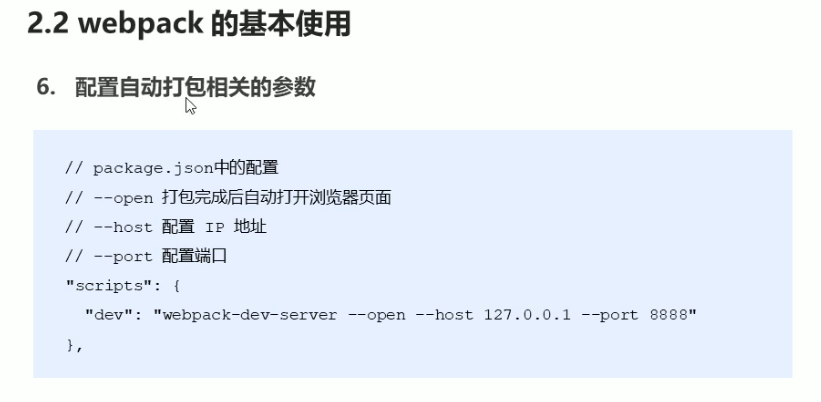

### webpack loader 加载器

​	webpack打包默认只能识别.js的文件 想要打包别的文件 需要用loader加载器

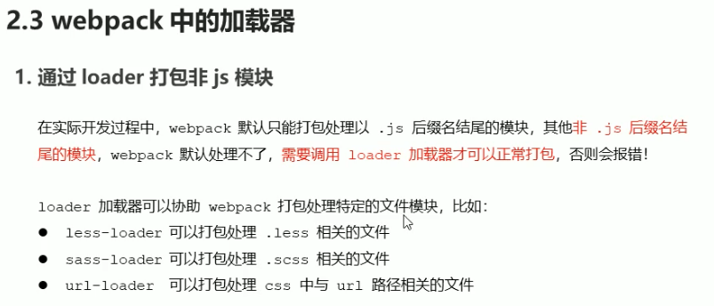

 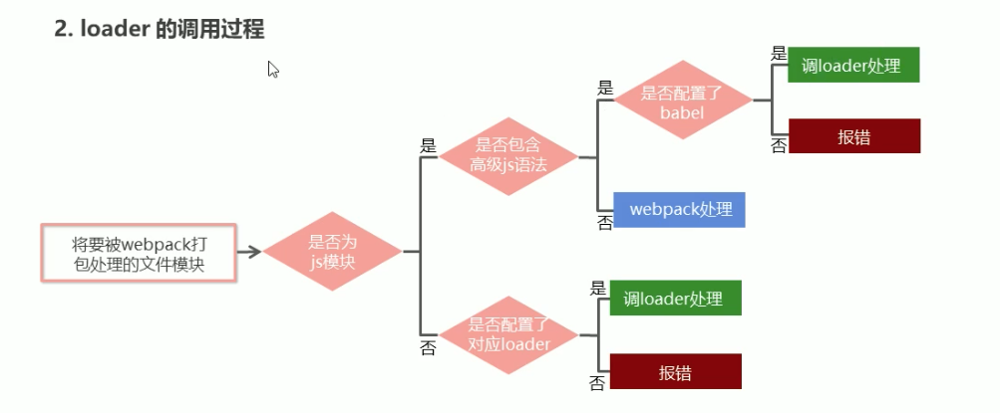


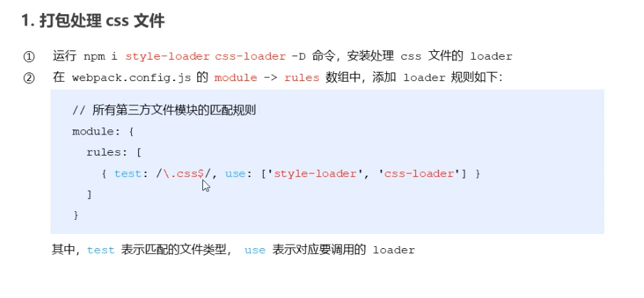

### 处理css浏览器兼容性问题

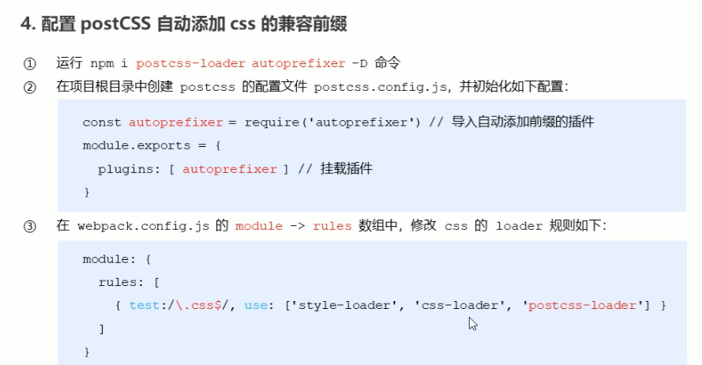

### 加载图片和文件字体

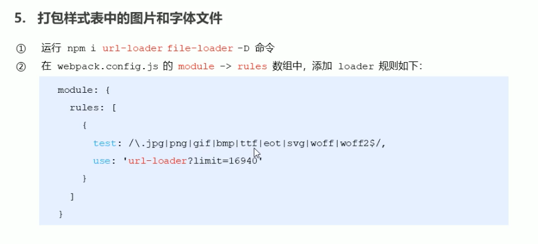

### 打包处理js文件中的高级语法
 babel 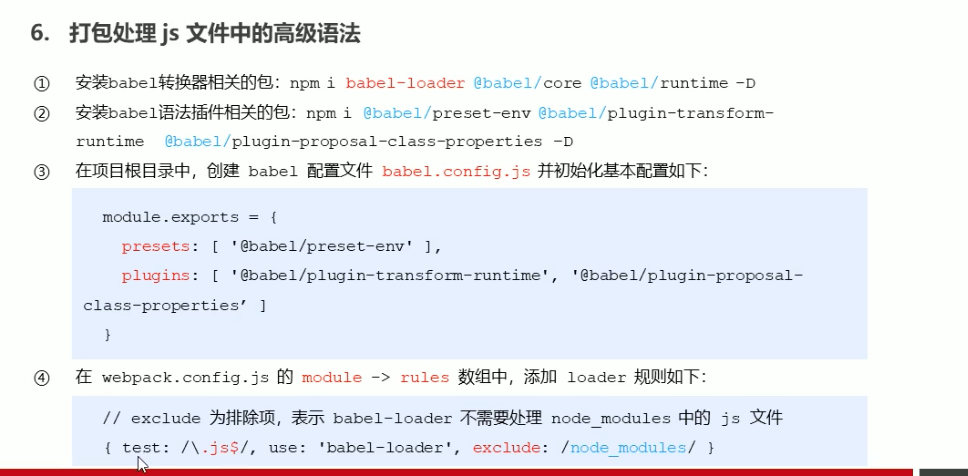

### webpack 配置 vue组件的加载器

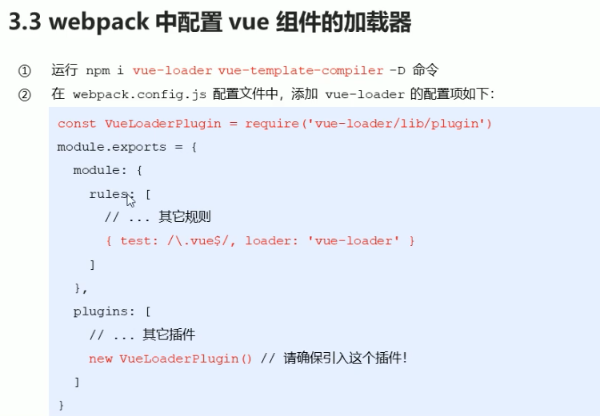

### 在webpack项目中使用vue

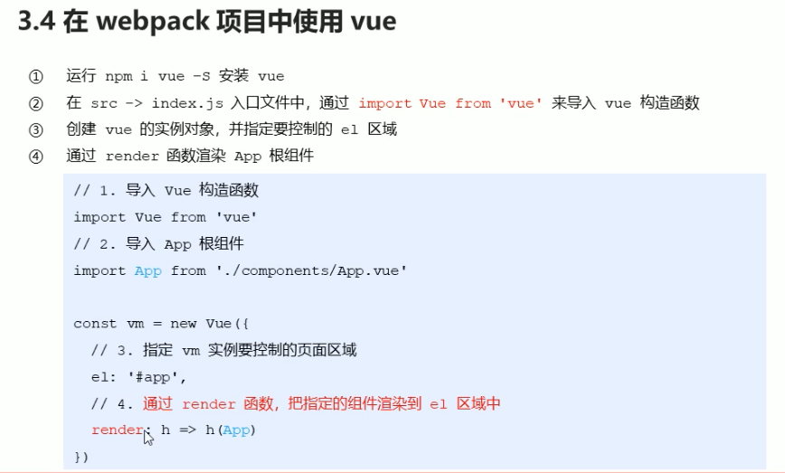

### 打包发布

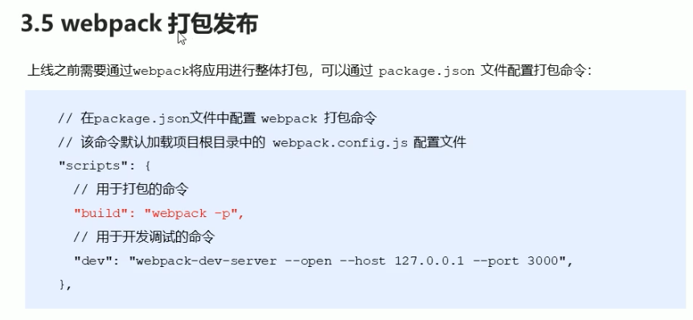
## webpack 与grunt、gulp的不同
  - 都是前端构建工具 grunt、gulp在之前比较流行、现在webpack比较流行
  - 轻量化的会用gulp 比如单独打包css文件
  - grunt、gulp是基于任务和流（task、stream）的，类似jquery，对某个文件进行链式操作 更新流上对数据，多个任务构成web构建流程
  - webpack 是基于入口对，自动递归解析入口琐细要加载对所有资源文件，然后用不同对loader处理不同对文件，用plugin扩展webpack的功能
## 常见的loader
  - file-loader ：把文件输出到一个文件夹中，在代码中通过相对url去饮用输出的文件
  - url-loader: 和file-loader类似 文件小的情况下以base64的方式把文件内容注入到代码中
  - source-map-loader:加载额外的Source Map文件，方便断点调试
  - image-loader:加载并且压缩图片文件
  - babel-loader：把es6转换成es5
  - css-loader:加载css，支持模块化、压缩、文件导入等特性
  - style-loader：把css代码注入到JavaScript中，通过dom操作去加载css
  - eslint-loader 通过eslint 检查JavaScript代码

## 常见的plugin 
  - defune-plugin ： 定义环境变量
  - commons-chunk-plugin 提取公共代码
  - uglifyjs-webpack-plugin 通过uglifyES压缩es6代码

## loader和plugin的不同
  - 不同的作用
    - loader是加载器 webpack将一切文件视为模块 webpack原生只能解析js文件需要解析其他文件就要用loader
    - plugin 是插件 可以扩展webpack的功能 在webpack运行的生命周期中会广播出许多事件，plugin可以监听这些事件，在合适的时机通过webpack提供的api改变输出结果
  - 不同的用法
    - loader在module.rules 中配置 
    - plugin在plugins中单独配置
## webpack 的构建流程
  - 初始化参数
    - 从配置文件和shell语句中读取与合并参数 得到最终参数
  - 开始编译
    - 用参数初始化complier对象，加载所有配置的插件，执行对象的run方法开始执行编译
  - 确定入口
    - 根据配置中的entry找出所有的入口文件
  - 编译模块
    -  从入口文件触发，调用所哟配置的loader对模块进行翻译，再找出该模块依赖的模块，再递归本步骤直到所有入口依赖的文件都经过了本步骤的处理
  - 完成模块编译
    - 在第四步使用loader编译完所有模块后，得到了每个模块被翻译后的最终内容以及他们之间的依赖关系
  - 输出资源
    - 根据入口和模块之间的依赖关系，组装成一个个包含多个模块的chunk 再把每个chunk转换成一个单独的文件加入到输出列表，这步是可以修改输出内容的最后机会
  - 输出完成
    - 在确定好输出内容后，根据配置确定输出的路径和文件名，把文件内容写入到文件系统。
`在以上过程中，Webpack 会在特定的时间点广播出特定的事件，插件在监听到感兴趣的事件后会执行特定的逻辑，并且插件可以调用 Webpack 提供的 API 改变 Webpack 的运行结果。`

## 工厂模式
- 定义一个创建对象的接口，让其子类自己决定实例话哪一个工厂类 工厂模式使其创建过程延迟到子类进行
- 优点
  - 1.调用者想要创建一个对象只需要知道名称就好了
  - 2.扩展性高
  - 3.屏蔽产品的具体实现，调用者主关心产品的接口
## BRD 和 SRS
- 商业需求文档
- 软件需求规范
## 软件开发的五个阶段
- 分析阶段
- 设计阶段
- 实现阶段
- 测试阶段
- 维护阶段

## .editorconfig 文件的作用
- 平衡好不容的设备 window mac 
- 代码缩紧的不同风格问题 
- vscode 需要安装插件 EditorConfig VS Code
```js
# http://editorconfig.org

root = true

[*] # 表示所有文件适用
charset = utf-8 # 设置文件字符集为 utf-8
indent_style =  space # 缩紧风格（tab ｜ space）
indent_size = 2 # 缩紧大小
end_of_line = lf # 控制换行类型（lf ｜ cr ｜ crlf）
trim_trailing_whitespace = true # 去除行首的任意空白字符
insert_final_newline = true # 始终在文件末尾插入一个新行

[*.md] # 表示仅 md 文件适用以下规则
max_line_length = off
trim_trailing_whitespace = false
```

## .prettierrc 
- useTabs：使用tab缩进还是空格锁紧，选择false
- tabWidth：tab是空格的情况下，是几个空格，选择2个
- printWidth：当行字符的长度，推进80，也有人喜欢100 或者 120
- singleQuote：使用单引号还是双引号，选择true，使用单引号
- trailingComma：在多行输入的尾逗号是否添加，设置为none
- semi：语句末尾是否要加分号，默认值true，选择false表示不加
```js
{
  "useTabs":false,
  "tabWidth":2,
  "printWidth":80,
  "singleQuote":true,
  "trailingComma":"none",
  "semi":false
}
```

## .prettierignore
```js
/dist/*
.local
.output.js
/node_modules/**

**/*.svg
**/*.sh

/public/*

```

## 批量格式化
- npm run prettier
```js
"scripts": {
  "prettier":"preitter --write"
}
```

## .eslintrc.js
```js
module.exports = {
  root: true,
  env: {
    node: true
  },
  extends: [
    'plugin:vue/vue3-essential',
    'eslint:recommended',
    '@vue/typescript/recommended',
    '@vue/prettier',
    '@vue/prettier/@typescript-eslint',
    'plugin:prettier/recommended'
  ],
  parserOptions: {
    ecmaVersion: 2020
  }
}

```
## 配置 husky
- npx husky-init && npm install
.husky 目录下面 的pre-commit 增加 npm run lint

## commitizen 提交代码信息自动生成
- 安装 npm install commitizen -D
- 初始化 npx commitizen init cz-conventional-changelog --save-dev --save-exact
- 执行 npx cz

## 代码提交验证
- 安装 npm i @commitlint/config-conventional @commitlint/cli -D
- npx husky add .husky/commit-msg "npx --no-install commitlint --edit $1"


 ## vue.config.js 文件
 ```js
 const { set } = require('core-js/core/dict')
const path = require('path')
module.exports = {
  // 1.配置方式一：CLI提供的属性
  outputDir: './build',
  // 2.配置方式二：和webpack属性完全一致，最后会进行合并
  // configureWebpack: {
  //   resolve: {
  //     alias: {
  //       components: '@/components'
  //     }
  //   }
  // }
  // configureWebpack: (config) => {
  //   config.resolve.alias = {
  //     '@': path.resolve(__dirname, 'src'),
  //     components: '@/components'
  //   }
  // },
  // 3.配置方式三
  chainWebpack: (config) => {
    config.resolve.alias.set('@', path.resolve(__dirname, 'src')).set('conponents', '@/components')
  }
}

 ```

## 手动配置vueRouter
- npm install vue-router@next


