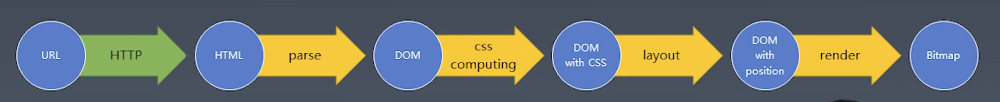

# 浏览器知识点

## dom树怎么生成的

- 浏览器是多进程框架，分别有主进程，第三方插件进程，GPU进程，渲染进程
  - Browser进程 
    - 负责、界面显示、前进、后退、页面管理、渲染bitmap位图 绘制到用户界面上
    - 网络资源管理、下载
  - 第三方插件进程 使用每种类型的插件时创建一个对应进程
  - GPU进程 至多一个 用于3d绘制
  - 渲染进程 通常说的浏览器内核
    - renderer进程 内部是多线程的 页面渲染 js脚本执行 事件处理


- 浏览器从磁盘或者网络读取html的原始字节，并根据文件的指定编码将他们转换成字符，通过状态机去做分词，将字符串转化成token，每个token都具有特殊规则和含义，解析token的时候会先把document压入栈底当下一个是endtag的时候从栈中弹出一个token，通过不断的入栈出栈生成dom树


## 解析器遇到script标签

- 解析器约到script标签会停止dom树加载 执行script中的脚本或者下载js文件
- script标签 含有async 和defer 会异步加载不会阻塞dom树生成

## DOM API

- traversal （废弃）
- node api 节点 api
- event api 事件 api
- range api 操作节点树更精确 应用性差
- iterator 迭代器 （淘汰）

## DOM 高级 api

- compareDocumentPosition 是一个用于比较两个节点中关系的函数
- contains 检查一个节点是否包含另一个节点的函数
- isEqualNode 检查两个节点是否完全相同
- isSameNode 检查两个节点是否是同一个节点，实际上在 javascript 中可以用‘===’
- cloneNode 复制一个节点，如果传入参数 true，则会连同子元素做深拷贝

## Range API

- dom 精细化操作 可以操作半个标签

```js
let range = new Range();
range.setStart(element, 9);
range.setEnd(element, 4);
let range = document.getSelection().getRangeAt(0);

range.setStartBefore; // 起点设置到某个节点之前
range.setEndBefore; // 终点设知道某个节点之前
range.setStartAfter; // 起点设置到某个节点之后
range.setEndAfter; // 终点设置到某个节点之后
range.selectNode; // 选中某个元素
range.selectNodeContents; // 选中一个元素所有的内容

var fragment = range.extractContents(); // 将某个节点上的内容取出 fragment是node的子类 当他被插入的时候会将他的子类插入 自身不会 并且操作fragment不会发生重排
range.insertNode(document.createTextNode('aaaa'));
```

## 网络协议

- 应用层：DHCP ·`DNS（域名解析）` · FTP · Gopher · `HTTP`· IMAP4 · IRC · NNTP · XMPP ·POP3 · SIP · SMTP ·SNMP · SSH ·TELNET · RPC · RTCP · RTP ·RTSP· SDP · SOAP · GTP · STUN · NTP· SSDP · BGP
- 表示层
- 会话层
- 传输层 ：`TCP` · `UDP` · TLS · DCCP · SCTP · RSVP · OSPF 等
- 网络层 `IP` (IPv4 · IPv6) · ICMP· ICMPv6·IGMP ·IS-IS · IPsec · ARP · RARP · RIP 等
- 数据链路层 ：Wi-Fi(IEEE 802.11) · WiMAX(IEEE 802.16) ·ATM · DTM · 令牌环 · 以太网 ·FDDI · 帧中继 · GPRS · EVDO ·HSPA · HDLC · PPP · L2TP ·PPTP · ISDN·STP · CSMA/CD 等
  物理层 ：以太网 · 调制解调器 · 电力线通信(PLC) · SONET/SDH · G.709 · 光导纤维 · 同轴电缆 · 双绞线等

## http

- 应用层协议
- HTTP 是一个传输协议
- HTTP 常被用于在 Web 浏览器和网站服务器之间传递信息，以明文方式发送内容，不提供任何方式的数据加密

## https

- HTTP 传递信息是以明文的形式发送内容，这并不安全。而 HTTPS 出现正是为了解决 HTTP 不安全的特性
- HTTPS = HTTP + SSL/TLS
  - SSL 协议位于 TCP/IP 协议与各种应用层协议之间，浏览器和服务器在使用 SSL 建立连接时需要选择一组恰当的加密算法来实现安全通信，为数据通讯提供安全支持

## UDP

- 用户数据包协议，是一个简单的「面向数据报的通信协议」，即对应用层交下来的报文，不合并，不拆分，只是在其上面加上首部后就交给了下面的网络层

## TCP

- 传输控制协议，是一种可靠、「面向字节流的通信协议」，把上面应用层交下来的数据看成无结构的字节流来发送
  `TCP 应用场景适用于对效率要求低，对准确性要求高或者要求有链接的场景，而UDP 适用场景为对效率要求高，对准确性要求低的场景`
  `TCP适用于 强调准确性不强调效率`
  `UDP适用于 强调效率 对准确性要求低`

## DNS

- 应用层协议
- 主要负责域名解析

#### 在地址栏里输入一个 URL,到这个页面呈现出来，中间会发生什么？

- 找 ip 缓存->hosts 文件->dns->得到 ip+端口—>http 请求->tcp 包->服务器解析得到 html 树->构建 dom 树和 cssom 树->构建途中遇到 js 和 css->合并两个树然后进行页面布局
- 1 DNS 域名解析（此处涉及 DNS 的寻址过程），找到网页的存放服务器；

- 2 浏览器与服务器建立 TCP 连接；

- 3 浏览器发起 HTTP 请求；

- 4 服务器响应 HTTP 请求，返回该页面的 HTML 内容；

- 5 浏览器解析 HTML 代码，并请求 HTML 代码中的资源（如 JavaScript、CSS、图片等，此处可能涉及 HTTP 缓存）；

- 6 得到一颗 dom 树 解析 css 代码 得到带 css 的 dom 树
- 7 通过 css 属性计算每个元素的位置 方便进行排版

- 8 排版完成之后进行绘制 浏览器对页面进行渲染呈现给用户（此处涉及浏览器的渲染原理）。

## websocket

### 后端 node

#### 安装包

- npm i ws -S

#### 创建对象

```javascript
const WebSocket = require('ws');
const wss = new WebSocket.Server({
  port: 9998,
});
```

#### 监听事件

- 连接事件

```javascript
wss.on('connention', (client) => {
  console.log('有客户端连接...');
});
```

- 接收数据事件

```javascript
wss.on('connection', (client) => {
  client.on('message', (msg) => {
    console.log('客户端发送数据过来了');
  });
});
```

#### 发送数据

```javascript
client.send('hello socket');
```

### 前端

#### 创建对象

```javascript
const ws = new WebSocket('ws://localhost:9998');
```

#### 监听事件

- 连接成功事件 ws.onopen
- 接收数据事件 ws.onmessage
- 关闭连接事件 ws.onclose

#### 发送数据

- ws.send

## 性能优化

- 从网站开始生成起的那一刻 到代码开始运行 消耗浏览器以及服务器资源 所需要的一切资源统称为性能

## 如何优化性能

### 浏览器缓存策略

- 强缓存 的两个状态
  - from memory cache 从内存中取资源 cdn 链接静态资源
  - from disk cache
- 协商缓存
  - 缓存生效 http 状态码 304
  - 缓存不生效 http 状态码 200，走正常从服务端获取资源

## 静态资源的加载

### cdn 静态资源服务器 缓存

## html 和 dom 有什么不同

- dom 是用来操作描述 html 文档的借口，如果说浏览器用 html 来描述网页的结构并渲染，那么使用 dom 则可以获取网页的结构并进行操作

## 浏览器工作原理

- 浏览器从 http 请求回来，产生了流式数据，后续的 dom 树构建、css 计算、渲染、合成、绘制，都是尽可能的流式处理前一步的产出，即不需要等到上一步骤完全结束就开始处理上一步的输出这样我们我们浏览网页的时候才会看到逐步出现的页面。
- http 协议 根据 url 把数据取回来
  - 基于 tcp
  - request-response 这个模式决定通讯必定是浏览器先发起的

## Toy-Browser

### url -〉 BitMap

- 浏览器基础渲染流程：将 url 转换成一张 BitMap 图片 然后传给显卡驱动 最后变成人眼可以识别的光信号
- 其中还包括 性能 能互动 和一些功能性的东西 比如 收藏 历史

## 架构图



## 有限状态机 处理字符串

- 每一个状态都是一个机器
  - 在每一个机器里我们可以做 计算 存储 输出
  - 所有的这些机器接受的输入是一致的
  - 状态机的诶一个机器本身没有状态，如果我们用函数来表示的话，它应该是纯函数
- 每一个机器知道下一个状态
  - 每个机器都有确定的下一个状态 moore
  - 每个机器根据输入决定下一个状态 mealy

## mearly 型 有限状态机

- 根据输入值返回不同的状态 这就意味着需要返回一个函数

```js
function match(string) {
  let state = start;
  for (let s of string) {
    state = state(s);
  }
  return state == end;
}
function start(s) {
  if (s == 'a') {
    return foundB;
  }
  return start(s);
}
function end() {
  return end;
}
function foundB(s) {
  if (s == 'b') {
    return foundC;
  }
  return start(s);
}
function foundC(s) {
  if (s == 'c') {
    return foundD;
  }
  return start(s);
}
function foundD(s) {
  if (s == 'd') {
    return foundE;
  }
  return start(s);
}
function foundE(s) {
  if (s == 'e') {
    return foundF;
  }
  return start(s);
}
function foundF(s) {
  if (s == 'f') {
    return end;
  }
  return start(s);
}

console.log(match('dsabcdefsdasdsa'));
```

## 排版 layout

- 第一类 普通流 display position float
- 第二类 flex 我们实现的
- 第三类 grid
- 第四类 （houdini）
- 根据主轴 和 交叉轴 进行分类
- flex-direction：row
  - main： width x left right
  - cross： height y top bottom
- flex-direction：cloumn
  - main：height y top bottom
  - cross：width x left right
